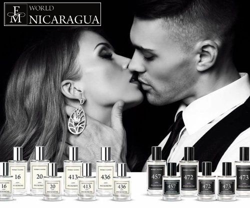

**FM** o **FEDERICO MAHORA**, es una marca de perfumes creados con la colaboración de **Perfand** y **Drom Fragrances** en Polonia, con un gran impacto de mercado en Europa. En **Nicaragua**, lleva 4 años dentro del mercado nacional teniendo una gran aceptación debido a la relación **calidad/precio** de nuestros productos, ofreciendo la máxima calidad a un precio accesible, razón por la cual hemos decidido darnos a conocer a través de plataformas digitales, incorporándonos a la nueva forma en la que se mueve y se conecta el mundo. Estamos muy contentos con los resultados, nos ha permitido interactuar con muchas personas, nuevos mercados interesados en distribuir nuestras fragancias.

La calidad de nuestras fragancias la obtenemos por la certificación que **DROM FRAGRANCES** nos otorga por ser clientes. **DROM** es una compañia Alemana con más de 100 años creando fragancias, actualmente fabrica el 80% de las esencias del mundo, siendo  grandes marcas como **Chanel**, **Lancome**, **Dior**, **Tom Ford**, **Lacoste**, entre otras, compran la materia prima en esencia que son utilizadas para crear sus perfumes. En **FM** también somos clientes **DROM**, lo que hace que nuestros perfumes tengan la misma **intensidad**, **durabilidad** y **calidad** de los productos top que conocemos en el mercado.

La propuesta de traer **FM** a **Nicaragua**, surge como resultado de un estudio de mercado realizado a nivel nacional, donde descubrimos que en **Nicaragua NO venden perfumes** y llámese perfumes a las fragancias que tienen 20% de concentración. En el mercado nacional solo ofertan aguas de colonia, de toilette y de perfumes, la diferencia entre ellas es el porcentaje de concentración en su esencia, es decir, aguas de colonia poseen solo un 5% de concentración, de toilette posee un 10% y de perfume un 16%, esta última es la que se asemeja a un perfume. Además de su baja intensidad en esencia descubrimos también que se comercializan a un precio elevado, casi inalcanzable para muchos. Por esta razón hemos tomado la decisión de ofertar un producto de **alta gama**, con calidad internacional, ofreciendo como  valor agregado una concentración superior en nuestras fragancias a un precio muy accesible para todos los Nicaragüenses, haciendo que nuestra propuesta sea única en el mercado.

  [+50588506541](https://wa.me/50588506541)

