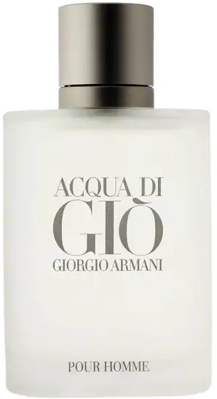
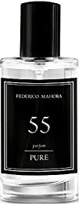
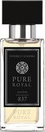

<h1>Catálogo PURE Hombres</h1>

Una fragancia perfectamente combinada es la firma de todo hombre, define su ego, su personalidad y subraya su temperamento. 🔥 Es tan importante como un traje a medida. 🌟

**Síguenos en nuestras redes sociales y haz tus pedidos desde nuestro WhatsApp🌟🌟🌟**

  

### INTENSE

¿Quieres oler bien más tiempo y más interesante? Estás buscando una fragancia duradera... muy duradera... ¡Elige **INTENSE**! ¡Disfruta de tu aroma favorito durante un tiempo increiblemente largo! ¡Concentración de hasta un **30%**!.

### PHEROMONE

¿Quieres seducir con tu olor? ¿Buscas ese último detalle antes de una cita? ¡Quédate en la memoria de los demás! ¡Gracias a este perfume, nadie te será indiferente!. Las **feromonas** son sustancias inodoros que se agregan a los perfumes para intensificar los efectos estimulantes. Son un arma secreta cuya misión es aumentar la atracción y la autoconfianza. ¡La seducción nunca ha sido tan fácil!.

## Colección PURE

**PURE** es una línea de perfumes de la marca **Federico Mahora** con un 20% de concentración embotellados en unos elegantes frascos de 50 ml. Esta galería aromática presenta hasta más de 85 composiciones diferentes que esconden una riqueza de notas aromáticas incomparable. ✨

### Pure 52

#### **DISPONIBLE TAMBIÉN EN "INTENSE" Y "PHEROMONE"**.

- **Carácter**: Atractivo, cautivador.
- **Notas aromáticas** 
- **Salida**: manzana, bergamota, menta.
- **Corazón**: Jazmín, pelargonio, lavanda.
- **Fondo**: Canela, clavo, almizcle.
- **Familia olfativa**: Oriental.
- **Tipo de perfume**: Atrevido.
- **Capacidad**: 50 ml.
- **Concentración**: 20%.
- **Ingredientes**: Alcohol denat., Fragrance/Parfum, Linalool, Limonene, Coumarin, Citronellol, Citral, Eugenol, Geraniol, Cinnamal.

<table class="tablem" cellspacing="8" cellpadding="8">

<tbody>

<tr>

<td width="">

</td>

<td width="">

</td>

</tr>
</tbody>
</table>

### Pure 457

#### **DISPONIBLE TAMBIÉN EN "INTENSE" Y "PHEROMONE"**.

- **Carácter**: Fresco, minimalista.
- **Notas aromáticas** 
- **Salida**: Pomelo, mandarina, notas acuosas.
- **Corazón**: Jazmín, hoja de laurel.
- **Fondo**: Ámbar gris, pachuli, musgo de roble.
- **Familia olfativa**: Amaderada.
- **Tipo de perfume**: Deportivo.
- **Capacidad**: 50 ml.
- **Concentración**: 20%.
- **Ingredientes**: Alcohol denat., Fragrance/Parfum, Water/Aqua, Benzyl Salicylate, Limonene, Linalool, Coumarin, Butylphenyl Methylpropional, Citronellol, Geraniol,Alpha-Isomethyl Ionone, Citral, Eugenol, Benzyl Benzoate.

<table class="tablem" cellspacing="8" cellpadding="8">

<tbody>

<tr>

<td width="">

</td>

<td width="">

</td>

</tr>
</tbody>
</table>

### Pure 705

- **Carácter**: Fresco, intemporal, desinhibido.
- **Notas aromáticas** 
- **Salida**: Limón, manzana, albahaca, bergamota.
- **Corazón**: Rosa, pimienta, jazmín, cardamomo, nuez moscada, lirio de los valles.
- **Fondo**: Árbol de cedro, almizcle, vainilla.
- **Familia olfativa**: Amaderada.
- **Tipo de perfume**: Libre.
- **Capacidad**: 50 ml.
- **Concentración**: 20%.
- **Ingredientes**: Alcohol denat., Fragrance/Parfum, Linalool, Limonene, Coumarin, Geraniol, Citronellol, Eugenol, Citral, Cinnamal, Isoeugenol.

<table class="tablem" cellspacing="8" cellpadding="8">

<tbody>

<tr>

<td width="">

</td>

<td width="">

</td>

</tr>
</tbody>
</table>

### Pure 134

#### **DISPONIBLE TAMBIÉN EN "INTENSE" Y "PHEROMONE"**.

- **Carácter**: Refrescante, cautivador.
- **Notas aromáticas** 
- **Salida**: Naranja amarga, limón, bergamota.
- **Corazón**: Romero, hierba marina, violeta.
- **Fondo**: Pachuli, cedro, ámbar gris.
- **Familia olfativa**: Cítrica.
- **Tipo de perfume**: Ligero.
- **Capacidad**: 50 ml.
- **Concentración**: 24%.
- **Ingredientes**: Alcohol denat., Fragrance/Parfum, Linalool, Limonene, Butylphenyl Methylpropional, Alpha-Isomethyl Ionone, Benzyl Salicylate, Geraniol, Citronellol, Citral, Eugenol, Evernia Furfuracea Extract, Hydroxycitronellal, Benzyl Benzoate, Farnesol.

<table class="tablem" cellspacing="8" cellpadding="8">

<tbody>

<tr>

<td width="">

</td>

<td width="">

</td>

</tr>
</tbody>
</table>

### Pure 135

#### **DISPONIBLE TAMBIÉN EN "PHEROMONE"**.

- **Carácter**: Sorprendente, intenso.
- **Notas aromáticas** 
- **Salida**: Naranja amarga, mandarina.
- **Corazón**: Santolina, hierba marina.
- **Fondo**: Ámbar gris, notas amaderadas.
- **Familia olfativa**: Fougère.
- **Tipo de perfume**: Ligero.
- **Capacidad**: 50 ml.
- **Concentración**: 20%.
- **Ingredientes**: Alcohol Denat., Fragrance/Parfum, Limonene, Butylphenyl Methylpropional, Linalool, Benzyl Salicylate, Hexyl Cinnamal, Hydroxyisohexyl 3-Cyclohexene Carboxaldehyde, Citral, Geraniol, Citronellol.

<table class="tablem" cellspacing="8" cellpadding="8">

<tbody>

<tr>

<td width="">

</td>

<td width="">

</td>

</tr>
</tbody>
</table>

### Pure 473

#### **DISPONIBLE TAMBIÉN EN "INTENSE" Y "PHEROMONE"**.

- **Carácter**: Limpio, energético.
- **Notas aromáticas** 
- **Salida**: Notas acuosas, romero.
- **Corazón**: Cardamomo, secuoya.
- **Fondo**: Almizcle, pachuli.
- **Familia olfativa**: Acuosa.
- **Tipo de perfume**: Deportivo.
- **Capacidad**: 50 ml.
- **Concentración**: 20%.
- **Ingredientes**: Alcohol Denat., Fragrance/Parfum, Limonene, Linalool, Butylphenyl Methylpropional, Benzyl Salicylate, Geraniol, Citral.

<table class="tablem" cellspacing="8" cellpadding="8">

<tbody>

<tr>

<td width="">

</td>

<td width="">

</td>

</tr>
</tbody>
</table>

### Pure 64

#### **DISPONIBLE TAMBIÉN EN "INTENSE" Y "PHEROMONE"**.

- **Carácter**: Elegante y sensual.
- **Notas aromáticas** 
- **Salida**: Mandarina, cedro, anís.
- **Corazón**: Romero, flor de olivo.
- **Fondo**: Almizcle, guayaco, haba Tonka.
- **Familia olfativa**: Oriental.
- **Tipo de perfume**: Elegante.
- **Capacidad**: 50 ml.
- **Concentración**: 24%.
- **Ingredientes**: Alcohol denat., Fragrance/Parfum, Limonene, Linalool, Coumarin, Hydroxycitronellal, Hydroxyisohexyl 3-Cyclohexene Carboxaldehyde, Butylphenyl Methylpropional, Alpha-Isomethyl Ionone, Hexyl Cinnamal, Citronellol, Citral, Geraniol.

<table class="tablem" cellspacing="8" cellpadding="8">

<tbody>

<tr>

<td width="">

</td>

<td width="">

</td>

</tr>
</tbody>
</table>

### Pure 224

- **Carácter**: Dulce, seductor.
- **Notas aromáticas** 
- **Salida**: Bergamota, pomelo, hierba.
- **Corazón**: Azafrán, violeta, jazmín, nuez moscada.
- **Fondo**: Azúcar de caña, vainilla, ámbar gris.
- **Familia olfativa**: Oriental.
- **Tipo de perfume**: Atrevido.
- **Capacidad**: 50 ml.
- **Concentración**: 20%.
- **Ingredientes**: Alcohol denat., Fragrance/Parfum, Hydroxycitronellal, Linalool, Coumarin, Benzyl Benzoate, Limonene, Alpha-Isomethyl Ionone, Metal 2-Octynoate, Geraniol, Citral.

<table class="tablem" cellspacing="8" cellpadding="8">

<tbody>

<tr>

<td width="">

</td>

<td width="">

</td>

</tr>
</tbody>
</table>

### Pure 472

#### **DISPONIBLE TAMBIÉN EN "INTENSE" Y "PHEROMONE"**.

- **Carácter**: Fresco y energético.
- **Notas aromáticas** 
- **Salida**: Hojas de grosella, fresia, frambuesa, mandarina.
- **Corazón**: Iris, violeta, mimosa.
- **Fondo**: Sándalo, vainilla, almizcle.
- **Familia olfativa**: Floral.
- **Tipo de perfume**: Deportivo.
- **Capacidad**: 50 ml.
- **Concentración**: 20%.
- **Ingredientes**: Alcohol denat., Fragrance/Parfum, Benzyl Salicylate, Limonene, Hexyl Cinnamal, Cinnamyl Alcohol, Benzyl Benzoate, Linalool, Benzyl Cinnamate.

<table class="tablem" cellspacing="8" cellpadding="8">

<tbody>

<tr>

<td width="">

</td>

<td width="">

</td>

</tr>
</tbody>
</table>

### Pure 471

- **Carácter**: Provocativo, extremo.
- **Notas aromáticas** 
- **Salida**: Pimienta rosa, pomelo, mandarina.
- **Corazón**: Café, plumeria, peonía.
- **Fondo**: Almizcle, vainilla, notas amaderadas.
- **Familia olfativa**: Oriental.
- **Tipo de perfume**: Sexy.
- **Capacidad**: 50 ml.
- **Concentración**: 24%.
- **Ingredientes**: Alcohol denat., Fragrance/Parfum, Benzyl Salicylate, Hexyl Cinnamal, Hydroxycitronellal, Benzyl Benzoate, Linalool, Coumarin, Limonene, Citronellol, Benzyl Alcohol, Farnesol, Citral, Amyl Cinnamal, Geraniol.

<table class="tablem" cellspacing="8" cellpadding="8">

<tbody>

<tr>

<td width="">

</td>

<td width="">

</td>

</tr>
</tbody>
</table>

### Pure 480

- **Carácter**: Penetrante, seductor.
- **Notas aromáticas** 
- **Salida**: Lichi, lirio, mandarina.
- **Corazón**: Polianthes tuberosa.
- **Fondo**: Sándalo, almizcle.
- **Familia olfativa**: Oriental.
- **Tipo de perfume**: Elegante.
- **Capacidad**: 50 ml.
- **Concentración**: 20%.
- **Ingredientes**: Alcohol denat., Fragrance/Parfum, Hexyl Cinnamal, Benzyl Salicylate, Limonene, Geraniol, Butylphenyl Methylpropional, Linalool, Hydroxycitronellal, Citronellol, Benzyl Alcohol, Coumarin, Citral, Amyl Cinnamal, Benzyl Benzoate, Isoeugenol, Benzyl Cinnamate.

<table class="tablem" cellspacing="8" cellpadding="8">

<tbody>

<tr>

<td width="">

</td>

<td width="">

</td>

</tr>
</tbody>
</table>

### Pure 490

- **Carácter**: Intenso, vintage.
- **Notas aromáticas** 
- **Salida**: Aldehído, notas afrutadas, cítricos.
- **Corazón**: Lirio, heliotropo, jazmín, polianthes tuberosa.
- **Fondo**: Almizcle, madera tropical.
- **Familia olfativa**: Oriental.
- **Tipo de perfume**: Dulce.
- **Capacidad**: 50 ml.
- **Concentración**: 20%.
- **Ingredientes**: Alcohol denat., Fragrance/Parfum, Benzyl Salicylate, Linalool, Butylphenyl Methylpropional, Coumarin, Citronellol, Geraniol, Hexyl Cinnamal, Benzyl Benzoate, Cinnamyl Alcohol, Amyl Cinnamal, Eugenol, Benzyl Cinnamate, Hydroxycitronellal, Limonene, Benzyl Alcohol, Citral.

<table class="tablem" cellspacing="8" cellpadding="8">

<tbody>

<tr>

<td width="">

</td>

<td width="">

</td>

</tr>
</tbody>
</table>

### Pure 719

- **Carácter**: Elegante, sorprendente.
- **Notas aromáticas** 
- **Salida**: Rosa, madreselva, mandarinas.
- **Corazón**: Margarita, jazmín.
- **Fondo**: Almizcle, pachuli.
- **Familia olfativa**: Oriental.
- **Tipo de perfume**: Elegante.
- **Capacidad**: 50 ml.
- **Concentración**: 20%.
- **Ingredientes**: Alcohol denat., Fragrance/Parfum, Benzyl Salicylate, Linalool, Limonene, Butylphenyl Methylpropional, Hexyl Cinnamal, Citronellol, Alpha-Isomethyl Ionone, Geraniol, Eugenol, Isoeugenol, Citral, Benzyl Alcohol, Benzyl Benzoate.

<table class="tablem" cellspacing="8" cellpadding="8">

<tbody>

<tr>

<td width="">

</td>

<td width="">

</td>

</tr>
</tbody>
</table>

### Pure 483

- **Carácter**: Seductor, variable.
- **Notas aromáticas** 
- **Salida**: Lichi, frambuesa, rosa.
- **Corazón**: Fresia, lirio, cedro.
- **Fondo**: Vainilla, ámbar gris, vetiver.
- **Familia olfativa**: Floral.
- **Tipo de perfume**: Misterioso.
- **Capacidad**: 50 ml.
- **Concentración**: 24%.
- **Ingredientes**: Alcohol denat., Fragrance/Parfum, Hexyl Cinnamal, Limonene, Alpha-Isomethyl Ionone, Geraniol, Citronellol, Linalool, Butylphenyl Methylpropional, Coumarin, Benzyl Benzoate, Citral, Eugenol.

<table class="tablem" cellspacing="8" cellpadding="8">

<tbody>

<tr>

<td width="">

</td>

<td width="">

</td>

</tr>
</tbody>
</table>

### Pure 452

- **Carácter**: Muy refrescante, intermitente.
- **Notas aromáticas** 
- **Salida**: Aldehído, menta, cítricos, notas acuosas.
- **Corazón**: Neroli, cedro, pimienta, ciprés.
- **Fondo**: Haba Tonka, vainilla, vetiver.
- **Familia olfativa**: Cítrica.
- **Tipo de perfume**: Deportiva.
- **Capacidad**: 50 ml.
- **Concentración**: 20%.
- **Ingredientes**: Alcohol denat., Fragrance/Parfum, Linalool, Limonene, Coumarin, Alpha-Isomethyl Ionone, Citronellol, Citral, Geraniol, Cinnamal.

<table class="tablem" cellspacing="8" cellpadding="8">

<tbody>

<tr>

<td width="">

</td>

<td width="">

</td>

</tr>
</tbody>
</table>

### Pure 110

#### **DISPONIBLE TAMBIÉN EN "INTENSE" Y "PHEROMONE"**.

- **Carácter**: Algo atrevido, rebelde.
- **Notas aromáticas** 
- **Salida**: Lavanda, bergamota, cardamomo.
- **Corazón**: Flor de azahar, lirio.
- **Fondo**: Almizcle, ámbar gris, vainilla.
- **Familia olfativa**: Chypre.
- **Tipo de perfume**: Libre.
- **Capacidad**: 50 ml.
- **Concentración**: 24%.
- **Ingredientes**: Alcohol denat., Fragrance/Parfum, Linalool, Butylphenyl Methylpropional, Alpha-Isomethyl Ionone, Coumarin, Limonene, Geraniol.

<table class="tablem" cellspacing="8" cellpadding="8">

<tbody>

<tr>

<td width="">

</td>

<td width="">

</td>

</tr>
</tbody>
</table>

### Pure 474

- **Carácter**: Fresco y energético.
- **Notas aromáticas** 
- **Salida**: Limón, enebro, cardamomo.
- **Corazón**: Manzana, lavanda, geranio.
- **Fondo**: Cedro, vainilla, haba Tonka.
- **Familia olfativa**: Fougère.
- **Tipo de perfume**: Juvenil.
- **Capacidad**: 50 ml.
- **Concentración**: 20%.
- **Ingredientes**: Alcohol denat., Fragrance/Parfum, Water/Aqua, Hexyl Cinnamal, Linalool, Limonene, Benzyl Salicylate, Coumarin,  lpha-Isomethyl Ionone, Citral, Citronellol, Geraniol, Benzyl Alcohol.

<table class="tablem" cellspacing="8" cellpadding="8">

<tbody>

<tr>

<td width="">

</td>

<td width="">

</td>

</tr>
</tbody>
</table>

### Pure 57

- **Carácter**: Magistral, lleno de sol.
- **Notas aromáticas** 
- **Salida**: Ciruela, manzana, bergamota.
- **Corazón**: Canela, pimienta rosa.
- **Fondo**: Vainilla, ron de Jamaica.
- **Familia olfativa**: Cítrica.
- **Tipo de perfume**: Elegante.
- **Capacidad**: 50 ml.
- **Concentración**: 20%.
- **Ingredientes**: Alcohol denat., Fragrance/Parfum, Linalool, Limonene, Alpha-Isomethyl Ionone, Citronellol, Cinnamal, Geraniol, Citral, Eugenol.

<table class="tablem" cellspacing="8" cellpadding="8">

<tbody>

<tr>

<td width="">

</td>

<td width="">

</td>

</tr>
</tbody>
</table>

### Pure 56

#### **DISPONIBLE TAMBIÉN EN "INTENSE" Y "PHEROMONE"**.

- **Carácter**: Vibrante, despierta los sentidos.
- **Notas aromáticas** 
- **Salida**: Pomelo, lavanda, fl or de nuez moscada, madreselva.
- **Corazón**: Frambuesa, heliotropo, clavo.
- **Fondo**: Cedro, resina, enebro.
- **Familia olfativa**: Chypre.
- **Tipo de perfume**: Decidido.
- **Capacidad**: 50 ml.
- **Concentración**: 20%.
- **Ingredientes**: Alcohol denat., Fragrance/Parfum, Limonene, Linalool, Coumarin, Geraniol, Eugenol, Citral, Isoeugenol, Cinnamyl Alcohol.

<table class="tablem" cellspacing="8" cellpadding="8">

<tbody>

<tr>

<td width="">

</td>

<td width="">

</td>

</tr>
</tbody>
</table>

### Pure 55

- **Carácter**: Ligero a la vez que elegante.
- **Notas aromáticas** 
- **Salida**: Cilantro, manzana.
- **Corazón**: Incienso, pimienta de Sichuan.
- **Fondo**: Vainilla, notas amaderadas.
- **Familia olfativa**: Amaderada.
- **Tipo de perfume**: Empresarial.
- **Capacidad**: 50 ml.
- **Concentración**: 20%.
- **Ingredientes**: Alcohol denat., Fragrance/Parfum, Limonene, Linalool, Hydroxyisohexyl 3-Cyclohexene Carboxaldehyde, Citral, Eugenol, Geraniol, Citronellol.

<table class="tablem" cellspacing="8" cellpadding="8">

<tbody>

<tr>

<td width="">

</td>

<td width="">

</td>

</tr>
</tbody>
</table>

### Pure 482

- **Carácter**: Elegante y sensual.
- **Notas aromáticas** 
- **Salida**: Mandarina, cedro, anís.
- **Corazón**: Romero, flor de olivo.
- **Fondo**: Almizcle, guayaco, haba Tonka.
- **Familia olfativa**: Oriental.
- **Tipo de perfume**: Elegante.
- **Capacidad**: 50 ml.
- **Concentración**: 20%.
- **Ingredientes**: Alcohol denat., Fragrance/Parfum, Limonene, Linalool, Coumarin, Hydroxycitronellal, Hydroxyisohexyl 3-Cyclohexene Carboxaldehyde, Butylphenyl Methylpropional, Alpha-Isomethyl Ionone, Hexyl Cinnamal, Citronellol, Citral, Geraniol.

<table class="tablem" cellspacing="8" cellpadding="8">

<tbody>

<tr>

<td width="">

</td>

<td width="">

</td>

</tr>
</tbody>
</table>

### Pure 43

#### **DISPONIBLE TAMBIÉN EN "INTENSE"**.

- **Carácter**: Energético, cautivador.
- **Notas aromáticas** 
- **Salida**: Mandarina, kumquat, pimienta rosa.
- **Corazón**: Cilantro, fresia, cardamomo.
- **Fondo**: Notas a cuero, árbol de Jacarandá.
- **Familia olfativa**: Fougère.
- **Tipo de perfume**: Deportivo.
- **Capacidad**: 50 ml.
- **Concentración**: 24%.
- **Ingredientes**: Alcohol denat., Fragrance/Parfum, Butylphenyl Methylpropional, Limonene, Linalool, Citral, Geraniol.

<table class="tablem" cellspacing="8" cellpadding="8">

<tbody>

<tr>

<td width="">

</td>

<td width="">

</td>

</tr>
</tbody>
</table>

### Pure 54

- **Carácter**: Ambiguo, fresco.
- **Notas aromáticas** 
- **Salida**: Menta, bergamota, ron.
- **Corazón**: Cedro, salvia, lavanda.
- **Fondo**: Musgo de roble, vetiver, gamuza.
- **Familia olfativa**: Fougère.
- **Tipo de perfume**: Empresarial.
- **Capacidad**: 50 ml.
- **Concentración**: 24%.
- **Ingredientes**: Alcohol denat., Fragrance/Parfum, Limonene, Linalool, Butylphenyl Methylpropional, Hydroxyisohexyl
3-Cyclohexene Carboxaldehyde, Alpha-Isomethyl Ionone, Eugenol, Citral, Hexyl Cinnamal, Evernia Furfuracea Extract, Geraniol, Evernia Prunastri Extract, Citronellol, Coumarin.

<table class="tablem" cellspacing="8" cellpadding="8">

<tbody>

<tr>

<td width="">

</td>

<td width="">

</td>

</tr>
</tbody>
</table>

### Pure 93

- **Carácter**: Moderno, despierto.
- **Notas aromáticas** 
- **Salida**: Piña, romero, bergamota.
- **Corazón**: Ciclamen, lavanda, jazmín, jengibre.
- **Fondo**: Musgo de roble, hiedra.
- **Familia olfativa**: Cítrica.
- **Tipo de perfume**: Ligero.
- **Capacidad**: 50 ml.
- **Concentración**: 20%.
- **Ingredientes**: Alcohol denat., Fragrance/Parfum, Linalool, Benzyl Benzoate, Limonene, Butylphenyl Methylpropional, Coumarin, Citral, Geraniol, Eugenol, Isoeugenol, Citronellol.

<table class="tablem" cellspacing="8" cellpadding="8">

<tbody>

<tr>

<td width="">

</td>

<td width="">

</td>

</tr>
</tbody>
</table>

### Pure 475

- **Carácter**: Aromático, intenso.
- **Notas aromáticas** 
- **Salida**: Anís estrellado, pimienta roja, pomelo.
- **Corazón**: Frambuesa, lavanda.
- **Fondo**: Heliotropo, vetiver.
- **Familia olfativa**: Fougère.
- **Tipo de perfume**: Decidido.
- **Capacidad**: 50 ml.
- **Concentración**: 20%.
- **Ingredientes**: Alcohol denat., Fragrance/Parfum, Limonene, Linalool, Butylphenyl Methylpropional, Coumarin, Citronellol, Citral, Geraniol.

<table class="tablem" cellspacing="8" cellpadding="8">

<tbody>

<tr>

<td width="">

</td>

<td width="">

</td>

</tr>
</tbody>
</table>

### Pure 481

- **Carácter**: Dulce, seductor.
- **Notas aromáticas** 
- **Salida**: Bergamota, pomelo, hierba.
- **Corazón**: Azafrán, violeta, jazmín, nuez moscada.
- **Fondo**: Azúcar de caña, vainilla, ámbar gris.
- **Familia olfativa**: Oriental.
- **Tipo de perfume**: Atrevido.
- **Capacidad**: 50 ml.
- **Concentración**: 20%.
- **Ingredientes**: Alcohol denat., Fragrance/Parfum, Hydroxycitronellal, Linalool, Coumarin, Benzyl Benzoate, Limonene, Alpha-Isomethyl Ionone, Metal 2-Octynoate, Geraniol, Citral.

<table class="tablem" cellspacing="8" cellpadding="8">

<tbody>

<tr>

<td width="">

</td>

<td width="">

</td>

</tr>
</tbody>
</table>

### Pure 479

- **Carácter**: Refrescante, cautivador.
- **Notas aromáticas** 
- **Salida**: Naranja amarga, limón, bergamota.
- **Corazón**: Romero, hierba marina, violeta.
- **Fondo**: Pachuli, cedro, ámbar gris.
- **Familia olfativa**: Cítrica.
- **Tipo de perfume**: Ligero.
- **Capacidad**: 50 ml.
- **Concentración**: 24%.
- **Ingredientes**: Alcohol denat., Fragrance/Parfum, Linalool, Limonene, Butylphenyl Methylpropional, Alpha-Isomethyl Ionone, Benzyl Salicylate, Geraniol, Citronellol, Citral, Eugenol, Evernia Furfuracea Extract, Hydroxycitronellal, Benzyl Benzoate, Farnesol.

<table class="tablem" cellspacing="8" cellpadding="8">

<tbody>

<tr>

<td width="">

</td>

<td width="">

</td>

</tr>
</tbody>
</table>

### Pure 478

- **Carácter**: Limpio, energético.
- **Notas aromáticas** 
- **Salida**: Notas acuosas, romero.
- **Corazón**: Cardamomo, secuoya.
- **Fondo**: Almizcle, pachuli.
- **Familia olfativa**: Acuosa.
- **Tipo de perfume**: Elegante.
- **Capacidad**: 50 ml.
- **Concentración**: 20%.
- **Ingredientes**: Alcohol Denat., Fragrance/Parfum, Limonene, Linalool, Butylphenyl Methylpropional, Benzyl Salicylate, Geraniol, Citral.

<table class="tablem" cellspacing="8" cellpadding="8">

<tbody>

<tr>

<td width="">

</td>

<td width="">

</td>

</tr>
</tbody>
</table>

### Pure 704

- **Carácter**: Extravertido, embriagador.
- **Notas aromáticas** 
- **Salida**: Bergamota, pomelo, resina de elemí.
- **Corazón**: Pimiento, canela, azafrán.
- **Fondo**: Notas a cuero, vetiver, tabaco.
- **Familia olfativa**: Oriental.
- **Tipo de perfume**: Decidido.
- **Capacidad**: 50 ml.
- **Concentración**: 20%.
- **Ingredientes**: Alcohol denat., Fragrance/Parfum, Water/Aqua, Limonene, Coumarin, Linalool, Eugenol, Citronellol, Cinnamal, Geraniol, Citral.

<table class="tablem" cellspacing="8" cellpadding="8">

<tbody>

<tr>

<td width="">

</td>

<td width="">

</td>

</tr>
</tbody>
</table>

### Pure 721

- **Carácter**: Abierto, positivo, emprendedor.
- **Notas aromáticas** 
- **Salida**: Mandarina, melón, naranja, limón, lavanda, salvia, manzana verde.
- **Corazón**: Cilantro, jazmín, fresia, cardamomo, canela, pimienta.
- **Fondo**: Haba tonka, cedro, ámbar, almizcle, rosa de roca (cistus).
- **Familia olfativa**: Oriental.
- **Tipo de perfume**: Atrevido.
- **Capacidad**: 50 ml.
- **Concentración**: 20%.
- **Ingredientes**: Alcohol denat., Fragrance/Parfum, Water/Aqua, Limonene, Coumarin, Linalool, Eugenol, Citronellol, Cinnamal, Geraniol, Citral.

<table class="tablem" cellspacing="8" cellpadding="8">

<tbody>

<tr>

<td width="">

</td>

<td width="">

</td>

</tr>
</tbody>
</table>

## Colección PURE ROYAL
La nueva línea **PURE ROYAL**, fascina con nuevas y refinadas fragancias, así como las de la apreciada colección de Lujo. Aromas de distinción aromática y elegancia sublime, incluye perfumes para ella y para él, con hasta un 30% de concentración, sellados en frascos en un diseño exquisito y estiloso. Una verdadera galería aromática que, junto con la colección de lujo incluye maravillas y diferentes fragancias.

### Pure ROYAL 151

- **Carácter**: Sutil, imponente.
- **Notas aromáticas** 
- **Salida**: Limón, bergamota, jengibre.
- **Corazón**: Cedro, ámbar.
- **Fondo**: Geranio, almizcle.
- **Familia olfativa**: Amaderada.
- **Tipo de perfume**: Empresarial.
- **Capacidad**: 50 ml.
- **Concentración**: 20%.
- **Ingredientes**: Alcohol denat., Fragrance/Parfum, Water/Aqua, Limonene, Butylphenyl Methylpropional, Alpha-Isomethyl Ionone, Coumarin, Geraniol, Linalool, Citral.

<table class="tablem" cellspacing="8" cellpadding="8">

<tbody>

<tr>

<td width="">

</td>

<td width="">

</td>

</tr>
</tbody>
</table>

### Pure ROYAL 814

- **Carácter**: Elegante y sensual.
- **Notas aromáticas** 
- **Salida**: Mandarina, cedro, anís.
- **Corazón**: Romero, flor de olivo.
- **Fondo**: Almizcle, guayaco, haba Tonka.
- **Familia olfativa**: Oriental.
- **Tipo de perfume**: Elegante.
- **Capacidad**: 50 ml.
- **Concentración**: 20%.
- **Ingredientes**: Alcohol denat., Fragrance/Parfum, Limonene, Linalool, Coumarin, Hydroxycitronellal, Hydroxyisohexyl 3-Cyclohexene Carboxaldehyde, Butylphenyl Methylpropional, Alpha-Isomethyl Ionone, Hexyl Cinnamal, Citronellol, Citral, Geraniol.

<table class="tablem" cellspacing="8" cellpadding="8">

<tbody>

<tr>

<td width="">

</td>

<td width="">

</td>

</tr>
</tbody>
</table>

### Pure ROYAL 831

- **Carácter**:  Transparente, fresco, liso.
- **Notas aromáticas** 
- **Salida**: Bergamota, mandarina, notas verdes.
- **Corazón**: Lavanda, ruibarbo, flor de manzana.
- **Fondo**: Sándalo, musgo de roble, cedro, almizcle.
- **Familia olfativa**: Oriental.
- **Tipo de perfume**: Limpio.
- **Capacidad**: 50 ml.
- **Concentración**: 20%.
- **Ingredientes**: Alcohol denat., Fragrance/Parfum, Limonene, Linalool, Coumarin, Hydroxycitronellal, Hydroxyisohexyl 3-Cyclohexene Carboxaldehyde, Butylphenyl Methylpropional, Alpha-Isomethyl Ionone, Hexyl Cinnamal, Citronellol, Citral, Geraniol.

<table class="tablem" cellspacing="8" cellpadding="8">

<tbody>

<tr>

<td width="">

</td>

<td width="">

</td>

</tr>
</tbody>
</table>

### Pure ROYAL 837

- **Carácter**:  Atractivo, cautivador.
- **Notas aromáticas** 
- **Salida**: Manzana, bergamota, menta.
- **Corazón**: Jazmín, pelargonio, lavanda.
- **Fondo**: Canela, clavo, almizcle.
- **Familia olfativa**: Oriental.
- **Tipo de perfume**: Atrevido.
- **Capacidad**: 50 ml.
- **Concentración**: 20%.
- **Ingredientes**: Alcohol denat., Fragrance/Parfum, Linalool, Limonene, Coumarin, Citronellol, Citral, Eugenol, Geraniol, Cinnamal.

<table class="tablem" cellspacing="8" cellpadding="8">

<tbody>

<tr>

<td width="">

</td>

<td width="">

</td>

</tr>
</tbody>
</table>

### Pure ROYAL 838

- **Carácter**:  Imperioso, expresivo, intransigente.
- **Notas aromáticas** 
- **Salida**: Bergamota, neroli.
- **Corazón**: Azahar, cedro.
- **Fondo**: Cuero, almizcle blanco, ámbar, ámbar gris, notas amaderadas.
- **Familia olfativa**: Elegante.
- **Tipo de perfume**: Expresivo.
- **Capacidad**: 50 ml.
- **Concentración**: 24%.
- **Ingredientes**: Alcohol denat., Fragrance/Parfum, Linalool, Limonene, Coumarin, Citronellol, Citral, Eugenol, Geraniol, Cinnamal.

<table class="tablem" cellspacing="8" cellpadding="8">

<tbody>

<tr>

<td width="">

</td>

<td width="">

</td>

</tr>
</tbody>
</table>

### Pure ROYAL 332

- **Carácter**:  Suave, lleno de energía.
- **Notas aromáticas** 
- **Salida**: Manzana verde, menta, mandarina.
- **Corazón**: Jengibre, salvia, helecho.
- **Fondo**: Musgo de roble, almizcle, sándalo.
- **Familia olfativa**: Fougère.
- **Tipo de perfume**: Deportivo.
- **Capacidad**: 50 ml.
- **Concentración**: 24%.
- **Ingredientes**: Alcohol denat., Fragrance/Parfum, Water/Aqua, Linalool, Benzyl Salicylate, Limonene, Hydroxycitronellal, Coumarin, Alpha-Isomethyl Ionone, Geraniol, Citral, Citronellol.

<table class="tablem" cellspacing="8" cellpadding="8">

<tbody>

<tr>

<td width="">

</td>

<td width="">

</td>

</tr>
</tbody>
</table>

### Pure ROYAL 199

- **Carácter**:  Opulento, pluridimensional.
- **Notas aromáticas** 
- **Salida**: Mandarina italiana, menta piperita.
- **Corazón**: Canela, rosa de Turquía, cardamomo.
- **Fondo**: Notas a cuero.
- **Familia olfativa**: Oriental.
- **Tipo de perfume**: Elegante.
- **Capacidad**: 50 ml.
- **Concentración**: 20%.
- **Ingredientes**: Alcohol denat., Fragrance/Parfum, Water/Aqua, Butylphenyl Methylpropional, Coumarin, Limonene, Alpha-Isomethyl Ionone, Hydroxycitronellal, Linalool, Citral, Eugenol, Cinnamal, Benzyl Alcohol, Isoeugenol, Geraniol.

<table class="tablem" cellspacing="8" cellpadding="8">

<tbody>

<tr>

<td width="">

</td>

<td width="">

</td>

</tr>
</tbody>
</table>

### Pure ROYAL 335

- **Carácter**:  Expresivo, moderno.
- **Notas aromáticas** 
- **Salida**: Palo Santo, cardamomo, pimienta.
- **Corazón**: Vetiver, madera de oud.
- **Fondo**: Vainilla, ámbar gris.
- **Familia olfativa**: Oriental.
- **Tipo de perfume**: Empresarial.
- **Capacidad**: 50 ml.
- **Concentración**: 20%.
- **Ingredientes**: Alcohol denat., Fragrance/Parfum, Water/Aqua, Linalool, Hydroxyisohexyl 3-Cyclohexene Carboxaldehyde, Butylphenyl Methylpropional, Coumarin, Limonene.

<table class="tablem" cellspacing="8" cellpadding="8">

<tbody>

<tr>

<td width="">

</td>

<td width="">

</td>

</tr>
</tbody>
</table>

### Pure ROYAL 169

- **Carácter**:  Relajante, especiado.
- **Notas aromáticas** 
- **Salida**: Mandarina siciliana.
- **Corazón**: Romero, Palo Santo, pimienta de Sichuan.
- **Fondo**: Incienso, musgo de roble.
- **Familia olfativa**: Chypre.
- **Tipo de perfume**: Ligero.
- **Capacidad**: 50 ml.
- **Concentración**: 20%.
- **Ingredientes**: Alcohol denat., Fragrance/Parfum, Water/Aqua, Linalool, Limonene, Butylphenyl Methylpropional, Alpha-Isomethyl Ionone, Hexyl Cinnamal, Geraniol, Citral, Citronellol.

<table class="tablem" cellspacing="8" cellpadding="8">

<tbody>

<tr>

<td width="">

</td>

<td width="">

</td>

</tr>
</tbody>
</table>

### Pure ROYAL 160

- **Carácter**:  Suave, sorprendente.
- **Notas aromáticas** 
- **Salida**: Hoja de tomatera, flores acuáticas, grosella negra.
- **Corazón**: Pimienta negra, rosa.
- **Fondo**: Pachuli.
- **Familia olfativa**: Amaderado.
- **Tipo de perfume**: Ligero.
- **Capacidad**: 50 ml.
- **Concentración**: 20%.
- **Ingredientes**: Alcohol denat., Fragrance/Parfum, Water/Aqua, Linalool, Limonene, Butylphenyl Methylpropional, Citral, Geraniol.

<table class="tablem" cellspacing="8" cellpadding="8">

<tbody>

<tr>

<td width="">

</td>

<td width="">

</td>

</tr>
</tbody>
</table>

### Pure ROYAL 327

- **Carácter**:  Indomable e intenso.
- **Notas aromáticas** 
- **Salida**: Pomelo, pimienta rosa.
- **Corazón**: Nuez moscada, jengibre, jazmín.
- **Fondo**: Vetiver, pachuli, labdanum.
- **Familia olfativa**: Amaderado.
- **Tipo de perfume**: Decidido.
- **Capacidad**: 50 ml.
- **Concentración**: 20%.
- **Ingredientes**: Alcohol denat., Fragrance/Parfum, Water/Aqua, Hexyl Cinnamal, Limonene, Linalool, Butylphenyl Methylpropional, Citronellol, Coumarin, Citral, Geraniol, Benzyl Alcohol, Eugenol, Amyl Cinnamal, Isoeugenol.

<table class="tablem" cellspacing="8" cellpadding="8">

<tbody>

<tr>

<td width="">

</td>

<td width="">

</td>

</tr>
</tbody>
</table>

### Pure ROYAL 813

- **Carácter**:  Emocionante y clásico.
- **Notas aromáticas** 
- **Salida**: Jazmín, limón, menta, bergamota.
- **Corazón**: Ajenjo, lavanda, café.
- **Fondo**: Almizcle, árbol de sándalo, haba Tonka, pachuli, vainilla, ámbar, musgo.
- **Familia olfativa**: Cítrico.
- **Tipo de perfume**: Fresco.
- **Capacidad**: 50 ml.
- **Concentración**: 20%.
- **Ingredientes**: Alcohol denat., Fragrance/Parfum, Water/Aqua, Linalool, Limonene, Butylphenyl Methylpropional, Citral, Geraniol.

<table class="tablem" cellspacing="8" cellpadding="8">

<tbody>

<tr>

<td width="">

</td>

<td width="">

</td>

</tr>
</tbody>
</table>

### Pure ROYAL 822

- **Carácter**:  Atrevido, multidimensional, adictivo.
- **Notas aromáticas** 
- **Salida**: Mandarina, incienso, pimienta.
- **Corazón**: Notas acuosas, lavanda, ciruela.
- **Fondo**: Árbol de cedro, árbol de sándalo, vetiver, ámbar.
- **Familia olfativa**: Oriental.
- **Tipo de perfume**: Elegante.
- **Capacidad**: 50 ml.
- **Concentración**: 20%.
- **Ingredientes**: Alcohol denat., Fragrance/Parfum, Water/Aqua, Limonene, Linalool, Alpha-Isomethyl Ionone, Citral, Eugenol, Geraniol, Benzyl Cinnamate.

<table class="tablem" cellspacing="8" cellpadding="8">

<tbody>

<tr>

<td width="">

</td>

<td width="">

</td>

</tr>
</tbody>
</table>

### Pure ROYAL 301

- **Carácter**:  Energético, intenso.
- **Notas aromáticas** 
- **Salida**: Mandarina, limón.
- **Corazón**: Cedro, cilantro.
- **Fondo**: Ámbar gris, labdanum.
- **Familia olfativa**: Oriental.
- **Tipo de perfume**: Decidido.
- **Capacidad**: 50 ml.
- **Concentración**: 20%.
- **Ingredientes**: Alcohol denat., Fragrance/Parfum, Water/Aqua, Linalool, Limonene, Butylphenyl Methylpropional, Alpha-Isomethyl Ionone, Citronellol, Coumarin, Citral, Geraniol.

<table class="tablem" cellspacing="8" cellpadding="8">

<tbody>

<tr>

<td width="">

</td>

<td width="">

</td>

</tr>
</tbody>
</table>

### Pure ROYAL 152

- **Carácter**:  Elegante, armonioso.
- **Notas aromáticas** 
- **Salida**: Bergamota.
- **Corazón**: Pimienta, incienso, cuero, tabaco.
- **Fondo**: Cedro.
- **Familia olfativa**: Amaderada.
- **Tipo de perfume**: Elegante.
- **Capacidad**: 50 ml.
- **Concentración**: 20%.
- **Ingredientes**: Alcohol denat., Fragrance/Parfum, Water/Aqua, Limonene, Linalool, Alpha-Isomethyl Ionone, Geraniol, Citral.

<table class="tablem" cellspacing="8" cellpadding="8">

<tbody>

<tr>

<td width="">

</td>

<td width="">

</td>

</tr>
</tbody>
</table>

### Pure ROYAL 195

- **Carácter**:  Noble, clásico.
- **Notas aromáticas** 
- **Salida**: Cilantro, albahaca.
- **Corazón**: Cardamomo.
- **Fondo**: Cedro, ámbar gris, tabaco.
- **Familia olfativa**: Amaderada.
- **Tipo de perfume**: Elegante.
- **Capacidad**: 50 ml.
- **Concentración**: 20%.
- **Ingredientes**: Alcohol denat., Fragrance/Parfum, Water/Aqua, Linalool, Limonene, Butylphenyl Methylpropional, Alpha-Isomethyl Ionone, Citral, Geraniol, Citronellol.

<table class="tablem" cellspacing="8" cellpadding="8">

<tbody>

<tr>

<td width="">

</td>

<td width="">

</td>

</tr>
</tbody>
</table>

### Pure ROYAL 198

- **Carácter**: Extravagante, expresivo.
- **Notas aromáticas** 
- **Salida**: Bergamota.
- **Corazón**: Pimienta negra, tabaco.
- **Fondo**: Pachuli, ciprés.
- **Familia olfativa**: Amaderada.
- **Tipo de perfume**: Elegante.
- **Capacidad**: 50 ml.
- **Concentración**: 20%.
- **Ingredientes**: Alcohol denat., Fragrance/Parfum, Benzyl Salicylate, Hydroxycitronellal, Limonene, Hydroxyisohexyl 3-Cyclohexene Carboxaldehyde, Linalool, Coumarin, Citral, Isoeugenol.

<table class="tablem" cellspacing="8" cellpadding="8">

<tbody>

<tr>

<td width="">

</td>

<td width="">

</td>

</tr>
</tbody>
</table>

### Pure ROYAL 300

- **Carácter**: Suave, dinámico.
- **Notas aromáticas** 
- **Salida**: Bergamota, limón, pomelo.
- **Corazón**: Jengibre, lavanda.
- **Fondo**: Cedro del Atlas.
- **Familia olfativa**: Fougère.
- **Tipo de perfume**: Deportivo.
- **Capacidad**: 50 ml.
- **Concentración**: 20%.
- **Ingredientes**: Alcohol denat., Fragrance/Parfum, Limonene, Linalool, Citral, Coumarin, Geraniol, Citronellol, Isoeugenol.

<table class="tablem" cellspacing="8" cellpadding="8">

<tbody>

<tr>

<td width="">

</td>

<td width="">

</td>

</tr>
</tbody>
</table>

### Pure ROYAL 326

- **Carácter**: Seductor, sensual.
- **Notas aromáticas** 
- **Salida**: Hojas de abedul.
- **Corazón**: Cardamomo, violeta africana.
- **Fondo**: Notas amaderadas, almizcle.
- **Familia olfativa**: Oriental.
- **Tipo de perfume**: Atrevido.
- **Capacidad**: 50 ml.
- **Concentración**: 20%.
- **Ingredientes**: Alcohol denat., Fragrance/Parfum, Water/Aqua, Limonene, Alpha-Isomethyl Ionone, Linalool, Citral, Geraniol, Hydroxycitronellal, Eugenol, Citronellol.

<table class="tablem" cellspacing="8" cellpadding="8">

<tbody>

<tr>

<td width="">

</td>

<td width="">

</td>

</tr>
</tbody>
</table>

### Pure ROYAL 334

- **Carácter**: Refrescante, con notas picantes.
- **Notas aromáticas** 
- **Salida**: Pomelo, naranja.
- **Corazón**: Hojas de pelargonio, pimienta negra, pimienta rosa.
- **Fondo**: Cedro, vetiver, pachuli.
- **Familia olfativa**: Amaderada.
- **Tipo de perfume**: Ligero.
- **Capacidad**: 50 ml.
- **Concentración**: 20%.
- **Ingredientes**: Alcohol denat., Fragrance/Parfum, Water/Aqua, Limonene, Hydroxycitronellal, Citronellol, Hexyl Cinnamal, Linalool, Butylphenyl Methylpropional, Geraniol, Evernia Prunastri Extract, Citral, Evernia Furfuracea Extract.

<table class="tablem" cellspacing="8" cellpadding="8">

<tbody>

<tr>

<td width="">

</td>

<td width="">

</td>

</tr>
</tbody>
</table>

### Pure ROYAL 815

- **Carácter**: Atrevido, lujurioso, magnético, vibrante.
- **Notas aromáticas** 
- **Salida**: Jengibre, tomillo, bergamota, pomelo, resina, limón.
- **Corazón**: Licor, manzana, canela, pimienta, vainilla, lavanda, pelargonio.
- **Fondo**: Azúcar, vetiver, mirra, olíbano (franquincienso), ámbar, almizcle, musgo de roble, cuero.
- **Familia olfativa**: Oriental.
- **Tipo de perfume**: Elegante.
- **Capacidad**: 50 ml.
- **Concentración**: 20%.
- **Ingredientes**: Alcohol denat., Fragrance/Parfum, Water/Aqua, Limonene, Butylphenyl Methylpropional, Linalool, Alpha-Isomethyl Ionone, Coumarin, Benzyl Salicylate, Citral, Citronellol, Geraniol, Isoeugenol.

<table class="tablem" cellspacing="8" cellpadding="8">

<tbody>

<tr>

<td width="">

</td>

<td width="">

</td>

</tr>
</tbody>
</table>

### Pure ROYAL 812

- **Carácter**: Fuerte, moderno, sofisticado.
- **Notas aromáticas** 
- **Salida**: Bergamota, pimienta negra, nuez moscada.
- **Corazón**: Aceite de Monoï, tomillo, lavanda.
- **Fondo**: Árbol de cedro, pachuli, almizcle.
- **Familia olfativa**: Oriental.
- **Tipo de perfume**: Amaderado.
- **Capacidad**: 50 ml.
- **Concentración**: 20%.
- **Ingredientes**: Alcohol denat., Fragrance/Parfum, Water/Aqua, Limonene, Linalool, Coumarin, Butylphenyl Methylpropional, Citral, Citronellol, Geraniol, Eugenol.

<table class="tablem" cellspacing="8" cellpadding="8">

<tbody>

<tr>

<td width="">

</td>

<td width="">

</td>

</tr>
</tbody>
</table>

### Pure ROYAL 821

- **Carácter**: Energético, carismático, seductor.
- **Notas aromáticas** 
- **Salida**: Pomelo, ciruela, madera flotante.
- **Corazón**: Avellana, cedro, miel blanca.
- **Fondo**: Pachuli, musgo, madera seca.
- **Familia olfativa**: Fougère.
- **Tipo de perfume**: Libre.
- **Capacidad**: 50 ml.
- **Concentración**: 20%.
- **Ingredientes**: Alcohol denat., Fragrance/Parfum, Water/Aqua, Linalool, Coumarin, Alpha-Isomethyl Ionone, Limonene, Geraniol, Citronellol, Citral.

<table class="tablem" cellspacing="8" cellpadding="8">

<tbody>

<tr>

<td width="">

</td>

<td width="">

</td>

</tr>
</tbody>
</table>

### Pure ROYAL 823

- **Carácter**: Decadente, lujoso, controvertido.
- **Notas aromáticas** 
- **Salida**: Lavanda silvestre, salvia sclarea.
- **Corazón**: Flor de vainilla, iris, almendra.
- **Fondo**: Almizcle de cachemira, haba Tonka, cuero, ámbar gris.
- **Familia olfativa**: Fougère.
- **Tipo de perfume**: Sexy.
- **Capacidad**: 50 ml.
- **Concentración**: 20%.
- **Ingredientes**: Alcohol denat., Fragrance/Parfum, Water/Aqua, Limonene,Linalool, Alpha-Isomethyl Ionone, Citral, Eugenol, Geraniol, Benzyl Cinnamate.

<table class="tablem" cellspacing="8" cellpadding="8">

<tbody>

<tr>

<td width="">

</td>

<td width="">

</td>

</tr>
</tbody>
</table>

### Pure ROYAL 824

- **Carácter**:  Fresco, libre, transparente.
- **Notas aromáticas** 
- **Salida**: Cáscara de lima, mandarina verde.
- **Corazón**: Flor de pomelo, jengibre confitado, mandarina amarilla.
- **Fondo**: Vetiver, almizcle blanco, árbol del ámbar.
- **Familia olfativa**: Oriental.
- **Tipo de perfume**: Atrevido.
- **Capacidad**: 50 ml.
- **Concentración**: 20%.
- **Ingredientes**: Alcohol denat., Fragrance/Parfum, Water/Aqua, Limonene, Alpha-Isomethyl Ionone, Linalool, Citral, Geraniol, Hydroxycitronellal, Eugenol, Citronellol.

<table class="tablem" cellspacing="8" cellpadding="8">

<tbody>

<tr>

<td width="">

</td>

<td width="">

</td>

</tr>
</tbody>
</table>

### Pure ROYAL 830

- **Carácter**: Fuerte, para hombres seguros.
- **Notas aromáticas** 
- **Salida**: Manzana verde, mandarina.
- **Corazón**: Azahar, lavanda, semillas de zanahoria, acuerdo de ron, nuez moscada.
- **Fondo**: Cuero, vainilla, haba tonka, cedro.
- **Familia olfativa**: Amaderada.
- **Tipo de perfume**: Elegante.
- **Capacidad**: 50 ml.
- **Concentración**: 20%.
- **Ingredientes**: Alcohol denat., Fragrance/Parfum, Water/Aqua, Hexyl Cinnamal, Limonene, Benzyl Salicylate, Linalool, Alpha-Isomethyl Ionone, Citronellol, Coumarin, Eugenol, Citral, Cinnamal, Benzyl Alcohol, Amyl Cinnamal, Geraniol.

<table class="tablem" cellspacing="8" cellpadding="8">

<tbody>

<tr>

<td width="">

</td>

<td width="">

</td>

</tr>
</tbody>
</table>

### Pure ROYAL 832

- **Carácter**: Sin compromiso, directo.
- **Notas aromáticas** 
- **Salida**: Pimienta negra, lavanda.
- **Corazón**: Iris, clavo, canela.
- **Fondo**: Vainilla negra, pachulí.
- **Familia olfativa**: Oriental.
- **Tipo de perfume**: Decidido.
- **Capacidad**: 50 ml.
- **Concentración**: 20%.
- **Ingredientes**: Alcohol denat., Fragrance/Parfum, Water/Aqua, Linalool, Limonene, Butylphenyl Methylpropional, Alpha-Isomethyl Ionone, Citronellol, Coumarin, Citral, Geraniol.

<table class="tablem" cellspacing="8" cellpadding="8">

<tbody>

<tr>

<td width="">

</td>

<td width="">

</td>

</tr>
</tbody>
</table>

### Pure ROYAL 839

- **Carácter**: Emocional, completo, lleno de amor.
- **Notas aromáticas** 
- **Salida**: Cardamomo, pimienta rosa, menta, salvia.
- **Corazón**: Violeta, hojas, azahar, lavanda, piña.
- **Fondo**: Vainilla, cedro, ámbar, guayaco.
- **Familia olfativa**: Chypre.
- **Tipo de perfume**: Ligero.
- **Capacidad**: 50 ml.
- **Concentración**: 20%.
- **Ingredientes**: Alcohol denat., Fragrance/Parfum, Water/Aqua, Linalool, Limonene, Butylphenyl Methylpropional, Alpha-Isomethyl Ionone, Hexyl Cinnamal, Geraniol, Citral, Citronellol.

<table class="tablem" cellspacing="8" cellpadding="8">

<tbody>

<tr>

<td width="">

</td>

<td width="">

</td>

</tr>
</tbody>
</table>

### Pure ROYAL 840

- **Carácter**: Atractivo, brillante, multifacético.
- **Notas aromáticas** 
- **Salida**: Jengibre, mandarina, limón, albahaca, bergamota, hoja de violeta.
- **Corazón**: Flor de naranjo, pimiento, hoja de tabaco, flor de pomelo.
- **Fondo**: Ámbar, pachulí, musgo de roble, vetiver, cedro, cuero.
- **Familia olfativa**: Amaderada.
- **Tipo de perfume**: Ligero.
- **Capacidad**: 50 ml.
- **Concentración**: 20%.
- **Ingredientes**: Alcohol denat., Fragrance/Parfum, Water/Aqua, Linalool, Limonene, Butylphenyl Methylpropional, Citral, Geraniol.

<table class="tablem" cellspacing="8" cellpadding="8">

<tbody>

<tr>

<td width="">

</td>

<td width="">

</td>

</tr>
</tbody>
</table>

### Pure ROYAL 907

- **Carácter**: Ardiente, sensual.
- **Notas aromáticas** 
- **Salida**: Bergamota, nectarina, jengibre.
- **Corazón**: Jazmín, clavo, canela, romero, heliotropo.
- **Fondo**: Vainilla, haba tonka.
- **Familia olfativa**: Oriental.
- **Tipo de perfume**: Fresco.
- **Capacidad**: 50 ml.
- **Concentración**: 20%.
- **Ingredientes**: Alcohol denat., Fragrance/Parfum, Limonene, Linalool, Citral, Coumarin, Geraniol, Citronellol, Isoeugenol.

<table class="tablem" cellspacing="8" cellpadding="8">

<tbody>

<tr>

<td width="">

</td>

<td width="">

</td>

</tr>
</tbody>
</table>

