<h1>Catálogo Perfumes Mujeres</h1>

Sensual, llena de delicadeza, deslumbrante ⭐ ¡Estas son las fragancias para mujeres!. Son excelentes perfumes para las damas modernas que aprecian las notas aromáticas intensas y sofisticadas junto a la hermosa apariencia del frasco. 💞 🌟

**Síguenos en nuestras redes sociales y haz tus pedidos desde nuestro WhatsApp🌟🌟🌟**

  

### INTENSE

¿Quieres oler bien más tiempo y más interesante? Estás buscando una fragancia duradera... muy duradera... ¡Elige **INTENSE**! ¡Disfruta de tu aroma favorito durante un tiempo increiblemente largo! ¡Concentración de hasta un **30%**!.

### PHEROMONE

¿Quieres seducir con tu olor? ¿Buscas ese último detalle antes de una cita? ¡Quédate en la memoria de los demás! ¡Gracias a este perfume, nadie te será indiferente!. Las **feromonas** son sustancias inodoros que se agregan a los perfumes para intensificar los efectos estimulantes. Son un arma secreta cuya misión es aumentar la atracción y la autoconfianza. ¡La seducción nunca ha sido tan fácil!.

## Colección Pure
 
**PURE** es una línea de perfumes de la marca **Federico Mahora** con un 20% de concentración embotellados en unos elegantes frascos de 50 ml. Esta galería aromática presenta hasta más de 100 composiciones diferentes que esconden una riqueza de notas aromáticas incomparable. ✨

### Pure 440

- **Carácter**: Tranquilo, relajante.
- **Notas aromáticas**
- **Salida**: Rosa, violeta alpina, flor de algodón.
- **Corazón**: Aroma a tejido.
- **Fondo**: Iris, almizcle.
- **Familia olfativa**: Floral.
- **Tipo de perfume**: Delicado.
- **Capacidad**: 50 ml.
- **Concentración**: 20%.
- **Ingredientes**: Alcohol denat., Fragrance/Parfum, Butylphenyl, Methylpropional, Linalool, Hexyl Cinnamal, Hydroxycitronellal, ydroxyisohexyl, 3-Cyclohexene Carboxaldehyde, Alpha-Isomethyl.

<table class="tablem" cellspacing="8" cellpadding="8">

<tbody>

<tr>

<td width="">

</td>

<td width="">
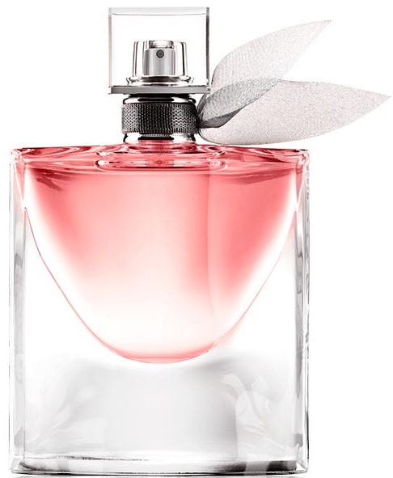
</td>

</tr>
</tbody>
</table>

### Pure 21

#### **DISPONIBLE TAMBIÉN EN "INTENSE"**.

- **Carácter**: Clásico, cálido y reconfortante.
- **Notas aromáticas** 
- **Salida**: Aldehído, ylang-ylang, fl or de azahar.
- **Corazón**: Rosa, lirio, iris.
- **Fondo**: Civeta africana, musgo de roble, sándalo.
- **Familia olfativa**: Floral.
- **Tipo de perfume**: Intemporal.
- **Capacidad**: 50 ml.
- **Concentración**: 30%.
- **Ingredientes**: Alcohol denat., Fragrance/Parfum, Linalool, Alpha-Isomethyl Ionone, Benzyl Benzoate, Coumarin, Hydroxycitronellal, Citronellol, Cinnamyl Alcohol, Eugenol, Geraniol, Benzyl Salicylate, Benzyl Cinnamate, Isoeugenol, Amyl Cinnamal, Farnesol, Hexyl Cinnamal, Benzyl Alcohol, Limonene, Citral, Cinnamal.

<table class="tablem" cellspacing="8" cellpadding="8">

<tbody>

<tr>

<td width="">
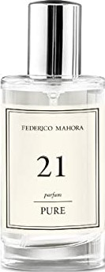
</td>

<td width="">
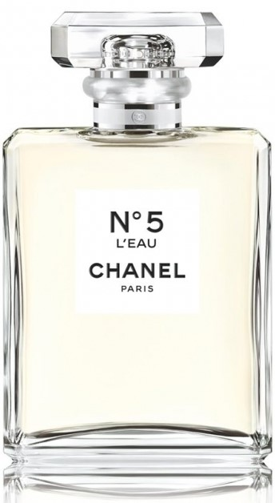
</td>

</tr>
</tbody>
</table>

### Pure 07

- **Carácter**: Equilibrado, suave.
- **Notas aromáticas** 
- **Salida**: Piña, peonía, guisante de olor.
- **Corazón**: Fresia, jazmín, azucena.
- **Fondo**: Sándalo, cedro, almizcle.
- **Familia olfativa**: Floral.
- **Tipo de perfume**: Empresarial.
- **Capacidad**: 50 ml.
- **Concentración**: 20%.
- **Ingredientes**: Alcohol denat., Fragrance/Parfum, Butylphenyl Methylpropional, Hexyl Cinnamal, Linalool, Limonene, Hydroxycitronellal, Alpha-Isomethyl Ionone, Citronellol, Geraniol, Citral, Eugenol, Benzyl Benzoate, Cinnamyl Alcohol, Isoeugenol, Benzyl Alcohol, Benzyl Salicylate, Amyl Cinnamal.

<table class="tablem" cellspacing="8" cellpadding="8">

<tbody>

<tr>

<td width="">
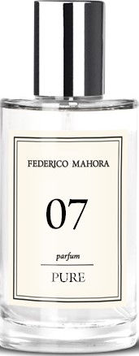
</td>

<td width="">

</td>

</tr>
</tbody>
</table>

### Pure 33

#### **DISPONIBLE TAMBIÉN EN "INTENSE" Y "PHEROMONE"**.

- **Carácter**: Refrescante, alegre.
- **Notas aromáticas** 
- **Salida**: Mango, limón siciliano, manzana.
- **Corazón**: Jazmín, bambú, rosas blancas.
- **Fondo**: Cedro, ámbar gris.
- **Familia olfativa**: Cítrica.
- **Tipo de perfume**: Fresca.
- **Capacidad**: 50 ml.
- **Concentración**: 20%.
- **Ingredientes**: Alcohol denat., Fragrance/Parfum, Limonene, Citral, Linalool, Cinnamal, Citronellol.

<table class="tablem" cellspacing="8" cellpadding="8">

<tbody>

<tr>

<td width="">

</td>

<td width="">

</td>

</tr>
</tbody>
</table>

### Pure 05

#### **DISPONIBLE TAMBIÉN EN "INTENSE" Y "PHEROMONE"**.

- **Carácter**: Intrigante, actual.
- **Notas aromáticas** 
- **Salida**: Fresia, gardenia.
- **Corazón**: Madera de sándalo, rosa, cilantro.
- **Fondo**: Vainilla, vetiver, pachuli.
- **Familia olfativa**: Chypre.
- **Tipo de perfume**: Sensual.
- **Capacidad**: 50 ml.
- **Concentración**: 30%.
- **Ingredientes**: Alcohol denat., Fragrance/Parfum, Methylpropional, Hydroxyisohexyl 3-Cyclohexene Carboxaldehyde, Hydroxycitronellal, Linalool, Alpha-Isomethyl Ionone, Citronellol, Geraniol, Limonene, Eugenol, Citral.

<table class="tablem" cellspacing="8" cellpadding="8">

<tbody>

<tr>

<td width="">
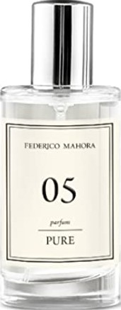
</td>

<td width="">

</td>

</tr>
</tbody>
</table>

### Pure 17

#### **DISPONIBLE TAMBIÉN EN "INTENSE"**.

- **Carácter**: Estimulante, dulce.
- **Notas aromáticas** 
- **Salida**: Melón, melocotón, manzana.
- **Corazón**: Fresia, azucena, mimosa, polianthes tuberosa, jazmín.
- **Fondo**: Cedro, ylang-ylang, almizcle.
- **Familia olfativa**: Floral.
- **Tipo de perfume**: Sexy.
- **Capacidad**: 50 ml.
- **Concentración**: 30%.
- **Ingredientes**: Alcohol denat., Fragrance/Parfum, Linalool, Limonene, Hexyl Cinnamal, Alpha-Isomethyl Ionone, Benzyl Salicylate, Citronellol, Citral, Isoeugenol, Benzyl Alcohol, Geraniol.

<table class="tablem" cellspacing="8" cellpadding="8">

<tbody>

<tr>

<td width="">

</td>

<td width="">

</td>

</tr>
</tbody>
</table>

### Pure 313

- **Carácter**: Elegante, irresistible.
- **Notas aromáticas** 
- **Salida**: Limón, frambuesa.
- **Corazón**: Flor de azahar, jazmín.
- **Fondo**: Pachuli, miel blanca.
- **Familia olfativa**: Amaderada.
- **Tipo de perfume**: Elegante con atomizador de pera ON-OFF.
- **Capacidad**: 50 ml.
- **Concentración**: 20%.
- **Ingredientes**: Alcohol denat., Fragrance/Parfum, Limonene, Hexyl Cinnamal, Benzyl Salicylate, Alpha-Isomethyl Ionone, Butylphenyl Methylpropional, Hydroxycitronellal, Citronellol, Coumarin, Citral, Isoeugenol, Linalool, Benzyl Alcohol; CI 15985, CI 19140.

<table class="tablem" cellspacing="8" cellpadding="8">

<tbody>

<tr>

<td width="">
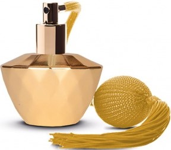
</td>

<td width="">
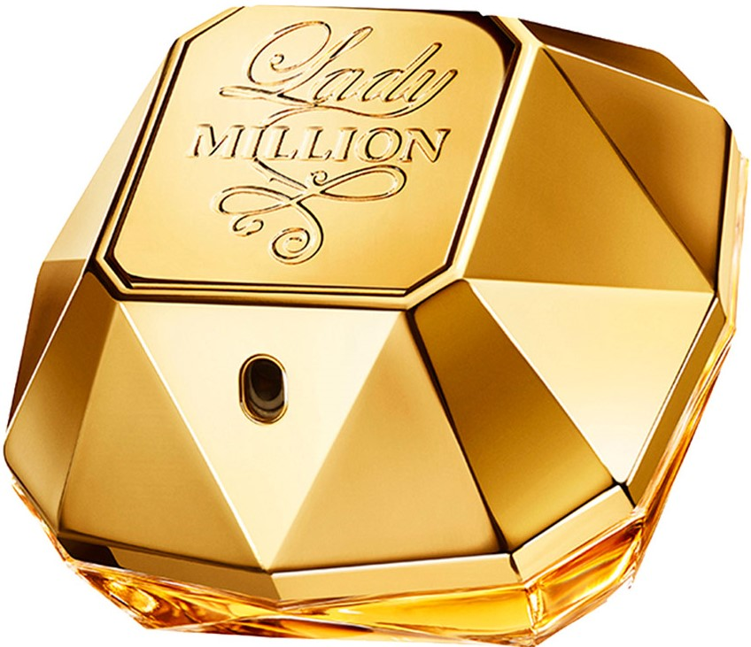
</td>

</tr>
</tbody>
</table>

### Pure 413

#### **DISPONIBLE TAMBIÉN EN "INTENSE" Y "PHEROMONE"**.

- **Carácter**: Impregnado de dulzura, algo juguetón.
- **Notas aromáticas** 
- **Salida**: Grosella negra, pera.
- **Corazón**: Iris, jazmín, fl or de azahar.
- **Fondo**: Praliné de chocolate, pachuli, vainilla.
- **Familia olfativa**: Oriental.
- **Tipo de perfume**: Dulce.
- **Capacidad**: 50 ml.
- **Concentración**: 20%.
- **Ingredientes**: Alcohol denat., Fragrance/Parfum, Benzyl Salicylate, Linalool, Limonene, Alpha-Isomethyl Ionone, Citronellol, Coumarin, Evernia Prunastri Extract, Hexyl Cinnamal, Geraniol, Citral.

<table class="tablem" cellspacing="8" cellpadding="8">

<tbody>

<tr>

<td width="">

</td>

<td width="">

</td>

</tr>
</tbody>
</table>

### Pure 431

#### **DISPONIBLE TAMBIÉN EN "PHEROMONE"**.

- **Carácter**: Con clase, elegante.
- **Notas aromáticas** 
- **Salida**: Pera, cardamomo, bergamota.
- **Corazón**: Plumeria, fresia, jazmín, violeta.
- **Fondo**: Vainilla, sándalo, almizcle.
- **Familia olfativa**: Amaderado.
- **Tipo de perfume**: Misterioso.
- **Capacidad**: 50 ml.
- **Concentración**: 20%.
- **Ingredientes**: Alcohol denat., Fragrance/Parfum, Benzyl Salicylate, Hexyl Cinnamal, Linalool, Amyl Cinnamal, Alpha-Isomethyl Ionone, Coumarin, Limonene, Hydroxycitronellal, Eugenol, Amylcinnamyl Alcohol, Benzyl Alcohol, Benzyl Benzoate, Citral, Benzyl Cinnamate.

<table class="tablem" cellspacing="8" cellpadding="8">

<tbody>

<tr>

<td width="">
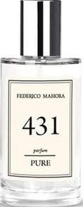
</td>

<td width="">
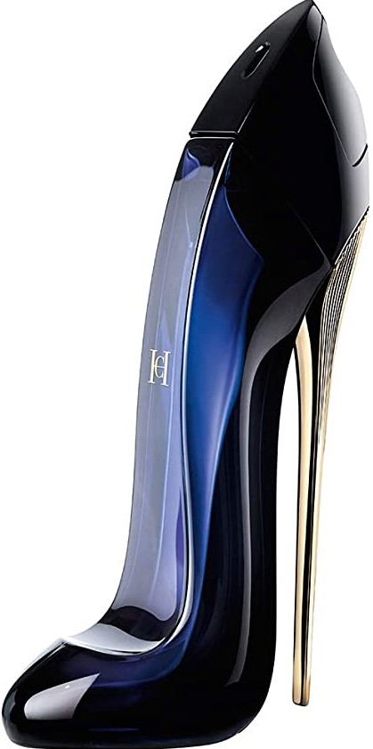
</td>

</tr>
</tbody>
</table>

### Pure 432

- **Carácter**: Romántico, fantástico, expresivo.
- **Notas aromáticas** 
- **Salida**: Mandarina, manzana, melocotón.
- **Corazón**: Jazmín, azucena, lirio.
- **Fondo**: Sándalo, vainilla, almizcle, heliotropo.
- **Familia olfativa**: Oriental.
- **Tipo de perfume**: Misterioso.
- **Capacidad**: 50 ml.
- **Concentración**: 20%.
- **Ingredientes**: Alcohol denat., Fragrance/Parfum, Butylphenyl Methylpropional, Benzyl Salicylate, Geraniol, Limonene, Citronellol, Alpha-Isomethyl Ionone, Linalool, Coumarin, Hydroxycitronellal, Citral, Benzyl Benzoate, Benzyl Alcohol.

<table class="tablem" cellspacing="8" cellpadding="8">

<tbody>

<tr>

<td width="">

</td>

<td width="">

</td>

</tr>
</tbody>
</table>

### Pure 426

- **Carácter**: Elegante, sensual, romántico.
- **Notas aromáticas** 
- **Salida**: Pera, nectarina, mandarina, bergamota.
- **Corazón**: Iris, fresia, jazmín, flor de naranja africana.
- **Fondo**: Vainilla, haba Tonka, heliotropo, árbol de cedro.
- **Familia olfativa**: Oriental.
- **Tipo de perfume**: Sensual.
- **Capacidad**: 50 ml.
- **Concentración**: 20%.
- **Ingredientes**: Alcohol denat., Fragrance/Parfum, Limonene, Alpha-Isomethyl Ionone, Benzyl Salicylate, Linalool, Coumarin, Citral, Isoeugenol, Hexyl Cinnamal, Benzyl Benzoate, Benzyl Cinnamate, Geraniol, Benzyl Alcohol.

<table class="tablem" cellspacing="8" cellpadding="8">

<tbody>

<tr>

<td width="">
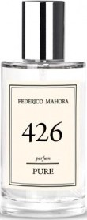
</td>

<td width="">

</td>

</tr>
</tbody>
</table>

### Pure 436

#### **DISPONIBLE TAMBIÉN EN "INTENSE" Y "PHEROMONE"**.

- **Carácter**: Seductoramente dulce, tentador.
- **Notas aromáticas** 
- **Salida**: Frutos rojos, mandarina.
- **Corazón**: Lirio, peonía.
- **Fondo**: Praliné, ámbar, almizcle, caramelo.
- **Familia olfativa**: Floral.
- **Tipo de perfume**: Sensual.
- **Capacidad**: 50 ml.
- **Concentración**: 20%.
- **Ingredientes**: Alcohol denat., Fragrance/Parfum, Benzyl Salicylate, Butylphenyl Methylpropional, Limonene, Hexyl Cinnamal, Hydroxycitronellal, Coumarin, Citronellol, Linalool, Benzyl Alcohol.

<table class="tablem" cellspacing="8" cellpadding="8">

<tbody>

<tr>

<td width="">
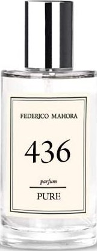
</td>

<td width="">

</td>

</tr>
</tbody>
</table>

### Pure 101

#### **DISPONIBLE TAMBIÉN EN "PHEROMONE"**.

- **Carácter**: Sofisticado, inolvidable.
- **Notas aromáticas** 
- **Salida**: Flor de azahar, pera.
- **Corazón**: Jengibre, incienso.
- **Fondo**: Sándalo, vainilla, miel, almizcle.
- **Familia olfativa**: Oriental.
- **Tipo de perfume**: Misterioso.
- **Capacidad**: 50 ml.
- **Concentración**: 20%.
- **Ingredientes**: Alcohol denat., Fragrance/Parfum, Linalool, Limonene, Butylphenyl Methylpropional, Benzyl Salicylate, Hexyl Cinnamal, Citronellol, Geraniol, Coumarin, Citral.

<table class="tablem" cellspacing="8" cellpadding="8">

<tbody>

<tr>

<td width="">

</td>

<td width="">

</td>

</tr>
</tbody>
</table>

### Pure 485

- **Carácter**: Sorprendente, ambiguo.
- **Notas aromáticas** 
- **Salida**: Limón, grosella negra, hojas de arándano.
- **Corazón**: Rosa, azahar, jazmín, durazno.
- **Fondo**: Pachulí, cedro, ámbar, vainilla, haba tonka.
- **Familia olfativa**: Oriental.
- **Tipo de perfume**: Misterioso.
- **Capacidad**: 50 ml.
- **Concentración**: 20%.
- **Ingredientes**: Alcohol denat., Fragrance/Parfum, Linalool, Alpha-Isomethyl Ionone, Geraniol, Citronellol, Limonene, Benzyl Benzoate, Benzyl Salicylate, Farnesol, Benzyl Alcohol.

<table class="tablem" cellspacing="8" cellpadding="8">

<tbody>

<tr>

<td width="">
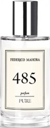
</td>

<td width="">

</td>

</tr>
</tbody>
</table>

### Pure 447

- **Carácter**: Expressivo, airoso, alegre.
- **Notas aromáticas** 
- **Salida**: Frutas exóticas, frutas vermelhas, bergamota, ameixa.
- **Corazón**: Amarela, bagas cor-de-rosa.
- **Fondo**: Patchouli, musgo, almíscar, árvore de âmbar, sândalo.
- **Familia olfativa**: Oriental.
- **Tipo de perfume**: Misterioso.
- **Capacidad**: 50 ml.
- **Concentración**: 20%.
- **Ingredientes**: Alcohol denat., Fragrance/Parfum, Linalool, Alpha-Isomethyl Ionone, Geraniol, Citronellol, Limonene, Benzyl Benzoate, Benzyl Salicylate, Farnesol, Benzyl Alcohol.

<table class="tablem" cellspacing="8" cellpadding="8">

<tbody>

<tr>

<td width="">
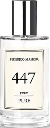
</td>

<td width="">
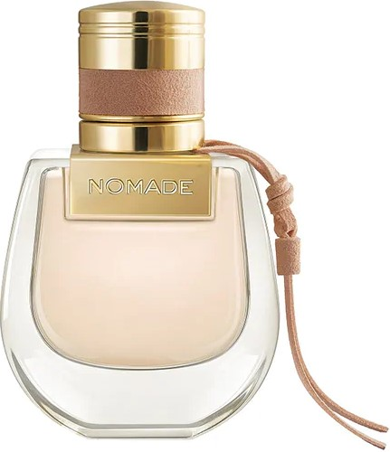
</td>

</tr>
</tbody>
</table>

### Pure 183

- **Carácter**: Picante, fuerte.
- **Notas aromáticas** 
- **Salida**: Arándano, pimienta rosa, tamarindo.
- **Corazón**: Violeta negra, cacao, rosa, Helleborus.
- **Fondo**: Pachuli, vainilla, árbol massoia.
- **Familia olfativa**: Floral.
- **Tipo de perfume**: Sexy.
- **Capacidad**: 50 ml.
- **Concentración**: 20%.
- **Ingredientes**: Alcohol denat., Fragrance/Parfum, Hexyl Cinnamal, Benzyl Salicylate, Butylphenyl Methylpropional, Linalool, Limonene, Geraniol, Benzyl Alcohol, Amyl Cinnamal, Citral.

<table class="tablem" cellspacing="8" cellpadding="8">

<tbody>

<tr>

<td width="">

</td>

<td width="">
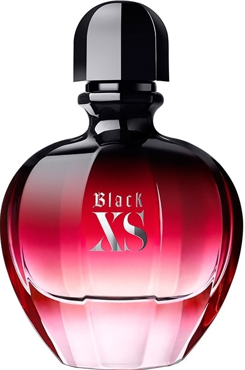
</td>

</tr>
</tbody>
</table>

### Pure 81

#### **DISPONIBLE TAMBIÉN EN "INTENSE" Y "PHEROMONE"**.

- **Carácter**: Excéntrico pero sutil.
- **Notas aromáticas** 
- **Salida**: Manzana verde, pepino, magnolia.
- **Corazón**: Lirio, rosa, violeta.
- **Fondo**: Sándalo, ámbar gris.
- **Familia olfativa**: Floral.
- **Tipo de perfume**: Delicado.
- **Capacidad**: 50 ml.
- **Concentración**: 20%.
- **Ingredientes**: Alcohol denat., Fragrance/Parfum, Butylphenyl Methylpropional, Alpha-Isomethyl Ionone, Geraniol, Linalool, Hydroxycitronellal, Citronellol, Isoeugenol, Methyl 2-Octynoate, Citral.

<table class="tablem" cellspacing="8" cellpadding="8">

<tbody>

<tr>

<td width="">
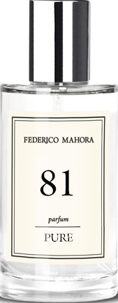
</td>

<td width="">

</td>

</tr>
</tbody>
</table>

### Pure 173

#### **DISPONIBLE TAMBIÉN EN "INTENSE" Y "PHEROMONE"**.

- **Carácter**: Onírico, sentimental.
- **Notas aromáticas** 
- **Salida**: Anís, regaliz.
- **Corazón**: Árbol de Jacarandá, almendras amargas.
- **Fondo**: Sándalo, almizcle, musgo.
- **Familia olfativa**: Oriental.
- **Tipo de perfume**: Misterioso.
- **Capacidad**: 50 ml.
- **Concentración**: 20%.
- **Ingredientes**: Alcohol denat., Fragrance/Parfum.

<table class="tablem" cellspacing="8" cellpadding="8">

<tbody>

<tr>

<td width="">

</td>

<td width="">

</td>

</tr>
</tbody>
</table>

### Pure 414

- **Carácter**: Independiente, muy femenino.
- **Notas aromáticas** 
- **Salida**: Cáctus.
- **Corazón**: Fresia rosa, jazmín, rosa.
- **Fondo**: Cedro, notas amaderadas.
- **Familia olfativa**: Floral.
- **Tipo de perfume**: Elegante.
- **Capacidad**: 50 ml.
- **Concentración**: 20%.
- **Ingredientes**: Alcohol denat., Fragrance/Parfum, Limonene, Hydroxycitronellal, Linalool, Citronellol, Geraniol, Benzyl Salicylate, Coumarin, Citral, Alpha-Isomethyl Ionone.

<table class="tablem" cellspacing="8" cellpadding="8">

<tbody>

<tr>

<td width="">

</td>

<td width="">

</td>

</tr>
</tbody>
</table>

### Pure 241

- **Carácter**: Seductor, libre, lleno de encanto.
- **Notas aromáticas** 
- **Salida**: Bergamota.
- **Corazón**: Ylang-ylang, azucena Casablanca, fl or de azahar.
- **Fondo**: Sándalo, resina de ámbar, vainilla.
- **Familia olfativa**: Amaderada.
- **Tipo de perfume**: Intemporal.
- **Capacidad**: 50 ml.
- **Concentración**: 20%.
- **Ingredientes**: Alcohol denat., Fragrance/Parfum, Linalool,Limonene, Hydroxycitronellal, Geraniol, Alpha-Isomethyl Ionone, Citral, Benzyl Benzoate, Isoeugenol.

<table class="tablem" cellspacing="8" cellpadding="8">

<tbody>

<tr>

<td width="">

</td>

<td width="">

</td>

</tr>
</tbody>
</table>

### Pure 237

- **Carácter**: Provocador, coqueto.
- **Notas aromáticas** 
- **Salida**: Frutas exóticas, grosella negra.
- **Corazón**: Peonía, jazmín, ciruela.
- **Fondo**: Vainilla, almizcle, ámbar gris.
- **Familia olfativa**: Oriental.
- **Tipo de perfume**: Atrevido.
- **Capacidad**: 50 ml.
- **Concentración**: 20%.
- **Ingredientes**: Alcohol denat., Fragrance/Parfum, Benzyl Salicylate, Butylphenyl Methylpropional, Alpha-Isomethyl Ionone, Limonene, Linalool, Geraniol, Coumarin, Citronellol, Citral.

<table class="tablem" cellspacing="8" cellpadding="8">

<tbody>

<tr>

<td width="">
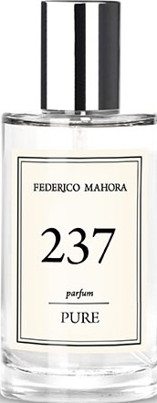
</td>

<td width="">
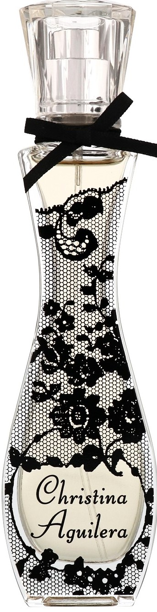
</td>

</tr>
</tbody>
</table>

### Pure 489

#### **DISPONIBLE TAMBIÉN EN "INTENSE" Y "PHEROMONE"**.

- **Carácter**: Futurista, excéntrico.
- **Notas aromáticas** 
- **Salida**: Hojas verdes, anís, grosella negra.
- **Corazón**: Azahar, notas acuáticas, lirio de los valles, árbol de cachemir.
- **Fondo**:  Cedro, pachulí, haba tonka, ámbar gris.
- **Familia olfativa**: Floral.
- **Tipo de perfume**: Acuoso.
- **Capacidad**: 50 ml.
- **Concentración**: 20%.
- **Ingredientes**: Alcohol denat., Fragrance/Parfum, Benzyl Salicylate, Butylphenyl Methylpropional, Alpha-Isomethyl Ionone, Limonene, Linalool, Geraniol, Coumarin, Citronellol, Citral.

<table class="tablem" cellspacing="8" cellpadding="8">

<tbody>

<tr>

<td width="">

</td>

<td width="">

</td>

</tr>
</tbody>
</table>

### Pure 10

#### **DISPONIBLE TAMBIÉN EN "INTENSE" Y "PHEROMONE"**.

- **Carácter**: Estimulante, dulce.
- **Notas aromáticas** 
- **Salida**: Mandarina, hojas de hiedra, flores de champaca.
- **Corazón**: Jazmín, orquídea africana, rosa.
- **Fondo**:  Madera de amaranto, zarzamora, almizcle.
- **Familia olfativa**: Floral.
- **Tipo de perfume**: Provocativo.
- **Capacidad**: 50 ml.
- **Concentración**: 20%.
- **Ingredientes**: Alcohol denat., Fragrance/Parfum, Butylphenyl Methylpropional, Linalool, Hexyl Cinnamal, Benzyl Salicylate, Citronellol, Alpha-Isomethyl Ionone, Hydroxycitronellal, Limonene, Geraniol, Benzyl Benzoate, Cinnamyl Alcohol, Citral, Benzyl Alcohol, Eugenol, Farnesol, Amyl Cinnamal.

<table class="tablem" cellspacing="8" cellpadding="8">

<tbody>

<tr>

<td width="">
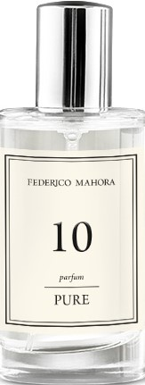
</td>

<td width="">
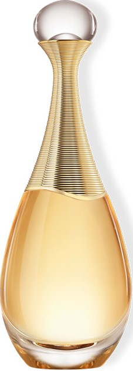
</td>

</tr>
</tbody>
</table>

### Pure 12

- **Carácter**: Hipnotizante, seductor.
- **Notas aromáticas** 
- **Salida**: Pasionaria.
- **Corazón**: Jazmín, gardenia.
- **Fondo**:  Vainilla, arce, vetiver.
- **Familia olfativa**: Oriental.
- **Tipo de perfume**: Sensual.
- **Capacidad**: 50 ml.
- **Concentración**: 20%.
- **Ingredientes**: Alcohol denat., Fragrance/Parfum, Limonene, Linalool, Hydroxycitronellal, Geraniol, Citronellol, Citral, Benzyl Alcohol.

<table class="tablem" cellspacing="8" cellpadding="8">

<tbody>

<tr>

<td width="">

</td>

<td width="">

</td>

</tr>
</tbody>
</table>

### Pure 16

#### **DISPONIBLE TAMBIÉN EN "INTENSE" Y "PHEROMONE"**.

- **Carácter**: Fabuloso, fascinante.
- **Notas aromáticas** 
- **Salida**: Mandarina, pera, notas verdes.
- **Corazón**: Orquídea.
- **Fondo**:  Pachuli, tofe.
- **Familia olfativa**: Chypre.
- **Tipo de perfume**: Dulce.
- **Capacidad**: 50 ml.
- **Concentración**: 20%.
- **Ingredientes**: Alcohol denat., Fragrance/Parfum, Hexyl Cinnamal, Benzyl Salicylate, Butylphenyl Methylpropional, Linalool, Limonene, Benzyl Alcohol, Amyl Cinnamal.

<table class="tablem" cellspacing="8" cellpadding="8">

<tbody>

<tr>

<td width="">
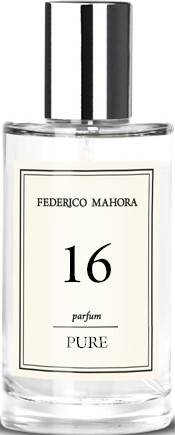
</td>

<td width="">

</td>

</tr>
</tbody>
</table>

### Pure 174

- **Carácter**: Mágico, intermitente.
- **Notas aromáticas** 
- **Salida**: Fresia, lichi.
- **Corazón**: Azucena, magnolia, jazmín, jengibre, pimienta.
- **Fondo**:  Ámbar, almizcle.
- **Familia olfativa**: Floral.
- **Tipo de perfume**: Romántico.
- **Capacidad**: 50 ml.
- **Concentración**: 20%.
- **Ingredientes**: Alcohol denat., Fragrance/Parfum, Linalool, Citronellol, Hydroxycitronellal, Butylphenyl Methylpropional, Limonene, Hydroxyisohexyl 3-Cyclohexene Carboxaldehyde, Geraniol, Hexyl Cinnamal, Alpha-Isomethyl Ionone, Cinnamyl Alcohol, Benzyl Alcohol, Isoeugenol, Citral, Benzyl Benzoate, Benzyl Salicylate, Farnesol.

<table class="tablem" cellspacing="8" cellpadding="8">

<tbody>

<tr>

<td width="">

</td>

<td width="">
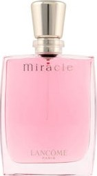
</td>

</tr>
</tbody>
</table>

### Pure 25

#### **DISPONIBLE TAMBIÉN EN "INTENSE"**.

- **Carácter**: Armonioso, algo atrevido.
- **Notas aromáticas** 
- **Salida**: Manzana verde, notas acuosas.
- **Corazón**: Jazmín, fresia, iris, pasionaria.
- **Fondo**:  Sándalo, cedro, vainilla.
- **Familia olfativa**: Floral.
- **Tipo de perfume**: Encantador.
- **Capacidad**: 50 ml.
- **Concentración**: 20%.
- **Ingredientes**: Alcohol denat., Fragrance/Parfum, Benzyl Salicylate, Butylphenyl Methylpropional, Alpha-Isomethyl Ionone, Hexyl Cinnamal, Citronellol, Linalool, Hydroxyisohexyl 3-Cyclohexene Carboxaldehyde, Limonene, Geraniol, Benzyl Alcohol.

<table class="tablem" cellspacing="8" cellpadding="8">

<tbody>

<tr>

<td width="">

</td>

<td width="">

</td>

</tr>
</tbody>
</table>

### Pure 34

#### **DISPONIBLE TAMBIÉN EN "PHEROMONE"**.

- **Carácter**: Libre, alegre.
- **Notas aromáticas** 
- **Salida**: Iris, piña, jacinto, pimienta rosa.
- **Corazón**: Jazmín, limón.
- **Fondo**:  Vainilla, vetiver, almizcle.
- **Familia olfativa**: Chypre.
- **Tipo de perfume**: Elegante.
- **Capacidad**: 50 ml.
- **Concentración**: 20%.
- **Ingredientes**: Alcohol denat., Fragrance/Parfum, Linalool, Butylphenyl Methylpropional, Hexyl Cinnamal, Limonene, Benzyl Salicylate, Hydroxycitronellal, Citronellol, Coumarin, Citral,  enzyl Benzoate, Benzyl Alcohol, Amyl Cinnamal.

<table class="tablem" cellspacing="8" cellpadding="8">

<tbody>

<tr>

<td width="">
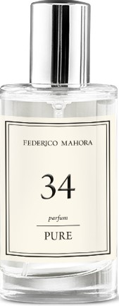
</td>

<td width="">

</td>

</tr>
</tbody>
</table>

### Pure 20

#### **DISPONIBLE TAMBIÉN EN "INTENSE" Y "PHEROMONE"**.

- **Carácter**: Seductor, sensual.
- **Notas aromáticas** 
- **Salida**: Osmanto, té negro, bergamota.
- **Corazón**: Rosa, fresia, magnolia, orquídea.
- **Fondo**:  Almizcle, pachuli.
- **Familia olfativa**: Floral.
- **Tipo de perfume**: Dulce.
- **Capacidad**: 50 ml.
- **Concentración**: 20%.
- **Ingredientes**: Alcohol denat., Fragrance/Parfum, Benzyl Salicylate, Linalool, Coumarin, Limonene, Benzyl Benzoate, Benzyl Cinnamate, Benzyl Alcohol, Citral.

<table class="tablem" cellspacing="8" cellpadding="8">

<tbody>

<tr>

<td width="">
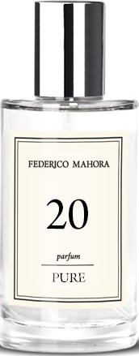
</td>

<td width="">
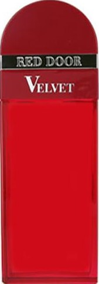
</td>

</tr>
</tbody>
</table>

### Pure 01

#### **DISPONIBLE TAMBIÉN EN "PHEROMONE"**.

- **Carácter**: Fresco y cálido a la vez.
- **Notas aromáticas** 
- **Salida**: Limón, té, arándano.
- **Corazón**: Jazmín, peonía, nenúfar blanco.
- **Fondo**:  Notas amaderadas, pachuli.
- **Familia olfativa**: Floral.
- **Tipo de perfume**: Misterioso.
- **Capacidad**: 50 ml.
- **Concentración**: 20%.
- **Ingredientes**: Alcohol denat., Fragrance/Parfum, Limonene, Linalool, Butylphenyl Methylpropional, Hexyl Cinnamal, Citral, Citronellol, Eugenol, Benzyl Benzoate, Geraniol.

<table class="tablem" cellspacing="8" cellpadding="8">

<tbody>

<tr>

<td width="">

</td>

<td width="">

</td>

</tr>
</tbody>
</table>

### Pure 06

- **Carácter**: Ligero, discreto.
- **Notas aromáticas** 
- **Salida**: Limón, bergamota, menta.
- **Corazón**: Naranja, té verde.
- **Fondo**: Musgo de roble, ámbar gris.
- **Familia olfativa**: Cítrica.
- **Tipo de perfume**: Fresco.
- **Capacidad**: 50 ml.
- **Concentración**: 20%.
- **Ingredientes**: Alcohol denat., Fragrance/Parfum, Linalool, Citronellol, Limonene, Hexyl Cinnamal, Geraniol, Butylphenyl Methylpropional, Benzyl Salicylate, Citral, Isoeugenol, Benzyl Alcohol, Amyl Cinnamal.

<table class="tablem" cellspacing="8" cellpadding="8">

<tbody>

<tr>

<td width="">
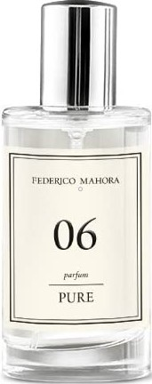
</td>

<td width="">
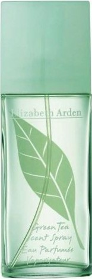
</td>

</tr>
</tbody>
</table>

### Pure 09

#### **DISPONIBLE TAMBIÉN EN "INTENSE"**.

- **Carácter**: Difícil de olvidar, mágico.
- **Notas aromáticas** 
- **Salida**: Violeta, cardamomo, frutas verdes.
- **Corazón**: Almendras, jazmín.
- **Fondo**: Vainilla, almizcle.
- **Familia olfativa**: Oriental.
- **Tipo de perfume**: Misterioso.
- **Capacidad**: 50 ml.
- **Concentración**: 20%.
- **Ingredientes**: Alcohol denat., Fragrance/Parfum, Benzyl Salicylate, Hexyl Cinnamal, Amyl Cinnamal, Alpha-Isomethyl Ionone, Linalool, Coumarin, Limonene, Hydroxycitronellal, Citral, Benzyl Cinnamate, Benzyl Alcohol, Geraniol.

<table class="tablem" cellspacing="8" cellpadding="8">

<tbody>

<tr>

<td width="">

</td>

<td width="">
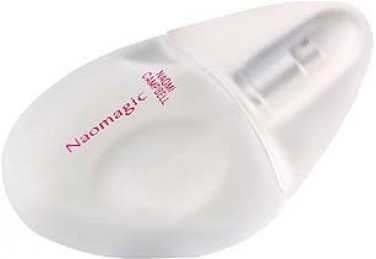
</td>

</tr>
</tbody>
</table>

### Pure 18

#### **DISPONIBLE TAMBIÉN EN "INTENSE" Y "PHEROMONE"**.

- **Carácter**: Radiante, seductor.
- **Notas aromáticas** 
- **Salida**: Naranja, flor de azahar.
- **Corazón**: Rosa, jazmín, ylang-ylang.
- **Fondo**: Almizcle blanco, vetiver, haba Tonka, vainilla.
- **Familia olfativa**: Chypre.
- **Tipo de perfume**: Provocativo.
- **Capacidad**: 50 ml.
- **Concentración**: 20%.
- **Ingredientes**: Alcohol denat., Fragrance/Parfum, Linalool, Butylphenyl Methylpropional, Limonene, Benzyl Salicylate, Hydroxycitronellal, Geraniol, Citronellol, Coumarin, Hexyl  innamal, Benzyl Alcohol, Citral, Eugenol.

<table class="tablem" cellspacing="8" cellpadding="8">

<tbody>

<tr>

<td width="">

</td>

<td width="">
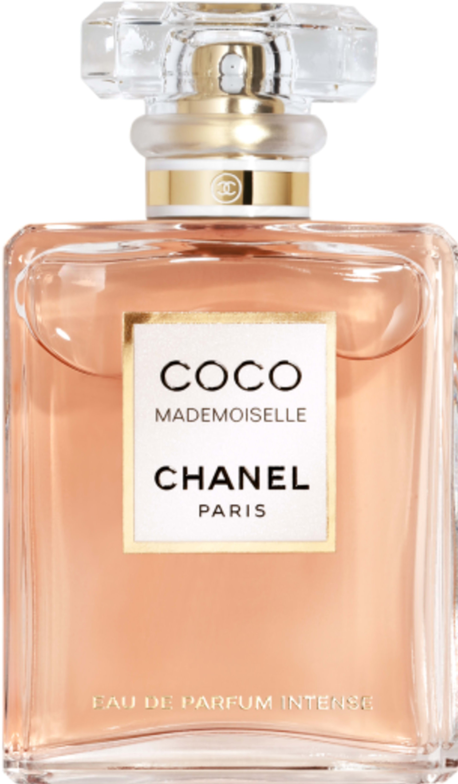
</td>

</tr>
</tbody>
</table>

### Pure 23

#### **DISPONIBLE TAMBIÉN EN "INTENSE" Y "PHEROMONE"**.

- **Carácter**: Sensual, con notas dulces.
- **Notas aromáticas** 
- **Salida**: Lirio, naranja roja.
- **Corazón**: Mandarina, jazmín, rosa.
- **Fondo**: Vainilla, sándalo, almizcle blanco.
- **Familia olfativa**: Cítrica.
- **Tipo de perfume**: Romántica.
- **Capacidad**: 50 ml.
- **Concentración**: 20%.
- **Ingredientes**: Alcohol denat., Fragrance/Parfum, Hexyl Cinnamal, Butylphenyl Methylpropional, Linalool, Hydroxycitronellal, Limonene, Citronellol, Coumarin, Geraniol, Benzyl Alcohol, Citral, Amyl Cinnamal.

<table class="tablem" cellspacing="8" cellpadding="8">

<tbody>

<tr>

<td width="">

</td>

<td width="">

</td>

</tr>
</tbody>
</table>

### Pure 24

- **Carácter**: Exótico, muy picante.
- **Notas aromáticas** 
- **Salida**: Mandarina, comino, clavo.
- **Corazón**: Mango, heliotropo, cardamomo, ylang-ylang.
- **Fondo**: Almizcle, vainilla, ámbar gris.
- **Familia olfativa**: Oriental.
- **Tipo de perfume**: Extravagante.
- **Capacidad**: 50 ml.
- **Concentración**: 20%.
- **Ingredientes**: Alcohol denat., Fragrance/Parfum, Coumarin, Linalool, Limonene, Benzyl Benzoate, Eugenol, Geraniol, Benzyl Salicylate, Citronellol, Citral, Benzyl Alcohol.

<table class="tablem" cellspacing="8" cellpadding="8">

<tbody>

<tr>

<td width="">
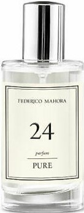
</td>

<td width="">

</td>

</tr>
</tbody>
</table>

### Pure 26

- **Carácter**: Con una reconfortante sensación cálida.
- **Notas aromáticas** 
- **Salida**: Guayaba, frambuesa, bergamota, coco.
- **Corazón**: Nenúfar blanco, rosa, pimiento, magnolia.
- **Fondo**: Sándalo, vainilla, café, caramelo.
- **Familia olfativa**: Oriental.
- **Tipo de perfume**: Dulce.
- **Capacidad**: 50 ml.
- **Concentración**: 20%.
- **Ingredientes**: Alcohol denat., Fragrance/Parfum, Benzyl Salicylate, Butylphenyl Methylpropional, Alpha-Isomethyl Ionone, Benzyl Benzoate, Limonene, Coumarin, Hydroxyisohexyl 3-Cyclohexene Carboxaldehyde, Linalool, Hydroxycitronellal,  Citral.

<table class="tablem" cellspacing="8" cellpadding="8">

<tbody>

<tr>

<td width="">
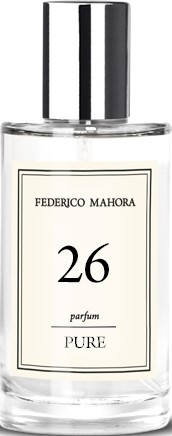
</td>

<td width="">

</td>

</tr>
</tbody>
</table>

### Pure 32

- **Carácter**: Fascinante, ambiguo.
- **Notas aromáticas** 
- **Salida**: Melón, coco, mandarina, algodón de azúcar.
- **Corazón**: Zarzamora, mango, ciruela, miel.
- **Fondo**: Vainilla, chocolate, tofe.
- **Familia olfativa**: Oriental.
- **Tipo de perfume**: Extravagante.
- **Capacidad**: 50 ml.
- **Concentración**: 20%.
- **Ingredientes**: Alcohol denat., Fragrance/Parfum, Hexyl Cinnamal, Butylphenyl Methylpropional, Coumarin, Linalool, Limonene, Citronellol, Geraniol, Benzyl Alcohol, Citral.

<table class="tablem" cellspacing="8" cellpadding="8">

<tbody>

<tr>

<td width="">

</td>

<td width="">
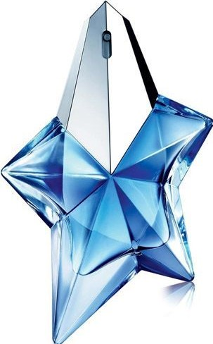
</td>

</tr>
</tbody>
</table>

### Pure 80

- **Carácter**: Sorprendente, apetecible.
- **Notas aromáticas** 
- **Salida**: Sorbete de fresa, cereza, piña.
- **Corazón**: Palomitas caramelizadas, violeta, rosa.
- **Fondo**: Almizcle, ámbar gris, pachuli.
- **Familia olfativa**: Chypre.
- **Tipo de perfume**: Dulce.
- **Capacidad**: 50 ml.
- **Concentración**: 20%.
- **Ingredientes**: Alcohol denat., Fragrance/Parfum, Hexyl Cinnamal, Butylphenyl Methylpropional, Benzyl Salicylate,  Linalool, Limonene, Citronellol, Alpha-Isomethyl Ionone, Geraniol, Cinnamyl Alcohol, Eugenol, Benzyl Alcohol, Citral, Amyl Cinnamal.

<table class="tablem" cellspacing="8" cellpadding="8">

<tbody>

<tr>

<td width="">

</td>

<td width="">
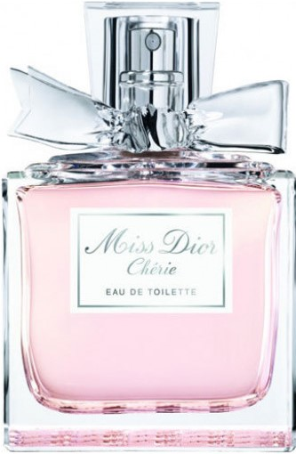
</td>

</tr>
</tbody>
</table>

### Pure 97

#### **DISPONIBLE TAMBIÉN EN "INTENSE" Y "PHEROMONE"**.

- **Carácter**: Encantador, aterciopelado.
- **Notas aromáticas** 
- **Salida**: Fresia, lirio, rosa.
- **Corazón**: Azucena, gardenia, palma, narciso.
- **Fondo**: Grosella negra, almizcle, musgo de roble.
- **Familia olfativa**: Floral.
- **Tipo de perfume**: Atrevido.
- **Capacidad**: 50 ml.
- **Concentración**: 20%.
- **Ingredientes**: Alcohol denat., Fragrance/Parfum, Butylphenyl Methylpropional, Hydroxycitronellal, Linalool, Limonene, Citronellol, Alpha-Isomethyl Ionone, Geraniol.

<table class="tablem" cellspacing="8" cellpadding="8">

<tbody>

<tr>

<td width="">

</td>

<td width="">

</td>

</tr>
</tbody>
</table>

### Pure 98

#### **DISPONIBLE TAMBIÉN EN "INTENSE" Y "PHEROMONE"**.

- **Carácter**: Fresco, sutil.
- **Notas aromáticas** 
- **Salida**: Grosella negra, bergamota, limón.
- **Corazón**: Jazmín, lirio, rosa.
- **Fondo**: Sándalo, cedro, ámbar.
- **Familia olfativa**: Oriental.
- **Tipo de perfume**: Empresarial.
- **Capacidad**: 50 ml.
- **Concentración**: 20%.
- **Ingredientes**: Alcohol denat., Fragrance/Parfum, Linalool, Limonene, Hydroxycitronellal, Citral, Geraniol.

<table class="tablem" cellspacing="8" cellpadding="8">

<tbody>

<tr>

<td width="">

</td>

<td width="">
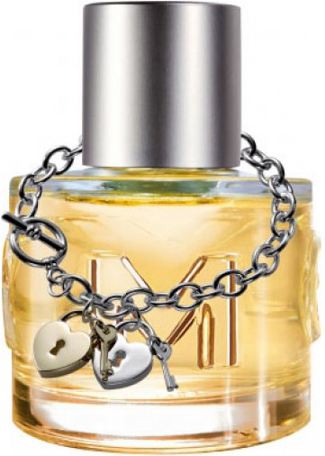
</td>

</tr>
</tbody>
</table>

### Pure 132

- **Carácter**: Exclusivo, intenso.
- **Notas aromáticas** 
- **Salida**: Jengibre, cardamomo, pimienta, naranja.
- **Corazón**: Polianthes tuberosa, coco, gardenia, peonía.
- **Fondo**: Ámbar gris, almizcle.
- **Familia olfativa**: Floral.
- **Tipo de perfume**: Intemporal.
- **Capacidad**: 50 ml.
- **Concentración**: 20%.
- **Ingredientes**: Alcohol denat., Fragrance/Parfum, Butylphenyl Methylpropional, Hydroxyisohexyl 3-Cyclohexene Carboxaldehyde, Alpha-Isomethyl Ionone, Linalool, Geraniol, Citronellol, Benzyl Salicylate, Coumarin, Hydroxycitronellal, Limonene.

<table class="tablem" cellspacing="8" cellpadding="8">

<tbody>

<tr>

<td width="">

</td>

<td width="">

</td>

</tr>
</tbody>
</table>

### Pure 177

- **Carácter**: Cálido, despierta el deseo.
- **Notas aromáticas** 
- **Salida**: Bergamota, hoja de laurel, pimienta rosa.
- **Corazón**: Azafrán, flor de azahar.
- **Fondo**: Incienso, vainilla, sándalo.
- **Familia olfativa**: Oriental.
- **Tipo de perfume**: Sensual.
- **Capacidad**: 50 ml.
- **Concentración**: 20%.
- **Ingredientes**: Alcohol denat., Fragrance/Parfum, Butylphenyl Methylpropional, Benzyl Salicylate, Linalool, Limonene, Alpha-Isomethyl Ionone, Geraniol, Citronellol, Coumarin, Benzyl Benzoate, Citral, Farnesol.

<table class="tablem" cellspacing="8" cellpadding="8">

<tbody>

<tr>

<td width="">

</td>

<td width="">
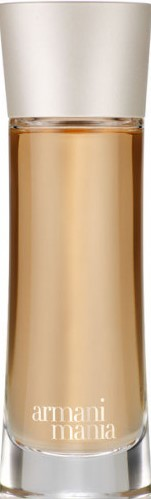
</td>

</tr>
</tbody>
</table>

### Pure 180

- **Carácter**: Seductor, variable.
- **Notas aromáticas** 
- **Salida**: Lichi, frambuesa, rosa.
- **Corazón**: Fresia, lirio, cedro.
- **Fondo**: Vainilla, ámbar gris, vetiver.
- **Familia olfativa**: Floral.
- **Tipo de perfume**: Misterioso.
- **Capacidad**: 50 ml.
- **Concentración**: 20%.
- **Ingredientes**: Alcohol denat., Fragrance/Parfum, Hexyl Cinnamal, Limonene, Alpha-Isomethyl Ionone, Geraniol, Citronellol, Linalool, Butylphenyl Methylpropional, Coumarin, Benzyl Benzoate, Citral, Eugenol.

<table class="tablem" cellspacing="8" cellpadding="8">

<tbody>

<tr>

<td width="">
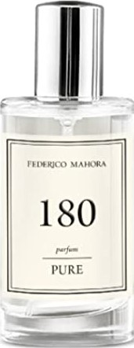
</td>

<td width="">
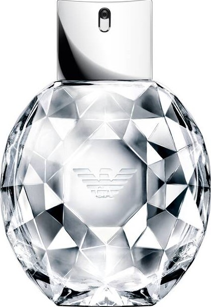
</td>

</tr>
</tbody>
</table>

### Pure 239

- **Carácter**: Vibrante, intenso.
- **Notas aromáticas** 
- **Salida**: Cardamomo, pimienta rosa, mandarina.
- **Corazón**: Iris, campanillas del bosque, té de Ceylán.
- **Fondo**: Cedro, vetiver, almizcle.
- **Familia olfativa**: Floral.
- **Tipo de perfume**: Encantador.
- **Capacidad**: 50 ml.
- **Concentración**: 20%.
- **Ingredientes**: Alcohol denat., Fragrance/Parfum, Benzyl Salicylate, Butylphenyl Methylpropional, Limonene, Hexyl Cinnamal, Hydroxycitronellal, Alpha-Isomethyl Ionone, Geraniol, Coumarin, Linalool, Citral, Benzyl Alcohol.

<table class="tablem" cellspacing="8" cellpadding="8">

<tbody>

<tr>

<td width="">
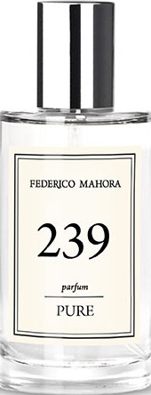
</td>

<td width="">
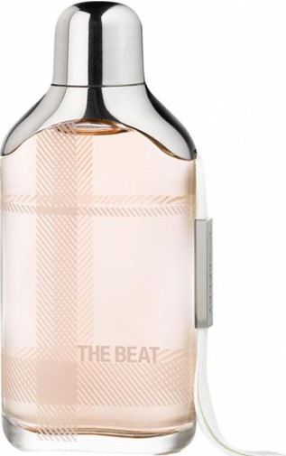
</td>

</tr>
</tbody>
</table>

### Pure 257

- **Carácter**: Elegante, sorprendente.
- **Notas aromáticas** 
- **Salida**: Rosa, madreselva, mandarina.
- **Corazón**: Margarita, jazmín.
- **Fondo**: Almizcle, pachuli.
- **Familia olfativa**: Oriental.
- **Tipo de perfume**: Elegante.
- **Capacidad**: 50 ml.
- **Concentración**: 20%.
- **Ingredientes**: Alcohol denat., Fragrance/Parfum, Benzyl Salicylate, Linalool, Limonene, Butylphenyl Methylpropional, Hexyl Cinnamal, Citronellol, Alpha-Isomethyl Ionone, Geraniol, Eugenol, Isoeugenol, Citral, Benzyl Alcohol, Benzyl Benzoate.

<table class="tablem" cellspacing="8" cellpadding="8">

<tbody>

<tr>

<td width="">

</td>

<td width="">
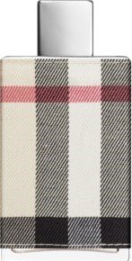
</td>

</tr>
</tbody>
</table>

### Pure 372

- **Carácter**: Intenso, vintage.
- **Notas aromáticas** 
- **Salida**: Aldehído, notas afrutadas, cítricos.
- **Corazón**: Lirio, heliotropo, jazmín, polianthes tuberosa.
- **Fondo**: Almizcle, madera tropical.
- **Familia olfativa**: Oriental.
- **Tipo de perfume**: Dulce.
- **Capacidad**: 50 ml.
- **Concentración**: 20%.
- **Ingredientes**: Alcohol denat., Fragrance/Parfum, Benzyl Salicylate, Linalool, Butylphenyl Methylpropional, Coumarin, Citronellol, Geraniol, Hexyl Cinnamal, Benzyl Benzoate, Cinnamyl Alcohol, Amyl Cinnamal, Eugenol, Benzyl Cinnamate, Hydroxycitronellal, Limonene, Benzyl Alcohol, Citral.

<table class="tablem" cellspacing="8" cellpadding="8">

<tbody>

<tr>

<td width="">

</td>

<td width="">
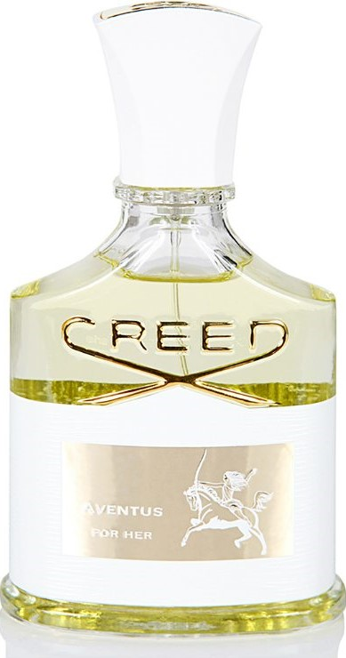
</td>

</tr>
</tbody>
</table>

### Pure 427

- **Carácter**: Alegre, hechizante.
- **Notas aromáticas** 
- **Salida**: Frambuesa, bergamota.
- **Corazón**: Rosa, iris, violeta.
- **Fondo**: Pachuli.
- **Familia olfativa**: Floral.
- **Tipo de perfume**: Dulce.
- **Capacidad**: 50 ml.
- **Concentración**: 20%.
- **Ingredientes**: Alcohol denat., Fragrance/Parfum, Limonene,Linalool, Citral, Geraniol, Butylphenyl Methylpropional, Cinnamal.

<table class="tablem" cellspacing="8" cellpadding="8">

<tbody>

<tr>

<td width="">
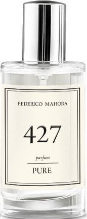
</td>

<td width="">
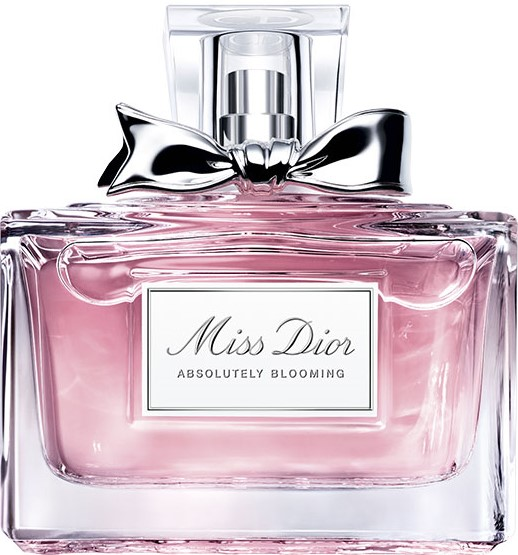
</td>

</tr>
</tbody>
</table>

### Pure 434

- **Carácter**: Atrevido, adictivo.
- **Notas aromáticas** 
- **Salida**: Naranja, pomelo, regaliz.
- **Corazón**: Rosa, flor de azahar, lirio de los valles, iris.
- **Fondo**: Árbol de sándalo, vainilla, almizcle.
- **Familia olfativa**: Floral.
- **Tipo de perfume**: Dulce.
- **Capacidad**: 50 ml.
- **Concentración**: 20%.
- **Ingredientes**: Alcohol denat., Fragrance/Parfum, Benzyl Salicylate, Linalool, Butylphenyl Methylpropional, Coumarin, Citronellol, Geraniol, Hexyl Cinnamal, Benzyl Benzoate, Cinnamyl Alcohol, Amyl Cinnamal, Eugenol, Benzyl Cinnamate, Hydroxycitronellal, Limonene, Benzyl Alcohol, Citral.

<table class="tablem" cellspacing="8" cellpadding="8">

<tbody>

<tr>

<td width="">
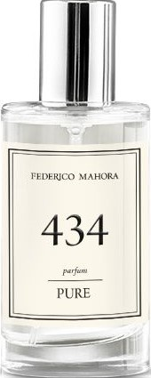
</td>

<td width="">

</td>

</tr>
</tbody>
</table>

### Pure 437

- **Carácter**: Seductor, lleno de dulzura.
- **Notas aromáticas** 
- **Salida**: Bergamota, fresa, flores frescas.
- **Corazón**: Melocotón, osmanto, macarrons de frambuesa.
- **Fondo**: Cacao, ámbar, vainilla.
- **Familia olfativa**: Floral.
- **Tipo de perfume**: Dulce.
- **Capacidad**: 50 ml.
- **Concentración**: 20%.
- **Ingredientes**: Alcohol denat., Fragrance/Parfum, Limonene, Linalool, Citral, Geraniol, Butylphenyl Methylpropional, Cinnamal.

<table class="tablem" cellspacing="8" cellpadding="8">

<tbody>

<tr>

<td width="">

</td>

<td width="">
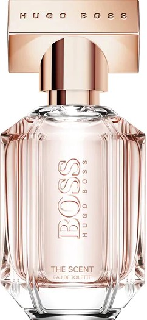
</td>

</tr>
</tbody>
</table>

### Pure 438

- **Carácter**: Dulce, femenino, sensual.
- **Notas aromáticas** 
- **Salida**:  Flor de manzana, nectarina, pera.
- **Corazón**: Jazmín, peonía, heliotropo.
- **Fondo**: Azúcar morena, incienso, vainilla, almizcle.
- **Familia olfativa**: Floral.
- **Tipo de perfume**: Dulce.
- **Capacidad**: 50 ml.
- **Concentración**: 20%.
- **Ingredientes**: Alcohol denat., Fragrance/Parfum, Limonene, Linalool, Citronellol, Citral, Alpha-Isomethyl Ionone.

<table class="tablem" cellspacing="8" cellpadding="8">

<tbody>

<tr>

<td width="">
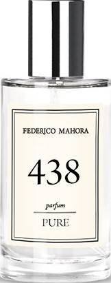
</td>

<td width="">
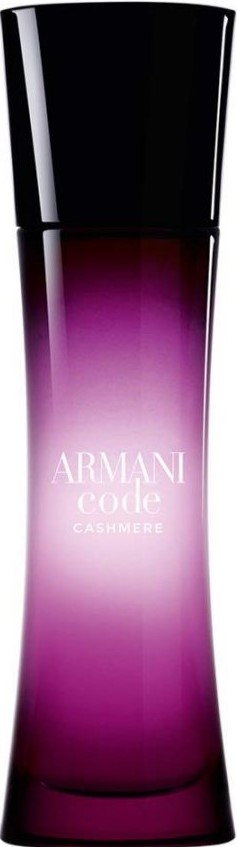
</td>

</tr>
</tbody>
</table>

### Pure 441

- **Carácter**: Fresco, gratis.
- **Notas aromáticas** 
- **Salida**:  Bergamota, lavanda, ilangue-ilangue.
- **Corazón**:  Jazmín, iris.
- **Fondo**: Vainilla, sándalo, almizcle.
- **Familia olfativa**: Oriental.
- **Tipo de perfume**: Dulce.
- **Capacidad**: 50 ml.
- **Concentración**: 20%.
- **Ingredientes**: Alcohol denat., Fragrance/Parfum, Benzyl Salicylate, Limonene, Hexyl Cinnamal, Cinnamyl Alcohol, Benzyl Benzoate, Linalool, Benzyl Cinnamate.

<table class="tablem" cellspacing="8" cellpadding="8">

<tbody>

<tr>

<td width="">
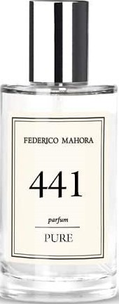
</td>

<td width="">

</td>

</tr>
</tbody>
</table>

### Pure 442

- **Carácter**: Caliente, picante, tentador.
- **Notas aromáticas** 
- **Salida**:  Rosa, azahar, pera.
- **Corazón**:  Café, jazmín, durazno.
- **Fondo**: Vainilla, pachulí, cedro.
- **Familia olfativa**: Oriental.
- **Tipo de perfume**: Sexy.
- **Capacidad**: 50 ml.
- **Concentración**: 20%.
- **Ingredientes**: Alcohol denat., Fragrance/Parfum, Linalool, Alpha-Isomethyl Ionone, Limonene, Hydroxycitronellal, Geraniol, Citronellol, Citral, Methyl 2-Octynoate.

<table class="tablem" cellspacing="8" cellpadding="8">

<tbody>

<tr>

<td width="">

</td>

<td width="">

</td>

</tr>
</tbody>
</table>

### Pure 443

- **Carácter**: Exquisito, seductor, cálido.
- **Notas aromáticas** 
- **Salida**:  Naranja, bergamota, grosella negra.
- **Corazón**: Jazmín, azahar, ilangue-ilangue, lirio de los valles.
- **Fondo**: Cedro, sándalo, vainilla.
- **Familia olfativa**: Chypre.
- **Tipo de perfume**: Sexy.
- **Capacidad**: 50 ml.
- **Concentración**: 20%.
- **Ingredientes**: Alcohol denat., Fragrance/Parfum, Benzyl Salicylate, Hexyl Cinnamal, Hydroxycitronellal, Benzyl Benzoate, Linalool, Coumarin, Limonene, Citronellol, Benzyl Alcohol, Farnesol, Citral, Amyl Cinnamal, Geraniol.

<table class="tablem" cellspacing="8" cellpadding="8">

<tbody>

<tr>

<td width="">
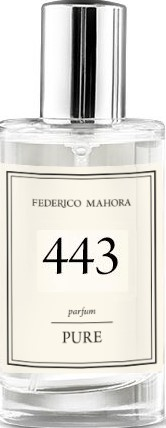
</td>

<td width="">
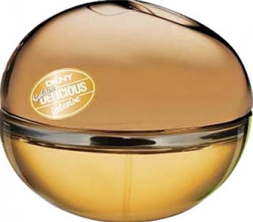
</td>

</tr>
</tbody>
</table>

### Pure 444

- **Carácter**: Tentador, sorprendente, caliente.
- **Notas aromáticas** 
- **Salida**:  Bergamota, pera, naranja dulce.
- **Corazón**: Rosa, iris, violeta, ilangueilangue.
- **Fondo**: Vainilla, almizcle, pachulí, café.
- **Familia olfativa**: Oriental.
- **Tipo de perfume**: Elegante.
- **Capacidad**: 50 ml.
- **Concentración**: 20%.
- **Ingredientes**: Alcohol denat., Fragrance/Parfum, Hexyl Cinnamal, Benzyl Salicylate, Limonene, Geraniol, Butylphenyl Methylpropional, Linalool, Hydroxycitronellal, Citronellol, Benzyl Alcohol, Coumarin, Citral, Amyl Cinnamal, Benzyl Benzoate, Isoeugenol, Benzyl Cinnamate.

<table class="tablem" cellspacing="8" cellpadding="8">

<tbody>

<tr>

<td width="">

</td>

<td width="">

</td>

</tr>
</tbody>
</table>

### Pure 445

- **Carácter**: Vivo, vibrante, jugoso.
- **Notas aromáticas** 
- **Salida**:  Mandarina, bergamota, nectarina.
- **Corazón**: Rosa, jazmín, madreselva, lirio de agua.
- **Fondo**: Sándalo, pachulí, cedro, vainilla, almizcle.
- **Familia olfativa**: Floral.
- **Tipo de perfume**: Elegante.
- **Capacidad**: 50 ml.
- **Concentración**: 20%.
- **Ingredientes**: Alcohol denat., Fragrance/Parfum, Limonene, Citronellol, Linalool, Geraniol.

<table class="tablem" cellspacing="8" cellpadding="8">

<tbody>

<tr>

<td width="">

</td>

<td width="">

</td>

</tr>
</tbody>
</table>

### Pure 446

- **Carácter**: Rebelde, sensual.
- **Notas aromáticas** 
- **Salida**:  Bergamota, manzana, jacinto, petitgrain.
- **Corazón**: Azahar, jazmín, nardo, rosa.
- **Fondo**: Cedro, vainilla, almizcle, árbol de cachemira, ámbar seco, heliotropo.
- **Familia olfativa**: Oriental.
- **Tipo de perfume**: Atrevido.
- **Capacidad**: 50 ml.
- **Concentración**: 20%.
- **Ingredientes**: Alcohol denat., Fragrance/Parfum, Limonene, Linalool, Coumarin, Citral, Citronellol, Geraniol.

<table class="tablem" cellspacing="8" cellpadding="8">

<tbody>

<tr>

<td width="">

</td>

<td width="">

</td>

</tr>
</tbody>
</table>

### Pure 448

- **Carácter**: Sorprendente, seductor, con un toque de dulzura.
- **Notas aromáticas** 
- **Salida**:  Pétalos de rosa, flor de azafrán, bosques blancos.
- **Corazón**:  Jazmín árabe, ciruela, vainilla planifolia.
- **Fondo**: Vetiver, ámbar, almizcle.
- **Familia olfativa**: Flor.
- **Tipo de perfume**: Dulce.
- **Capacidad**: 50 ml.
- **Concentración**: 20%.
- **Ingredientes**: Alcohol denat., Fragrance/Parfum, Limonene, Linalool, Coumarin, Citral, Citronellol, Geraniol.

<table class="tablem" cellspacing="8" cellpadding="8">

<tbody>

<tr>

<td width="">

</td>

<td width="">

</td>

</tr>
</tbody>
</table>

### Pure 449

- **Carácter**: Multifacético, emocionante, de buen gusto.
- **Notas aromáticas** 
- **Salida**: Limón, mandarina, pera, bergamota, regaliz,  ruibarbo, durazno, piña, coco, ciruela, torajna, cardamomo.
- **Corazón**: Jazmín árabe, rosa, lirio de los valles, naranja, notas solares, violeta, geranio, lías de vino.
- **Fondo**: Vainilla, gourmand, pachulí, almizcle, sándalo, cedro, madera seca.
- **Familia olfativa**: Oriental.
- **Tipo de perfume**: Encantador.
- **Capacidad**: 50 ml.
- **Concentración**: 20%.
- **Ingredientes**:Alcohol denat., Fragrance/Parfum, Alpha-Isomethyl Ionone, Butylphenyl Methylpropional, Cinnamyl Alcohol.

<table class="tablem" cellspacing="8" cellpadding="8">

<tbody>

<tr>

<td width="">

</td>

<td width="">

</td>

</tr>
</tbody>
</table>

### Pure 484

- **Carácter**: Luminoso, llamativo.
- **Notas aromáticas** 
- **Salida**: Mandarina, naranja, nuez moscada, clavo.
- **Corazón**: Azahar, jazmín, nardo, lavanda.
- **Fondo**: Vainilla, láudano, pachulí, sándalo.
- **Familia olfativa**: Oriental.
- **Tipo de perfume**: Dulce.
- **Capacidad**: 50 ml.
- **Concentración**: 20%.
- **Ingredientes**:Alcohol denat., Fragrance/Parfum, Limonene, Hydroxycitronellal, Linalool, Citronellol, Geraniol, Benzyl Salicylate, Coumarin, Citral, Alpha-Isomethyl Ionone.

<table class="tablem" cellspacing="8" cellpadding="8">

<tbody>

<tr>

<td width="">

</td>

<td width="">

</td>

</tr>
</tbody>
</table>

### Pure 486

- **Carácter**: Dulce, joven, apetitoso.
- **Notas aromáticas** 
- **Salida**: Pimienta rosa, frambuesa, bergamota.
- **Corazón**: Peonía, rosa, lirio de los valles, iris.
- **Fondo**: Sándalo, pachulí, cedro almizclero.
- **Familia olfativa**: Oriental.
- **Tipo de perfume**: Dulce.
- **Capacidad**: 50 ml.
- **Concentración**: 20%.
- **Ingredientes**: Alcohol denat., Fragrance/Parfum, Linalool, Alpha-Isomethyl Ionone, Geraniol, Citronellol, Limonene, Benzyl Benzoate, Benzyl Salicylate, Farnesol, Benzyl Alcohol.

<table class="tablem" cellspacing="8" cellpadding="8">

<tbody>

<tr>

<td width="">

</td>

<td width="">

</td>

</tr>
</tbody>
</table>

### Pure 487

- **Carácter**: Elegante, sensual, tentador.
- **Notas aromáticas** 
- **Salida**: Pimienta rosa, frambuesa, grosella negra, manzana.
- **Corazón**: Rosa, peonía, clavel, iris.
- **Fondo**: Pachulí, sándalo, almizcle, vainilla.
- **Familia olfativa**: Oriental.
- **Tipo de perfume**: Elegante.
- **Capacidad**: 50 ml.
- **Concentración**: 20%.
- **Ingredientes**: Alcohol denat., Fragrance/Parfum, Linalool, Limonene, Citronellol, Hydroxycitronellal, Alpha-Isomethyl Ionone, Citral, Geraniol.

<table class="tablem" cellspacing="8" cellpadding="8">

<tbody>

<tr>

<td width="">

</td>

<td width="">

</td>

</tr>
</tbody>
</table>

### Pure 488

- **Carácter**: Ligero, radiante, elegante.
- **Notas aromáticas** 
- **Salida**: Pomelo, bergamota, lichi, notas de agua.
- **Corazón**: Rosa, jazmín, magnolia, clavel.
- **Fondo**: Sándalo, ámbar gris, musgo de roble, cedro, almizcle.
- **Familia olfativa**: Amaderada.
- **Tipo de perfume**: Encantador.
- **Capacidad**: 50 ml.
- **Concentración**: 20%.
- **Ingredientes**: Alcohol denat., Fragrance/Parfum, Benzyl Salicylate, Butylphenyl Methylpropional, Linalool, Limonene, Citronellol, Coumarin, Geraniol, Methyl 2-Octynoate, Citral, Benzyl Benzoate.

<table class="tablem" cellspacing="8" cellpadding="8">

<tbody>

<tr>

<td width="">

</td>

<td width="">

</td>

</tr>
</tbody>
</table>

### Pure 700

- **Carácter**: Femenino, sensual.
- **Notas aromáticas** 
- **Salida**: Limón, manzana, hojas de violeta.
- **Corazón**: Peonía, lirio de los valles.
- **Fondo**: Árbol de cedro, almizcle, ámbar.
- **Familia olfativa**: Amaderada.
- **Tipo de perfume**: Sexy.
- **Capacidad**: 50 ml.
- **Concentración**: 20%.
- **Ingredientes**: Alcohol denat., Fragrance/Parfum, Benzyl Salicylate, Butylphenyl Methylpropional, Limonene, Hexyl Cinnamal, Hydroxycitronellal, Coumarin, Citronellol, Linalool, Benzyl Alcohol.

<table class="tablem" cellspacing="8" cellpadding="8">

<tbody>

<tr>

<td width="">

</td>

<td width="">

</td>

</tr>
</tbody>
</table>

### Pure 701

- **Carácter**: Magnético, sensual.
- **Notas aromáticas** 
- **Salida**: Piña, ruibarbo, manzana.
- **Corazón**: Jazmín, lirio de los valles, fresia.
- **Fondo**: Almizcle, melocotón.
- **Familia olfativa**: Oriental.
- **Tipo de perfume**: Moderno.
- **Capacidad**: 50 ml.
- **Concentración**: 20%.
- **Ingredientes**: Alcohol denat., Fragrance/Parfum, Linalool, Alpha-Isomethyl Ionone, Geraniol, Citronellol, Limonene, Benzyl Benzoate, Benzyl Salicylate, Farnesol, Benzyl Alcohol.

<table class="tablem" cellspacing="8" cellpadding="8">

<tbody>

<tr>

<td width="">

</td>

<td width="">

</td>

</tr>
</tbody>
</table>

### Pure 702

- **Carácter**: Expresivo, lleno de pasión.
- **Notas aromáticas** 
- **Salida**: Mandarina, bergamota, notas acuosas.
- **Corazón**: Jazmín, pelargonio, lirio de los valles.
- **Fondo**: Almizcle, ámbar.
- **Familia olfativa**: Oriental.
- **Tipo de perfume**: Atrevido.
- **Capacidad**: 50 ml.
- **Concentración**: 20%.
- **Ingredientes**: Alcohol denat., Fragrance/Parfum, Linalool, Limonene, Citronellol, Hydroxycitronellal, Alpha-Isomethyl Ionone, Citral, Geraniol.

<table class="tablem" cellspacing="8" cellpadding="8">

<tbody>

<tr>

<td width="">

</td>

<td width="">

</td>

</tr>
</tbody>
</table>

### Pure 703

- **Carácter**: Fresco, ligero, alegre.
- **Notas aromáticas** 
- **Salida**: Limón, grosella negra, arándano, hojas de té.
- **Corazón**: Lirio de agua, rosa, peonía blanca.
- **Fondo**: Vainilla, pachulí, almizcle.
- **Familia olfativa**: Floral.
- **Tipo de perfume**: Fresco.
- **Capacidad**: 50 ml.
- **Concentración**: 20%.
- **Ingredientes**: Alcohol denat., Fragrance/Parfum, Benzyl Salicylate, Butylphenyl Methylpropional, Linalool, Limonene, Citronellol, Coumarin, Geraniol, Methyl 2-Octynoate, Citral, Benzyl Benzoate.

<table class="tablem" cellspacing="8" cellpadding="8">

<tbody>

<tr>

<td width="">

</td>

<td width="">

</td>

</tr>
</tbody>
</table>

### Pure 706

- **Carácter**: Suave, romántico.
- **Notas aromáticas** 
- **Salida**: Bergamota, hojas de violeta, cilantro.
- **Corazón**: Melocotón, lirio de agua, rosa, violeta, narciso.
- **Fondo**: Vetiver, cedro, sándalo, almizcle.
- **Familia olfativa**: Floral.
- **Tipo de perfume**: Fresco.
- **Capacidad**: 50 ml.
- **Concentración**: 20%.
- **Ingredientes**: Alcohol denat., Fragrance/Parfum, Benzyl Salicylate, Butylphenyl Methylpropional, Limonene, Hexyl Cinnamal, Hydroxycitronellal, Coumarin, Citronellol, Linalool, Benzyl Alcohol.

<table class="tablem" cellspacing="8" cellpadding="8">

<tbody>

<tr>

<td width="">

</td>

<td width="">

</td>

</tr>
</tbody>
</table>

### Pure 716

- **Carácter**: Elegante, sensual, romántico.
- **Notas aromáticas** 
- **Salida**: Pera, nectarina, mandarina, bergamota.
- **Corazón**: Iris, fresia, jazmín, fl or de naranja africana.
- **Fondo**: Vainilla, haba Tonka, heliotropo, árbol de cedro.
- **Familia olfativa**: Oriental.
- **Tipo de perfume**: Sensual.
- **Capacidad**: 50 ml.
- **Concentración**: 20%.
- **Ingredientes**: Alcohol denat., Fragrance/Parfum, Limonene, Alpha-Isomethyl Ionone, Benzyl Salicylate, Linalool, Coumarin, Citral, Isoeugenol, Hexyl Cinnamal, Benzyl Benzoate, Benzyl Cinnamate, Geraniol, Benzyl Alcohol.

<table class="tablem" cellspacing="8" cellpadding="8">

<tbody>

<tr>

<td width="">

</td>

<td width="">

</td>

</tr>
</tbody>
</table>

### Pure 717

- **Carácter**: Atrayente, rebelde.
- **Notas aromáticas** 
- **Salida**: Pimiento, flores frescas, almizcle de agua.
- **Corazón**: Jazmín, almizcle blanco.
- **Fondo**: Árbol de sándalo, cachemira, almizcle helado.
- **Familia olfativa**: Amaderado.
- **Tipo de perfume**: Atractivo.
- **Capacidad**: 50 ml.
- **Concentración**: 20%.
- **Ingredientes**: Alcohol denat., Fragrance/Parfum, Benzyl Salicylate, Hexyl Cinnamal, Linalool, Amyl Cinnamal, Alpha-Isomethyl Ionone, Coumarin, Limonene, Hydroxycitronellal, Eugenol, Amylcinnamyl Alcohol, Benzyl Alcohol, Benzyl Benzoate, Citral, Benzyl Cinnamate.

<table class="tablem" cellspacing="8" cellpadding="8">

<tbody>

<tr>

<td width="">

</td>

<td width="">

</td>

</tr>
</tbody>
</table>

## Colección Pure ROYAL
La nueva línea **PURE ROYAL**, fascina con nuevas y refinadas fragancias, así como las de la apreciada colección de Lujo. Aromas de distinción aromática y elegancia sublime, incluye perfumes para ella y para él, con hasta un 30% de concentración, sellados en frascos en un diseño exquisito y estiloso. Una verdadera galería aromática que, junto con la colección de lujo incluye maravillas y diferentes fragancias.

### Pure ROYAL 141

- **Carácter**: Cristalinamente limpio, romántico.
- **Notas aromáticas** 
- **Salida**: Yuzu, granada, acordes de hielo.
- **Corazón**: Loto, magnolia, peonía.
- **Fondo**: Ámbar gris, almizcle, caoba.
- **Familia olfativa**: Floral.
- **Tipo de perfume**: Romántico.
- **Capacidad**: 50 ml.
- **Concentración**: 20%.
- **Ingredientes**: Alcohol denat., Fragrance/Parfum, Butylphenyl Methylpropional, Linalool, Citronellol.

<table class="tablem" cellspacing="8" cellpadding="8">

<tbody>

<tr>

<td width="">

</td>

<td width="">

</td>

</tr>
</tbody>
</table>

### Pure ROYAL 142

- **Carácter**: Provocativo, adictivo.
- **Notas aromáticas** 
- **Salida**: Zarzamora, hojas de mandarina.
- **Corazón**: Rosa, polianthes tuberosa, flor de azahar.
- **Fondo**: Sándalo, haba Tonka, vainilla.
- **Familia olfativa**: Oriental.
- **Tipo de perfume**: Provocativo.
- **Capacidad**: 50 ml.
- **Concentración**: 20%.
- **Ingredientes**: Alcohol denat., Fragrance/Parfum, Linalool, Limonene, Geraniol, Coumarin, Cinnamyl Alcohol, Citronellol, Isoeugenol, Citral, Cinnamal.

<table class="tablem" cellspacing="8" cellpadding="8">

<tbody>

<tr>

<td width="">

</td>

<td width="">

</td>

</tr>
</tbody>
</table>

### Pure ROYAL 146

- **Carácter**: Imbuido en dulzura, misterioso.
- **Notas aromáticas** 
- **Salida**: Fresia, manzana, pimienta de Jamaica.
- **Corazón**: Violeta, hibisco, rosa, lila.
- **Fondo**: Labdanum, sándalo, cedro, gamuza.
- **Familia olfativa**: Floral.
- **Tipo de perfume**: Dulce.
- **Capacidad**: 50 ml.
- **Concentración**: 20%.
- **Ingredientes**: Alcohol denat., Fragrance/Parfum, Butylphenyl Methylpropional, Linalool, Alpha-Isomethyl Ionone, Citronellol, Geraniol, Hexyl Cinnamal.

<table class="tablem" cellspacing="8" cellpadding="8">

<tbody>

<tr>

<td width="">

</td>

<td width="">

</td>

</tr>
</tbody>
</table>

### Pure ROYAL 147

- **Carácter**: Seductor y de buen gusto.
- **Notas aromáticas** 
- **Salida**: Lichi, mandarina, melocotón.
- **Corazón**: Ciruela, lirio, azucena.
- **Fondo**: Vainilla, ámbar gris, almizcle.
- **Familia olfativa**: Floral.
- **Tipo de perfume**: Empresarial.
- **Capacidad**: 50 ml.
- **Concentración**: 20%.
- **Ingredientes**: Alcohol denat., Fragrance/Parfum, Butylphenyl Methylpropional, Benzyl Salicylate, Limonene, Geraniol, Citronellol, Benzyl Alcohol, Citral, Linalool, Benzyl Benzoate.

<table class="tablem" cellspacing="8" cellpadding="8">

<tbody>

<tr>

<td width="">

</td>

<td width="">

</td>

</tr>
</tbody>
</table>

### Pure ROYAL 162

- **Carácter**: Clásico, algo dulce.
- **Notas aromáticas** 
- **Salida**: Miel de flores.
- **Corazón**: Rosa, vainilla.
- **Fondo**: Almizcle, pachuli.
- **Familia olfativa**: Oriental.
- **Tipo de perfume**: Intemporal.
- **Capacidad**: 50 ml.
- **Concentración**: 20%.
- **Ingredientes**: Alcohol denat., Fragrance/Parfum, Benzyl Salicylate, Butylphenyl Methylpropional, Benzyl Alcohol, Geraniol, Hydroxycitronellal, Hydroxyisohexyl 3-Cyclohexene Carboxaldehyde, Linalool, Hexyl Cinnamal, Limonene, Citral, Benzyl Benzoate.

<table class="tablem" cellspacing="8" cellpadding="8">

<tbody>

<tr>

<td width="">

</td>

<td width="">

</td>

</tr>
</tbody>
</table>

### Pure ROYAL 171

- **Carácter**:  Expresivo, intenso, cautivador.
- **Notas aromáticas** 
- **Salida**: Piña, nectarina, pera jugosa.
- **Corazón**: Peonía rosa, fresia, plumeria.
- **Fondo**: Almizcle, árbol de sándalo, pachuli, haba Tonka, vainilla.
- **Familia olfativa**: Oriental.
- **Tipo de perfume**: Intemporal.
- **Capacidad**: 50 ml.
- **Concentración**: 20%.
- **Ingredientes**: Alcohol denat., Fragrance/Parfum, Butylphenyl Methylpropional, Benzyl Salicylate, Limonene, Geraniol, Alpha-Isomethyl Ionone, Linalool, Cinnamyl Alcohol, Citronellol, Citral.

<table class="tablem" cellspacing="8" cellpadding="8">

<tbody>

<tr>

<td width="">

</td>

<td width="">

</td>

</tr>
</tbody>
</table>

### Pure ROYAL 281

- **Carácter**: Vibrante, apasionado.
- **Notas aromáticas** 
- **Salida**: Grosella negra.
- **Corazón**: Jazmín, rosa.
- **Fondo**: Almizcle, fresa.
- **Familia olfativa**: Floral.
- **Tipo de perfume**: Dulce.
- **Capacidad**: 50 ml.
- **Concentración**: 20%.
- **Ingredientes**: Alcohol denat., Fragrance/Parfum, Benzyl Salicylate, Butylphenyl Methylpropional, Hexyl Cinnamal, Hydroxycitronellal, Limonene, Linalool, Citronellol, Citral, Benzyl Alcohol.

<table class="tablem" cellspacing="8" cellpadding="8">

<tbody>

<tr>

<td width="">

</td>

<td width="">

</td>

</tr>
</tbody>
</table>

### Pure ROYAL 286

- **Carácter**: Sexy, elegante.
- **Notas aromáticas** 
- **Salida**: Bergamota.
- **Corazón**: Rosa, pachuli.
- **Fondo**: Ámbar gris, naranja.
- **Familia olfativa**: Oriental.
- **Tipo de perfume**: Sexy.
- **Capacidad**: 50 ml.
- **Concentración**: 20%.
- **Ingredientes**: Alcohol denat., Fragrance/Parfum, Hexyl Cinnamal, Linalool, Butylphenyl Methylpropional, Limonene, Geraniol, Hydroxycitronellal, Citronellol, Coumarin, Benzyl Alcohol, Isoeugenol, Citral, Amyl Cinnamal, Benzyl Benzoate, Benzyl Cinnamate.

<table class="tablem" cellspacing="8" cellpadding="8">

<tbody>

<tr>

<td width="">

</td>

<td width="">

</td>

</tr>
</tbody>
</table>

### Pure ROYAL 298

- **Carácter**: Fresco, lleno de energía.
- **Notas aromáticas** 
- **Salida**: Cítricos, peonía.
- **Corazón**: Rosa, osmanto.
- **Fondo**: Pachuli, sándalo.
- **Familia olfativa**: Floral.
- **Tipo de perfume**: Fresco.
- **Capacidad**: 50 ml.
- **Concentración**: 20%.
- **Ingredientes**: Alcohol denat., Fragrance/Parfum, Alpha-Isomethyl Ionone, Butylphenyl Methylpropional, Benzyl Salicylate, Hydroxycitronellal, Linalool, Limonene, Hydroxyisohexyl 3-Cyclohexene Carboxaldehyde, Geraniol, Citronellol, Citral, Farnesol.

<table class="tablem" cellspacing="8" cellpadding="8">

<tbody>

<tr>

<td width="">

</td>

<td width="">

</td>

</tr>
</tbody>
</table>

### Pure ROYAL 317

- **Carácter**: Provocativo, sensual.
- **Notas aromáticas** 
- **Salida**: Bayas rojas, pimienta rosa.
- **Corazón**: Frambuesa, melocotón, violeta, lila.
- **Fondo**: Pachuli, ámbar gris.
- **Familia olfativa**: Floral.
- **Tipo de perfume**: Sensual.
- **Capacidad**: 50 ml.
- **Concentración**: 20%.
- **Ingredientes**: Alcohol denat., Fragrance/Parfum, Butylphenyl Methylpropional, Hydroxycitronellal, Limonene, Hydroxyisohexyl 3-Cyclohexene Carboxaldehyde, Hexyl Cinnamal, Alpha-Isomethyl Ionone, Citronellol, Linalool, Geraniol, Isoeugenol, Citral.

<table class="tablem" cellspacing="8" cellpadding="8">

<tbody>

<tr>

<td width="">

</td>

<td width="">

</td>

</tr>
</tbody>
</table>

### Pure ROYAL 322

- **Carácter**: Sereno, sensual.
- **Notas aromáticas** 
- **Salida**: Membrillo, pomelo.
- **Corazón**: Jazmín, jacinto.
- **Fondo**: Almizcle blanco, cedro.
- **Familia olfativa**: Floral.
- **Tipo de perfume**: Intemporal.
- **Capacidad**: 50 ml.
- **Concentración**: 20%.
- **Ingredientes**: Alcohol denat., Fragrance/Parfum, Water/Aqua, Alpha-Isomethyl Ionone, Citronellol, Linalool, Butylphenyl Methylpropional, Hexyl Cinnamal, Hydroxycitronellal, Geraniol; CI 17200.

<table class="tablem" cellspacing="8" cellpadding="8">

<tbody>

<tr>

<td width="">

</td>

<td width="">

</td>

</tr>
</tbody>
</table>

### Pure ROYAL 352

- **Carácter**: Aterciopelado, cautivador.
- **Notas aromáticas** 
- **Salida**: Flor de azahar.
- **Corazón**: Jazmín.
- **Fondo**: Pachuli, miel.
- **Familia olfativa**: Floral.
- **Tipo de perfume**: Provocativo.
- **Capacidad**: 50 ml.
- **Concentración**: 20%.
- **Ingredientes**: Alcohol denat., Fragrance/Parfum, Linalool, Benzyl Salicylate, Limonene, Hexyl Cinnamal, Butylphenyl Methylpropional, Geraniol, Citronellol, Coumarin, Benzyl Benzoate, Benzyl Alcohol, Farnesol, Eugenol, Citral; CI 15985.

<table class="tablem" cellspacing="8" cellpadding="8">

<tbody>

<tr>

<td width="">

</td>

<td width="">

</td>

</tr>
</tbody>
</table>

### Pure ROYAL 355

- **Carácter**: Sensual, atrayente.
- **Notas aromáticas** 
- **Salida**: Notas cítricas.
- **Corazón**: Té de jazmín, azucena.
- **Fondo**: Sándalo, cedro, vainilla.
- **Familia olfativa**: Floral.
- **Tipo de perfume**: Sensual.
- **Capacidad**: 50 ml.
- **Concentración**: 20%.
- **Ingredientes**: Alcohol denat., Fragrance/Parfum, Limonene, Geraniol, Coumarin, Linalool, Citronellol, Hexyl Cinnamal, Isoeugenol, Benzyl Benzoate, Hydroxycitronellal, Citral, Farnesol.

<table class="tablem" cellspacing="8" cellpadding="8">

<tbody>

<tr>

<td width="">

</td>

<td width="">

</td>

</tr>
</tbody>
</table>

### Pure ROYAL 358

- **Carácter**: Extremadamente femenino, fascinante.
- **Notas aromáticas** 
- **Salida**: Bergamota, grosella negra.
- **Corazón**: Jazmín, lirio.
- **Fondo**: Cedro, sándalo, haba Tonka, vainilla.
- **Familia olfativa**: Amaderado.
- **Tipo de perfume**: Intemporal.
- **Capacidad**: 50 ml.
- **Concentración**: 20%.
- **Ingredientes**: Alcohol denat., Fragrance/Parfum, Limonene, Alpha-Isomethyl Ionone, Hydroxycitronellal, Geraniol, Coumarin, Linalool, Benzyl Alcohol, Citral; CI 60730, CI 17200.

<table class="tablem" cellspacing="8" cellpadding="8">

<tbody>

<tr>

<td width="">

</td>

<td width="">

</td>

</tr>
</tbody>
</table>

### Pure ROYAL 359

- **Carácter**: Magnético, intenso.
- **Notas aromáticas** 
- **Salida**: Jazmín, heliotropo.
- **Corazón**: Raíz de iris, madera de Cachemira.
- **Fondo**: Ámbar gris, vainilla.
- **Familia olfativa**: Oriental.
- **Tipo de perfume**: Extravagante.
- **Capacidad**: 50 ml.
- **Concentración**: 20%.
- **Ingredientes**: Alcohol denat., Fragrance/Parfum, Benzyl Salicylate, Coumarin, Alpha-Isomethyl Ionone, Geraniol, Anise Alcohol, Benzyl Benzoate, Citronellol, Linalool, Hexyl Cinnamal, Limonene, Eugenol.

<table class="tablem" cellspacing="8" cellpadding="8">

<tbody>

<tr>

<td width="">

</td>

<td width="">

</td>

</tr>
</tbody>
</table>

### Pure ROYAL 362

- **Carácter**: Paralizador, seductor.
- **Notas aromáticas** 
- **Salida**: Hoja de grosella negra.
- **Corazón**: Rosa, fresia.
- **Fondo**: Pachuli, vainilla, ambroxan, notas amaderadas.
- **Familia olfativa**: Chypre.
- **Tipo de perfume**: Sensual.
- **Capacidad**: 50 ml.
- **Concentración**: 20%.
- **Ingredientes**: Alcohol denat., Fragrance/Parfum, Benzyl Salicylate, Benzyl Alcohol, Limonene, Linalool, Geraniol, Cinnamyl Alcohol, Alpha-Isomethyl Ionone, Coumarin, Eugenol, Citronellol, Citral, Benzyl Benzoate.

<table class="tablem" cellspacing="8" cellpadding="8">

<tbody>

<tr>

<td width="">

</td>

<td width="">

</td>

</tr>
</tbody>
</table>

### Pure ROYAL 365

- **Carácter**: Clásico con notas a suntuosidad barroca.
- **Notas aromáticas** 
- **Salida**: Pomelo, bergamota.
- **Corazón**: Rosa, narciso, jazmín, geranio, pachuli.
- **Fondo**: Sándalo, vainilla, almizcle blanco, haba Tonka.
- **Familia olfativa**: Floral.
- **Tipo de perfume**: Elegante.
- **Capacidad**: 50 ml.
- **Concentración**: 20%.
- **Ingredientes**: Alcohol denat., Fragrance/Parfum, Hexyl Cinnamal, Linalool, Limonene, Coumarin, Geraniol, Benzyl Salicylate, Alpha-Isomethyl Ionone, Citronellol, Benzyl Benzoate, Citral, Eugenol, Benzyl Alcohol, Amyl Cinnamal, Hydroxycitronellal.

<table class="tablem" cellspacing="8" cellpadding="8">

<tbody>

<tr>

<td width="">

</td>

<td width="">

</td>

</tr>
</tbody>
</table>

### Pure ROYAL 366

- **Carácter**: Rebelde, urbano, sexy, con garra.
- **Notas aromáticas** 
- **Salida**: Pimienta roja, flor de azahar, pera.
- **Corazón**: Café, jazmín.
- **Fondo**: Vainilla, pachuli, cedro.
- **Familia olfativa**: Oriental.
- **Tipo de perfume**: Provocativo.
- **Capacidad**: 50 ml.
- **Concentración**: 20%.
- **Ingredientes**:Alcohol denat., Fragrance/Parfum, Benzyl Salicylate, Hydroxycitronellal, Linalool, Hexyl Cinnamal, Citronellol, Limonene, Geraniol, Cinnamyl Alcohol, Coumarin.

<table class="tablem" cellspacing="8" cellpadding="8">

<tbody>

<tr>

<td width="">

</td>

<td width="">

</td>

</tr>
</tbody>
</table>

### Pure ROYAL 707

- **Carácter**: Lleno de energía, evoca recuerdos de verano.
- **Notas aromáticas** 
- **Salida**: Bergamota, limón, naranja, mandarina, notas de hoja.
- **Corazón**: Lirio de los valles, jazmín, notas de agua.
- **Fondo**: Pachulí, melocotón, ámbar gris.
- **Familia olfativa**: Cítrico.
- **Tipo de perfume**: Provocativo.
- **Capacidad**: 50 ml.
- **Concentración**: 20%.
- **Ingredientes**: Alcohol denat., Fragrance/Parfum, Benzyl Salicylate, Limonene, Hydroxycitronellal, Citronellol, Linalool, Butylphenyl Methylpropional, Alpha-Isomethyl Ionone, Coumarin, Benzyl Alcohol, Eugenol, Geraniol, Benzyl Benzoate, Citral.

<table class="tablem" cellspacing="8" cellpadding="8">

<tbody>

<tr>

<td width="">

</td>

<td width="">

</td>

</tr>
</tbody>
</table>

### Pure ROYAL 708

- **Carácter**: Armonioso, jugoso.
- **Notas aromáticas** 
- **Salida**: Bergamota, lichi, melocotón.
- **Corazón**: Jazmín, peonía, azahar.
- **Fondo**: Notas amaderadas, musgo, almizcle.
- **Familia olfativa**: Oriental.
- **Tipo de perfume**: Sensual.
- **Capacidad**: 50 ml.
- **Concentración**: 20%.
- **Ingredientes**: Alcohol denat., Fragrance/Parfum, Water/Aqua, Benzyl Salicylate, Alpha-Isomethyl Ionone, Butylphenyl Methylpropional, Hydroxyisohexyl 3-Cyclohexene Carboxaldehyde, Hydroxycitronellal, Coumarin, Limonene, Geraniol.

<table class="tablem" cellspacing="8" cellpadding="8">

<tbody>

<tr>

<td width="">

</td>

<td width="">

</td>

</tr>
</tbody>
</table>

### Pure ROYAL 709

- **Carácter**: Refrescante, transparente, independiente.
- **Notas aromáticas** 
- **Salida**: Bergamota, limón, neroli, clavo.
- **Corazón**: Violeta, jazmín, ciclamen.
- **Fondo**: Ámbar negro, almizcle, vetiver, cedro.
- **Familia olfativa**: Floral.
- **Tipo de perfume**: Fresco.
- **Capacidad**: 50 ml.
- **Concentración**: 20%.
- **Ingredientes**: Alcohol denat., Fragrance/Parfum, Water/Aqua, Benzyl Salicylate, Alpha-Isomethyl Ionone, Citronellol, Limonene, Geraniol, Citral, Linalool; CI 60730, CI 17200.

<table class="tablem" cellspacing="8" cellpadding="8">

<tbody>

<tr>

<td width="">

</td>

<td width="">

</td>

</tr>
</tbody>
</table>

### Pure ROYAL 711

- **Carácter**: Maduro, equilibrado, amigable.
- **Notas aromáticas** 
- **Salida**: Manzana, mandarina, clavo, naranja.
- **Corazón**: Rosa, jazmín, azahar.
- **Fondo**: Pachulí, vainilla, almizcle, sándalo.
- **Familia olfativa**: Floral.
- **Tipo de perfume**: Empresarial.
- **Capacidad**: 50 ml.
- **Concentración**: 20%.
- **Ingredientes**: Alcohol denat., Fragrance/Parfum, Water/Aqua, Alpha-Isomethyl Ionone, Limonene, Hydroxycitronellal, Benzyl Salicylate, Citronellol, Linalool, Geraniol, Citral; CI 42090, CI 19140.

<table class="tablem" cellspacing="8" cellpadding="8">

<tbody>

<tr>

<td width="">

</td>

<td width="">

</td>

</tr>
</tbody>
</table>

### Pure ROYAL 712

- **Carácter**: Enérgico, luminoso, meridional.
- **Notas aromáticas** 
- **Salida**: Bergamota, limón, bayas rojas, clementina, flor de manzana.
- **Corazón**: Cardamomo, jazmín.
- **Fondo**: Sándalo, cedro, almizcle.
- **Familia olfativa**: Floral.
- **Tipo de perfume**: Amaderado.
- **Capacidad**: 50 ml.
- **Concentración**: 20%.
- **Ingredientes**: Alcohol denat., Fragrance/Parfum, Water/Aqua, Alpha-Isomethyl Ionone, Citronellol, Linalool, Butylphenyl Methylpropional, Hexyl Cinnamal, Hydroxycitronellal, Geraniol; CI 17200.

<table class="tablem" cellspacing="8" cellpadding="8">

<tbody>

<tr>

<td width="">

</td>

<td width="">

</td>

</tr>
</tbody>
</table>

### Pure ROYAL 713

- **Carácter**: Rosado, definido, elegante.
- **Notas aromáticas** 
- **Salida**: Azafrán Corazón: rosa, jazmín, peonía.
- **Corazón**: Notas amaderadas, almizcle, ámbar gris.
- **Fondo**: Sándalo, cedro, almizcle.
- **Familia olfativa**: Floral.
- **Tipo de perfume**: Amaderado.
- **Capacidad**: 50 ml.
- **Concentración**: 20%.
- **Ingredientes**: Alcohol denat., Fragrance/Parfum, Water/Aqua, Butylphenyl Methylpropional, Limonene, Alpha-Isomethyl Ionone, Citronellol, Citral, Linalool, Cinnamyl Alcohol, Cinnamal; CI 42090, CI 19140.

<table class="tablem" cellspacing="8" cellpadding="8">

<tbody>

<tr>

<td width="">

</td>

<td width="">

</td>

</tr>
</tbody>
</table>

### Pure ROYAL 714

- **Carácter**: Fresco, alegre, abierto.
- **Notas aromáticas** 
- **Salida**: Bergamota, limón, flor de manzana, pera jugosa.
- **Corazón**: Jazmín, rosa, pimienta negra.
- **Fondo**: Almizcle, sándalo, heliotropo.
- **Familia olfativa**: Oriental.
- **Tipo de perfume**: Atractivo.
- **Capacidad**: 50 ml.
- **Concentración**: 20%.
- **Ingredientes**: Alcohol denat., Fragrance/Parfum, Water/Aqua, Geraniol, Citronellol, Benzyl Salicylate, Alpha-Isomethyl Ionone, Linalool, Limonene, Benzyl Benzoate, Citral, Farnesol. 

<table class="tablem" cellspacing="8" cellpadding="8">

<tbody>

<tr>

<td width="">

</td>

<td width="">

</td>

</tr>
</tbody>
</table>

### Pure ROYAL 715

- **Carácter**: Contrastante, elegante, clásico.
- **Notas aromáticas** 
- **Salida**: Mandarina amarilla, pera verde, pimienta rosa, grosella negra, durazno, manzana.
- **Corazón**: Jazmín árabe, naranjo, lirio de los valles, rosa, clavo de burro.
- **Fondo**: Pachulí, almizcle blanco, cedro, madera seca, vainilla, cachemira.
- **Familia olfativa**: Chypre.
- **Tipo de perfume**: Dulce.
- **Capacidad**: 50 ml.
- **Concentración**: 20%.
- **Ingredientes**: Alcohol denat., Fragrance/Parfum, Water/Aqua, Benzyl Salicylate, Butylphenyl Methylpropional, Citronellol, Linalool, Limonene, Geraniol, Alpha-Isomethyl Ionone, Coumarin, Hydroxycitronellal, Hexyl Cinnamal, Benzyl Benzoate, Eugenol, Citral, Cinnamyl Alcohol. 

<table class="tablem" cellspacing="8" cellpadding="8">

<tbody>

<tr>

<td width="">

</td>

<td width="">

</td>

</tr>
</tbody>
</table>

### Pure ROYAL 777

- **Carácter**: Elegante, armonioso, vintage.
- **Notas aromáticas** 
- **Salida**: Bergamota, durazno, ciruela, grosella negra, lirio, pera.
- **Corazón**: Mimosa, rosa, jazmín, heliotropo, lirio de los valles, coco.
- **Fondo**: Vainilla, sándalo, haba tonka, almizcle, caramelo.
- **Familia olfativa**: Oriental.
- **Tipo de perfume**: Elegante.
- **Capacidad**: 50 ml.
- **Concentración**: 20%.
- **Ingredientes**: Alcohol denat., Fragrance/Parfum, Linalool, Limonene, Benzyl Benzoate, Citronellol, Hydroxyisohexyl 3-Cyclohexene Carboxaldehyde, Geraniol, Eugenol, Cinnamyl Alcohol, Cinnamal, Citral, Farnesol. 

<table class="tablem" cellspacing="8" cellpadding="8">

<tbody>

<tr>

<td width="">

</td>

<td width="">

</td>

</tr>
</tbody>
</table>

### Pure ROYAL 800

- **Carácter**: Alegre, brillante, lleno de energía positiva.
- **Notas aromáticas** 
- **Salida**: Mandarina, toronja, grosella negra.
- **Corazón**: Jazmín, nardo, ilangue-ilangue.
- **Fondo**: Rosa, sándalo, almizcle.
- **Familia olfativa**: Floral.
- **Tipo de perfume**: Elegante.
- **Capacidad**: 50 ml.
- **Concentración**: 20%.
- **Ingredientes**: Alcohol denat., Fragrance/Parfum, Linalool, Benzyl Salicylate, Limonene, Hexyl Cinnamal, Butylphenyl Methylpropional, Geraniol, Citronellol, Coumarin, Benzyl Benzoate, Benzyl Alcohol, Farnesol, Eugenol, Citral; CI 15985. 

<table class="tablem" cellspacing="8" cellpadding="8">

<tbody>

<tr>

<td width="">

</td>

<td width="">

</td>

</tr>
</tbody>
</table>

### Pure ROYAL 801

- **Carácter**: Fresco, romántico, sensual, lleno de encanto.
- **Notas aromáticas** 
- **Salida**: Cóctel de cítricos, arándanos rosas, pera, notas verdes.
- **Corazón**: Rosa, magnolia, jazmín nocturno.
- **Fondo**: Pachuli, vainilla, haba Tonka, árbol de sándalo.
- **Familia olfativa**: Oriental.
- **Tipo de perfume**: Sensual.
- **Capacidad**: 50 ml.
- **Concentración**: 20%.
- **Ingredientes**: Alcohol denat., Fragrance/Parfum, Alpha-Isomethyl Ionone, Hydroxyisohexyl 3-Cyclohexene Carboxaldehyde, Citronellol, Geraniol, Limonene, Eugenol. 

<table class="tablem" cellspacing="8" cellpadding="8">

<tbody>

<tr>

<td width="">

</td>

<td width="">

</td>

</tr>
</tbody>
</table>

### Pure ROYAL 802

- **Carácter**: Provocativo, sensual, original.
- **Notas aromáticas** 
- **Salida**: Pomelo, pimienta de maíz rosa, acordes marinos.
- **Corazón**: Pomelo, pimienta de maíz rosa, acordes marinos.
- **Fondo**: Pachuli, almizcle, vainilla.
- **Familia olfativa**: Oriental.
- **Tipo de perfume**: Sensual.
- **Capacidad**: 50 ml.
- **Concentración**: 20%.
- **Ingredientes**: Alcohol denat., Fragrance/Parfum, Limonene, Benzyl Salicylate, Citronellol, Alpha-Isomethyl Ionone, Hydroxycitronellal, Hexyl Cinnamal, Geraniol, Citral, Linalool, Cinnamal. 

<table class="tablem" cellspacing="8" cellpadding="8">

<tbody>

<tr>

<td width="">

</td>

<td width="">

</td>

</tr>
</tbody>
</table>

### Pure ROYAL 803

- **Carácter**: Sensual, tentador, escandaloso.
- **Notas aromáticas** 
- **Salida**: Naranja, miel, melocotón salvaje.
- **Corazón**: Gardenia, flor de azahar, iris.
- **Fondo**: Pachuli, vainilla, ámbar.
- **Familia olfativa**: Oriental.
- **Tipo de perfume**: Sensual.
- **Capacidad**: 50 ml.
- **Concentración**: 20%.
- **Ingredientes**: Alcohol denat., Fragrance/Parfum, Butylphenyl Methylpropional, Citronellol, Limonene, Alpha-Isomethyl Ionone, Linalool, Amyl Cinnamal, Geraniol. 

<table class="tablem" cellspacing="8" cellpadding="8">

<tbody>

<tr>

<td width="">

</td>

<td width="">

</td>

</tr>
</tbody>
</table>

### Pure ROYAL 804

- **Carácter**: Atrevido, moderno, lleno de encanto.
- **Notas aromáticas** 
- **Salida**: Mandarina, grosella negra, hojas de bambú.
- **Corazón**: Rosa, peonía, flor de azahar.
- **Fondo**: Pachuli, praliné, almizcle.
- **Familia olfativa**: Oriental.
- **Tipo de perfume**: Atrevido.
- **Capacidad**: 50 ml.
- **Concentración**: 20%.
- **Ingredientes**: Alcohol denat., Fragrance/Parfum, Alpha-Isomethyl Ionone, Butylphenyl Methylpropional, Benzyl Salicylate, Hydroxycitronellal, Linalool, Limonene, Hydroxyisohexyl 3-Cyclohexene Carboxaldehyde, Geraniol, Citronellol, Citral, Farnesol. 

<table class="tablem" cellspacing="8" cellpadding="8">

<tbody>

<tr>

<td width="">

</td>

<td width="">

</td>

</tr>
</tbody>
</table>

### Pure ROYAL 806

- **Carácter**: Atrevido, alegre, positivo, lujoso.
- **Notas aromáticas** 
- **Salida**: Mandarina, jazmín, notas acuosas.
- **Corazón**: Rosa, polianthes tuberosa, ylang-ylang.
- **Fondo**: Almizcle, árbol de sándalo, árbol de cedro.
- **Familia olfativa**: Amaderado.
- **Tipo de perfume**: Acuoso.
- **Capacidad**: 50 ml.
- **Concentración**: 20%.
- **Ingredientes**: Alcohol denat., Fragrance/Parfum, Citronellol, Limonene, Linalool, Geraniol, Hexyl Cinnamal, Benzyl Cinnamate, Cinnamal, Benzyl Benzoate, Eugenol, Citral. 

<table class="tablem" cellspacing="8" cellpadding="8">

<tbody>

<tr>

<td width="">

</td>

<td width="">

</td>

</tr>
</tbody>
</table>

### Pure ROYAL 807

- **Carácter**: Romántico, ligero, fresco.
- **Notas aromáticas** 
- **Salida**: Bergamota, neroli, hojas de naranjo.
- **Corazón**: Melocotón salvaje, lirio de los valles, jazmín.
- **Fondo**: Árbol de cedro, almizcle.
- **Familia olfativa**: Amaderado.
- **Tipo de perfume**: Fresco.
- **Capacidad**: 50 ml.
- **Concentración**: 20%.
- **Ingredientes**: Alcohol denat., Fragrance/Parfum, Limonene, Butylphenyl Methylpropional, Benzyl Salicylate, Linalool, Alpha-Isomethyl Ionone, Geraniol, Hydroxycitronellal, Citronellol, Citral, Hexyl Cinnamal. 

<table class="tablem" cellspacing="8" cellpadding="8">

<tbody>

<tr>

<td width="">

</td>

<td width="">

</td>

</tr>
</tbody>
</table>

### Pure ROYAL 809

- **Carácter**: Sofisticado, selecto, elegante.
- **Notas aromáticas** 
- **Salida**: Bergamota, jengibre, notas acuosas.
- **Corazón**: Incienso, rosa, pachuli.
- **Fondo**: Almizcle, vainilla, vetiver.
- **Familia olfativa**: Oriental.
- **Tipo de perfume**: Elegante.
- **Capacidad**: 50 ml.
- **Concentración**: 20%.
- **Ingredientes**: Alcohol denat., Fragrance/Parfum, Butylphenyl Methylpropional, Benzyl Salicylate, Alpha-Isomethyl Ionone, Limonene, Citronellol, Coumarin, Citral, Geraniol, Linalool. 

<table class="tablem" cellspacing="8" cellpadding="8">

<tbody>

<tr>

<td width="">

</td>

<td width="">

</td>

</tr>
</tbody>
</table>

### Pure ROYAL 810

- **Carácter**: Sutil, delicado, femenino, sereno.
- **Notas aromáticas** 
- **Salida**: Bergamota, mandarina, grosella negra.
- **Corazón**: Peonía rosa, rosa, lirio de los valles, melocotón, albaricoque.
- **Fondo**: Almizcle, ámbar, pachuli, musgo de roble.
- **Familia olfativa**: Floral.
- **Tipo de perfume**: Delicado.
- **Capacidad**: 50 ml.
- **Concentración**: 20%.
- **Ingredientes**: Alcohol denat., Fragrance/Parfum, Hexyl Cinnamal, Limonene, Alpha-Isomethyl Ionone, Geraniol, Butylphenyl Methylpropional, Linalool, Citronellol, Benzyl Benzoate, Eugenol, Cinnamyl Alcohol, Citral, Benzyl Alcohol. 

<table class="tablem" cellspacing="8" cellpadding="8">

<tbody>

<tr>

<td width="">

</td>

<td width="">

</td>

</tr>
</tbody>
</table>

### Pure ROYAL 811

- **Carácter**: Fresco, frívolo, libre.
- **Notas aromáticas** 
- **Salida**: Bergamota, pera, frambuesa.
- **Corazón**: Jazmín, flor de azahar, rosa.
- **Fondo**: Ámbar, pachuli, almizcle.
- **Familia olfativa**: Oriental.
- **Tipo de perfume**: Fresco.
- **Capacidad**: 50 ml.
- **Concentración**: 20%.
- **Ingredientes**: Alcohol denat., Fragrance/Parfum, Benzyl Salicylate, Alpha-Isomethyl Ionone, Linalool, Coumarin, Isoeugenol; CI 15985. 

<table class="tablem" cellspacing="8" cellpadding="8">

<tbody>

<tr>

<td width="">

</td>

<td width="">

</td>

</tr>
</tbody>
</table>

### Pure ROYAL 817

- **Carácter**: Alegre, sutil, resplandeciente.
- **Notas aromáticas** 
- **Salida**: Frambuesa, limón.
- **Corazón**: Rosa, neroli.
- **Fondo**: Almizcle, vainilla, pachuli.
- **Familia olfativa**: Floral.
- **Tipo de perfume**: Dulce.
- **Capacidad**: 50 ml.
- **Concentración**: 20%.
- **Ingredientes**: Alcohol denat., Fragrance/Parfum, Butylphenyl Methylpropional, Benzyl Salicylate, Limonene, Geraniol, Alpha-Isomethyl Ionone, Linalool, Cinnamyl Alcohol, Citronellol, Citral. 

<table class="tablem" cellspacing="8" cellpadding="8">

<tbody>

<tr>

<td width="">

</td>

<td width="">

</td>

</tr>
</tbody>
</table>

### Pure ROYAL 818

- **Carácter**: Alegre, fresco, tentador.
- **Notas aromáticas** 
- **Salida**: Bayas rojas, mandarina, limón, pera.
- **Corazón**: Gardenia, jazmín, lirio de los valles, neroli.
- **Fondo**: Vainilla, pachuli, almizcle, resina de benjuí.
- **Familia olfativa**: Floral.
- **Tipo de perfume**: Sexy.
- **Capacidad**: 50 ml.
- **Concentración**: 20%.
- **Ingredientes**: Alcohol denat., Fragrance/Parfum, Benzyl Salicylate, Butylphenyl Methylpropional, Benzyl Alcohol, Geraniol, Hydroxycitronellal, Hydroxyisohexyl 3-Cyclohexene Carboxaldehyde, Linalool, Hexyl Cinnamal, Limonene, Citral, Benzyl Benzoate. 

<table class="tablem" cellspacing="8" cellpadding="8">

<tbody>

<tr>

<td width="">

</td>

<td width="">

</td>

</tr>
</tbody>
</table>

### Pure ROYAL 819

- **Carácter**: Sofisticado, moderno, elegante.
- **Notas aromáticas** 
- **Salida**: Pimienta rosa, bergamota, flor de ciruelo.
- **Corazón**: Rosa de Turquía, jazmín silvestre, pachuli.
- **Fondo**: Cuero, ámbar gris, musgo de roble, árbol de sándalo, haba Tonka, vainilla.
- **Familia olfativa**: Oriental.
- **Tipo de perfume**: Elegante.
- **Capacidad**: 50 ml.
- **Concentración**: 20%.
- **Ingredientes**: Alcohol denat., Fragrance/Parfum, Benzyl Salicylate, Butylphenyl Methylpropional, Coumarin, Citronellol, Geraniol, Limonene, Linalool. 

<table class="tablem" cellspacing="8" cellpadding="8">

<tbody>

<tr>

<td width="">

</td>

<td width="">

</td>

</tr>
</tbody>
</table>

### Pure ROYAL 820

- **Carácter**: Sensual, provocativo, magnético.
- **Notas aromáticas** 
- **Salida**: Flor de azahar, melocotón.
- **Corazón**: Ylang-ylang, rosa.
- **Fondo**: Árbol de sándalo, ámbar gris, vainilla, almizcle.
- **Familia olfativa**: Oriental.
- **Tipo de perfume**: Sexy.
- **Capacidad**: 50 ml.
- **Concentración**: 20%.
- **Ingredientes**: Alcohol denat., Fragrance/Parfum, Linalool, Limonene, Geraniol, Coumarin, Cinnamyl Alcohol, Citronellol, Isoeugenol, Citral, Cinnamal. 

<table class="tablem" cellspacing="8" cellpadding="8">

<tbody>

<tr>

<td width="">

</td>

<td width="">

</td>

</tr>
</tbody>
</table>

### Pure ROYAL 825

- **Carácter**: Elegante, agrega confianza.
- **Notas aromáticas** 
- **Salida**: Mandarina, limón, nectarina.
- **Corazón**: Pimienta, fresia, peonía.
- **Fondo**: Caramelo, almizcle de vainilla, sándalo.
- **Familia olfativa**: Oriental.
- **Tipo de perfume**: Sexy.
- **Capacidad**: 50 ml.
- **Concentración**: 20%.
- **Ingredientes**: Alcohol denat., Fragrance/Parfum, Butylphenyl Methylpropional, Linalool, Citronellol. 

<table class="tablem" cellspacing="8" cellpadding="8">

<tbody>

<tr>

<td width="">

</td>

<td width="">

</td>

</tr>
</tbody>
</table>

### Pure ROYAL 826

- **Carácter**: Elegante, agrega confianza.
- **Notas aromáticas** 
- **Salida**: Mandarina, limón, nectarina.
- **Corazón**: Pimienta, fresia, peonía.
- **Fondo**: Caramelo, almizcle de vainilla, sándalo.
- **Familia olfativa**: Oriental.
- **Tipo de perfume**: Dulce.
- **Capacidad**: 50 ml.
- **Concentración**: 20%.
- **Ingredientes**: Alcohol denat., Fragrance/Parfum, Butylphenyl Methylpropional, Linalool, Alpha-Isomethyl Ionone, Citronellol, Geraniol, Hexyl Cinnamal. 

<table class="tablem" cellspacing="8" cellpadding="8">

<tbody>

<tr>

<td width="">

</td>

<td width="">

</td>

</tr>
</tbody>
</table>

### Pure ROYAL 827

- **Carácter**: Alegre, lleno de energía, soleado.
- **Notas aromáticas** 
- **Salida**: Melocotón, limón, flor de manzana, pera jugosa, hojas de violeta.
- **Corazón**: Jazmín, fresia, hibisco, hojas verdes.
- **Fondo**: Almizcle, cedro, sándalo.
- **Familia olfativa**: Cítrico.
- **Tipo de perfume**: Fresco.
- **Capacidad**: 50 ml.
- **Concentración**: 20%.
- **Ingredientes**: Alcohol denat., Fragrance/Parfum, Butylphenyl Methylpropional, Alpha-Isomethyl Ionone, Benzyl Salicylate, Geraniol, Linalool, Citronellol, Benzyl Alcohol, Limonene, Hexyl Cinnamal, Cinnamal, Benzyl Benzoate, Citral, Farnesol, Eugenol. 

<table class="tablem" cellspacing="8" cellpadding="8">

<tbody>

<tr>

<td width="">

</td>

<td width="">

</td>

</tr>
</tbody>
</table>

### Pure ROYAL 828

- **Carácter**: Delicioso, lleno de dulzura.
- **Notas aromáticas** 
- **Salida**: Limón, frambuesa, almendra, grosella negra.
- **Corazón**: Rosa, azahar, jazmín.
- **Fondo**: Vainilla, pachulí, ámbar gris, almizcle.
- **Familia olfativa**: Oriental.
- **Tipo de perfume**: Atrevido.
- **Capacidad**: 50 ml.
- **Concentración**: 20%.
- **Ingredientes**: Alcohol denat., Fragrance/Parfum, Limonene, Coumarin, Linalool, Geraniol, Citronellol, Citral, Cinnamal, Amyl Cinnamal. 

<table class="tablem" cellspacing="8" cellpadding="8">

<tbody>

<tr>

<td width="">

</td>

<td width="">

</td>

</tr>
</tbody>
</table>

### Pure ROYAL 829

- **Carácter**: Elegante, agrega confianza.
- **Notas aromáticas** 
- **Salida**: Mandarina, limón, nectarina.
- **Corazón**: Pimienta, fresia, peonía.
- **Fondo**: Caramelo, almizcle, vainilla, sándalo.
- **Familia olfativa**: Oriental.
- **Tipo de perfume**: Elegante.
- **Capacidad**: 50 ml.
- **Concentración**: 20%.
- **Ingredientes**: Alcohol denat., Fragrance/Parfum, Benzyl Salicylate, Butylphenyl Methylpropional, Hexyl Cinnamal, Hydroxycitronellal, Limonene, Linalool, Citronellol, Citral, Benzyl Alcohol. 

<table class="tablem" cellspacing="8" cellpadding="8">

<tbody>

<tr>

<td width="">

</td>

<td width="">

</td>

</tr>
</tbody>
</table>

### Pure ROYAL 833

- **Carácter**: Noble, femenino.
- **Notas aromáticas** 
- **Salida**: Melocotón, naranja, madreselva.
- **Corazón**: Nardo, jazmín, iris.
- **Fondo**: Sándalo, cedro, vainilla, almizcle.
- **Familia olfativa**: Floral.
- **Tipo de perfume**: Elegante.
- **Capacidad**: 50 ml.
- **Concentración**: 20%.
- **Ingredientes**: Alcohol denat., Fragrance/Parfum, Linalool, Limonene, Hydroxycitronellal, Geraniol, Alpha-Isomethyl Ionone, Citral, Benzyl Benzoate, Isoeugenol. 

<table class="tablem" cellspacing="8" cellpadding="8">

<tbody>

<tr>

<td width="">

</td>

<td width="">

</td>

</tr>
</tbody>
</table>

### Pure ROYAL 834

- **Carácter**: Cálido, acogedor.
- **Notas aromáticas** 
- **Salida**: Bergamota, lirio de los valles.
- **Corazón**: Rosa, coco, lirio.
- **Fondo**: Resina de benzoina, ámbar, madera, vainilla, sándalo.
- **Familia olfativa**: Floral.
- **Tipo de perfume**: Ducle.
- **Capacidad**: 50 ml.
- **Concentración**: 20%.
- **Ingredientes**: Alcohol denat., Fragrance/Parfum, Benzyl Salicylate, Butylphenyl Methylpropional, Alpha-Isomethyl Ionone, Limonene, Linalool, Geraniol, Coumarin, Citronellol, Citral. 

<table class="tablem" cellspacing="8" cellpadding="8">

<tbody>

<tr>

<td width="">

</td>

<td width="">

</td>

</tr>
</tbody>
</table>

### Pure ROYAL 835

- **Carácter**: Dulce, pero con garra, vigoroso.
- **Notas aromáticas** 
- **Salida**: Manzana, pera, bergamota, limón, durazno.
- **Corazón**: Lirio de los valles, jazmín, rosa, iris.
- **Fondo**: Cedro, pachulí, vainilla, ámbar gris, almizcle.
- **Familia olfativa**: Oriental.
- **Tipo de perfume**: Ducle.
- **Capacidad**: 50 ml.
- **Concentración**: 20%.
- **Ingredientes**: Alcohol denat., Fragrance/Parfum, Linalool, Limonene, Hydroxycitronellal, Geraniol, Alpha-Isomethyl Ionone, Citral, Benzyl Benzoate, Isoeugenol. 

<table class="tablem" cellspacing="8" cellpadding="8">

<tbody>

<tr>

<td width="">

</td>

<td width="">

</td>

</tr>
</tbody>
</table>

### Pure ROYAL 836

- **Carácter**: Agradable, optimista.
- **Notas aromáticas** 
- **Salida**: Pera, manzana, bergamota, lirio de los valles, frambuesa.
- **Corazón**: Peonía, rosa, magnolia, fresia.
- **Fondo**: Sándalo, almizcle, pachulí, ámbar.
- **Familia olfativa**: Chypre.
- **Tipo de perfume**: Ducle.
- **Capacidad**: 50 ml.
- **Concentración**: 20%.
- **Ingredientes**: Alcohol denat., Fragrance/Parfum, Limonene, Linalool, Butylphenyl Methylpropional, Eugenol, Citral, Geraniol. 

<table class="tablem" cellspacing="8" cellpadding="8">

<tbody>

<tr>

<td width="">

</td>

<td width="">

</td>

</tr>
</tbody>
</table>

