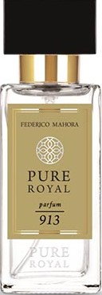

<h1>Catálogo Perfumes Unisex</h1>

**PURE ROYAL UNISEX** representa un regreso a la perfumería clásica donde las fragancias no se atribuyeron al género ⭐. Son composiciones extremadamente originales, creadas para mujeres y hombres, por un lado, fuertes y llamativas, por otro, entrelazadas con toques claros y frescos. Son perfumes que se pueden compartir con su pareja, y aun así, el olor será diferente en cada uno. 💞 🌟

**Síguenos en nuestras redes sociales y haz tus pedidos desde nuestro WhatsApp🌟🌟🌟**

  

### PURE ROYAL UNISEX 900

- **Carácter**: Fascinante, único, con un encantador aroma a cereza.
- **Notas aromáticas**
- **Salida**: Cereza negra, licor de cereza, almendras amargas.
- **Corazón**: Rosa, jazmín, cereza ácida.
- **Fondo**: Haba Tonka, árbol de sándalo, vetiver, cedro.
- **Familia olfativa**: Floral.
- **Tipo de perfume**: Encantador.
- **Capacidad**: 50 ml.
- **Concentración**: 20%.
- **Ingredientes**: Alcohol denat., Fragrance/Parfum, Linalool, Alpha-Isomethyl Ionone, Geraniol, Citronellol, Limonene, Benzyl Benzoate, Benzyl Salicylate, Farnesol, Benzyl Alcohol.

<table class="tablem" cellspacing="8" cellpadding="8">

<tbody>

<tr>

<td width="">

</td>

<td width="">

</td>

</tr>
</tbody>
</table>

### PURE ROYAL UNISEX 901

- **Carácter**: Clásico, equilibrado, elegante.
- **Notas aromáticas**
- **Salida**: Mandarina, ajenjo, enebro.
- **Corazón**: Cardamomo, jengibre, lavanda.
- **Fondo**: Árbol de cedro, ámbar, pachuli.
- **Familia olfativa**: Oriental.
- **Tipo de perfume**: Elegante.
- **Capacidad**: 50 ml.
- **Concentración**: 20%.
- **Ingredientes**: Alcohol denat., Fragrance/Parfum, Benzyl Salicylate, Butylphenyl Methylpropional, Linalool, Limonene, Citronellol, Coumarin, Geraniol, Methyl 2-Octynoate, Citral, Benzyl Benzoate.

<table class="tablem" cellspacing="8" cellpadding="8">

<tbody>

<tr>

<td width="">

</td>

<td width="">

</td>

</tr>
</tbody>
</table>

### PURE ROYAL UNISEX 902

- **Carácter**: Fresco, claro, estimulante.
- **Notas aromáticas**
- **Salida**: Mandarina, bergamota, limón.
- **Corazón**: Petitgrain, flor de azahar, pimienta.
- **Fondo**: Árbol de cedro, almizcle.
- **Familia olfativa**: Cítrico.
- **Tipo de perfume**: Fresco.
- **Capacidad**: 50 ml.
- **Concentración**: 20%.
- **Ingredientes**: Alcohol denat., Fragrance/Parfum, Linalool, Limonene, Citronellol, Hydroxycitronellal, Alpha-Isomethyl Ionone, Citral, Geraniol.

<table class="tablem" cellspacing="8" cellpadding="8">

<tbody>

<tr>

<td width="">

</td>

<td width="">

</td>

</tr>
</tbody>
</table>

### PURE ROYAL UNISEX 903

- **Carácter**: Estimulante, positivo.
- **Notas aromáticas**
- **Salida**: Mandarina, bergamota, limón, petitgrain, romero.
- **Corazón**: Neroli, flor de azahar, jazmín.
- **Fondo**: Árbol de cedro, almizcle.
- **Familia olfativa**: Cítrico.
- **Tipo de perfume**: Fresco.
- **Capacidad**: 50 ml.
- **Concentración**: 20%.
- **Ingredientes**: Alcohol denat., Fragrance/Parfum, Benzyl Salicylate, Butylphenyl Methylpropional, Limonene, Hexyl Cinnamal, Hydroxycitronellal, Coumarin, Citronellol, Linalool, Benzyl Alcohol.

<table class="tablem" cellspacing="8" cellpadding="8">

<tbody>

<tr>

<td width="">

</td>

<td width="">

</td>

</tr>
</tbody>
</table>

### PURE ROYAL UNISEX 904

- **Carácter**: Rebelde, descarado, refrescante.
- **Notas aromáticas**
- **Salida**: Comino, cardamomo, ciclamen.
- **Corazón**: Incienso, iris, notas de tierra.
- **Fondo**: Almizcle, cuero, sándalo.
- **Familia olfativa**: Oriental.
- **Tipo de perfume**: Extravagante.
- **Capacidad**: 50 ml.
- **Concentración**: 20%.
- **Ingredientes**: Alcohol denat., Fragrance/Parfum, Limonene, Alpha-Isomethyl Ionone, Benzyl Salicylate, Linalool, Coumarin, Citral, Isoeugenol, Hexyl Cinnamal, Benzyl Benzoate, Benzyl Cinnamate, Geraniol, Benzyl Alcohol.

<table class="tablem" cellspacing="8" cellpadding="8">

<tbody>

<tr>

<td width="">

</td>

<td width="">

</td>

</tr>
</tbody>
</table>

### PURE ROYAL UNISEX 905

- **Carácter**: Equilibrio entre sagrado y profano.
- **Notas aromáticas**
- **Salida**: Ciruela, frambuesa, ruibarbo, granada, clavo.
- **Corazón**: Pimienta rosa, jazmín, opoponax, pachulí, lirio.
- **Fondo**: Guayaco, cedro, ámbar, incienso, vainilla.
- **Familia olfativa**: Amaderado.
- **Tipo de perfume**: Sexy.
- **Capacidad**: 50 ml.
- **Concentración**: 20%.
- **Ingredientes**: Alcohol denat., Fragrance/Parfum, Benzyl Salicylate, Butylphenyl Methylpropional, Limonene, Hexyl Cinnamal, Hydroxycitronellal, Coumarin, Citronellol, Linalool, Benzyl Alcohol.

<table class="tablem" cellspacing="8" cellpadding="8">

<tbody>

<tr>

<td width="">

</td>

<td width="">

</td>

</tr>
</tbody>
</table>

### PURE ROYAL UNISEX 906

- **Carácter**: Ardiente, sensual.
- **Notas aromáticas**
- **Salida**: Bergamota, nectarina, jengibre.
- **Corazón**: Jazmín, clavo, canela, romero, heliotropo.
- **Fondo**: Vainilla, haba tonka, cedro, tabaco, pachulí.
- **Familia olfativa**: Oriental.
- **Tipo de perfume**: Sensual.
- **Capacidad**: 50 ml.
- **Concentración**: 20%.
- **Ingredientes**: Alcohol denat., Fragrance/Parfum, Butylphenyl Methylpropional, Benzyl Salicylate, Geraniol, Limonene, Citronellol, Alpha-Isomethyl Ionone, Linalool, Coumarin, Hydroxycitronellal, Citral, Benzyl Benzoate, Benzyl Alcohol.

<table class="tablem" cellspacing="8" cellpadding="8">

<tbody>

<tr>

<td width="">

</td>

<td width="">

</td>

</tr>
</tbody>
</table>

### PURE ROYAL UNISEX 908

- **Carácter**: Elegante, genial.
- **Notas aromáticas**
- **Salida**: Bergamota, cilantro, ciruela.
- **Corazón**: Jazmín, rosa, peonía, gamuza.
- **Fondo**: Pachulí, semillas de ambrette, musgo, ámbar.
- **Familia olfativa**: Oriental.
- **Tipo de perfume**: Sensual.
- **Capacidad**: 50 ml.
- **Concentración**: 20%.
- **Ingredientes**: Alcohol denat., Fragrance/Parfum, Butylphenyl Methylpropional, Limonene, Linalool, Citral.

<table class="tablem" cellspacing="8" cellpadding="8">

<tbody>

<tr>

<td width="">

</td>

<td width="">

</td>

</tr>
</tbody>
</table>

### PURE ROYAL UNISEX 909

- **Carácter**: Fresco, con un elemento depredador.
- **Notas aromáticas**
- **Salida**: Bergamota, mandarina, miel, ron.
- **Corazón**: Orquídea, magnolia, jazmín, rosa, azahar, heliotropo.
- **Fondo**: Sándalo, cítricos, mirra, bálsamo peruano, cuero, vainilla.
- **Familia olfativa**: Chypre.
- **Tipo de perfume**: Fresco.
- **Capacidad**: 50 ml.
- **Concentración**: 20%.
- **Ingredientes**: Alcohol denat., Fragrance/Parfum, Limonene, Linalool, Hydroxyisohexyl 3-C.

<table class="tablem" cellspacing="8" cellpadding="8">

<tbody>

<tr>

<td width="">

</td>

<td width="">

</td>

</tr>
</tbody>
</table>

### PURE ROYAL UNISEX 910

- **Carácter**: Seco, con un toque de dulzura.
- **Notas aromáticas**
- **Salida**: Jazmín, azafrán.
- **Corazón**: Bálsamo de abeto, cedro.
- **Fondo**: Árbol de cachemir, ámbar gris, musgo, azúcar moreno.
- **Familia olfativa**: Amaderado.
- **Tipo de perfume**: Elegante.
- **Capacidad**: 50 ml.
- **Concentración**: 20%.
- **Ingredientes**: Alcohol denat., Fragrance/Parfum, Limonene, Linalool, Coumarin, Geraniol, Eugenol, Citral, Isoeugenol, Cinnamyl Alcohol.

<table class="tablem" cellspacing="8" cellpadding="8">

<tbody>

<tr>

<td width="">

</td>

<td width="">

</td>

</tr>
</tbody>
</table>

### PURE ROYAL UNISEX 911

- **Carácter**: Positivo, cautiva con una nota de lima.
- **Notas aromáticas**
- **Salida**: Toronja, bergamota, lima, albahaca, limón.
- **Corazón**: Tomillo, lila, jazmín, iris.
- **Fondo**: Vetiver, pachulí, cedro, láudano, almizcle.
- **Familia olfativa**: Cítrico.
- **Tipo de perfume**: Atractivo.
- **Capacidad**: 50 ml.
- **Concentración**: 20%.
- **Ingredientes**: Alcohol denat., Fragrance/Parfum, Limonene, Linalool, Coumarin, Hydroxycitronellal, Hydroxyisohexyl 3-Cyclohexene Carboxaldehyde, Butylphenyl Methylpropional, Alpha-Isomethyl Ionone, Hexyl Cinnamal, Citronellol, Citral, Geraniol.

<table class="tablem" cellspacing="8" cellpadding="8">

<tbody>

<tr>

<td width="">

</td>

<td width="">

</td>

</tr>
</tbody>
</table>

### PURE ROYAL UNISEX 912

- **Carácter**: Urbano, moderno, victorioso.
- **Notas aromáticas**
- **Salida**: Bergamota, limón, pimienta, petitgrain.
- **Corazón**: Neroli, azahar, albahaca.
- **Fondo**: Almizcle, vetiver.
- **Familia olfativa**: Oriental.
- **Tipo de perfume**: Moderno.
- **Capacidad**: 50 ml.
- **Concentración**: 20%.
- **Ingredientes**: Alcohol denat., Fragrance/Parfum, Linalool, Limonene, Alpha-Isomethyl Ionone, Citronellol, Cinnamal, Geraniol, Citral, Eugenol.

<table class="tablem" cellspacing="8" cellpadding="8">

<tbody>

<tr>

<td width="">

</td>

<td width="">

</td>

</tr>
</tbody>
</table>

### PURE ROYAL UNISEX 913

- **Carácter**: Cálido, dulce, atractivo.
- **Notas aromáticas**
- **Salida**: Pimienta rosa, bergamota, naranja, pistacho.
- **Corazón**: Coco, ylang-ylang, jazmín, polianthes tuberosa.
- **Fondo**: Resina de benjuí, haba Tonka, vainilla, ámbar.
- **Familia olfativa**: Oriental.
- **Tipo de perfume**: Moderno.
- **Capacidad**: 50 ml.
- **Concentración**: 20%.
- **Ingredientes**: Alcohol denat., Fragrance/Parfum, Limonene, Hexyl Cinnamal, Coumarin, Butylphenyl Methylpropional, Linalool, Alpha-Isomethyl Ionone, Citral, Geraniol, Benzyl Alcohol.

<table class="tablem" cellspacing="8" cellpadding="8">

<tbody>

<tr>

<td width="">

</td>

<td width="">

</td>

</tr>
</tbody>
</table>

### PURE ROYAL UNISEX 914

- **Carácter**: Refrescante, espumoso, dulce.
- **Notas aromáticas**
- **Salida**: Bergamota, notas verdes, notas saladas.
- **Corazón**: Salvia, notas afrutadas, notas florales.
- **Fondo**: Notas amaderadas, ámbar, almizcle.
- **Familia olfativa**: Oriental.
- **Tipo de perfume**: Acuoso.
- **Capacidad**: 50 ml.
- **Concentración**: 20%.
- **Ingredientes**: Alcohol denat., Fragrance/Parfum, Linalool, Limonene, Butylphenyl Methylpropional, Benzyl Salicylate, Alpha-Isomethyl Ionone, Citral, Geraniol.

<table class="tablem" cellspacing="8" cellpadding="8">

<tbody>

<tr>

<td width="">

</td>

<td width="">

</td>

</tr>
</tbody>
</table>

### PURE ROYAL UNISEX 915

- **Carácter**: Jugoso, dulce, ligero.
- **Notas aromáticas**
- **Salida**: Jacinto, clavel.
- **Corazón**: Lirio de los valles, jazmín, rosa canina.
- **Fondo**: Ámbar blanco, almizcle.
- **Familia olfativa**: Floral.
- **Tipo de perfume**: Dulce.
- **Capacidad**: 50 ml.
- **Concentración**: 20%.
- **Ingredientes**: Alcohol denat., Fragrance/Parfum, Linalool, Benzyl Benzoate, Limonene, Butylphenyl Methylpropional, Coumarin, Citral, Geraniol, Eugenol, Isoeugenol, Citronellol.

<table class="tablem" cellspacing="8" cellpadding="8">

<tbody>

<tr>

<td width="">

</td>

<td width="">

</td>

</tr>
</tbody>
</table>

### PURE ROYAL UNISEX 916

- **Carácter**: Misterioso, intrigante.
- **Notas aromáticas**
- **Salida**: Bergamota, albahaca, menta.
- **Corazón**: Fresia, pera, rosa.
- **Fondo**: Almizcle, pachuli, árbol de sándalo.
- **Familia olfativa**: Oriental.
- **Tipo de perfume**: Misterioso.
- **Capacidad**: 50 ml.
- **Concentración**: 20%.
- **Ingredientes**: Alcohol denat., Fragrance/Parfum, Coumarin, Linalool, Butylphenyl Methylpropional, Alpha-Isomethyl Ionone, Limonene, Geraniol.

<table class="tablem" cellspacing="8" cellpadding="8">

<tbody>

<tr>

<td width="">

</td>

<td width="">

</td>

</tr>
</tbody>
</table>

### PURE ROYAL UNISEX 917

- **Carácter**: Serio con un toque radiante.
- **Notas aromáticas**
- **Salida**: Naranja, mandarina, salvia.
- **Corazón**: Jazmín, flor de azahar.
- **Fondo**: Miel, notas soleadas.
- **Familia olfativa**: Cítrico.
- **Tipo de perfume**: Floral.
- **Capacidad**: 50 ml.
- **Concentración**: 20%.
- **Ingredientes**: Alcohol denat., Fragrance/Parfum, Limonene, Linalool, Butylphenyl Methylpropional, Coumarin, Citronellol, Citral, Geraniol.

<table class="tablem" cellspacing="8" cellpadding="8">

<tbody>

<tr>

<td width="">

</td>

<td width="">

</td>

</tr>
</tbody>
</table>

### PURE ROYAL UNISEX 918

- **Carácter**: Claro, fresco.
- **Notas aromáticas**
- **Salida**: Ruibarbo, hoja de melocotón.
- **Corazón**: Violeta, rosa.
- **Fondo**: Madera clara, almizcle.
- **Familia olfativa**: Oriental.
- **Tipo de perfume**: Fresco.
- **Capacidad**: 50 ml.
- **Concentración**: 20%.
- **Ingredientes**: Alcohol denat., Fragrance/Parfum, Hydroxycitronellal, Linalool, Coumarin, Benzyl Benzoate, Limonene, Alpha-Isomethyl Ionone, Metal 2-Octynoate, Geraniol, Citral.

<table class="tablem" cellspacing="8" cellpadding="8">

<tbody>

<tr>

<td width="">

</td>

<td width="">

</td>

</tr>
</tbody>
</table>

### PURE ROYAL UNISEX 919

- **Carácter**: Digno, expresivo, claro.
- **Notas aromáticas**
- **Salida**: Lima, albahaca, limón.
- **Corazón**: Jazmín, lavanda, té blanco.
- **Fondo**: Musgo de roble, vetiver, almizcle, ámbar.
- **Familia olfativa**: Cítrico.
- **Tipo de perfume**: Atrevido.
- **Capacidad**: 50 ml.
- **Concentración**: 20%.
- **Ingredientes**: Alcohol denat., Fragrance/Parfum, Linalool, Limonene, Butylphenyl Methylpropional, Alpha-Isomethyl Ionone, Benzyl Salicylate, Geraniol, Citronellol, Citral, Eugenol, Evernia Furfuracea Extract, Hydroxycitronellal.

<table class="tablem" cellspacing="8" cellpadding="8">

<tbody>

<tr>

<td width="">

</td>

<td width="">

</td>

</tr>
</tbody>
</table>

### PURE ROYAL UNISEX 920

- **Carácter**: Salvaje, sorprendente.
- **Notas aromáticas**
- **Salida**: Pimienta rosa, incienso, rosa.
- **Corazón**: Piel, frutos rojos, azafrán.
- **Fondo**: Melocotón, oud, ámbar.
- **Familia olfativa**: Oriental.
- **Tipo de perfume**: Cuero.
- **Capacidad**: 50 ml.
- **Concentración**: 20%.
- **Ingredientes**: Alcohol Denat., Fragrance/Parfum, Limonene, Linalool, Butylphenyl Methylpropional, Benzyl Salicylate, Geraniol, Citral.

<table class="tablem" cellspacing="8" cellpadding="8">

<tbody>

<tr>

<td width="">

</td>

<td width="">

</td>

</tr>
</tbody>
</table>

### PURE ROYAL UNISEX 921

- **Carácter**: Deslumbrante, vigorizante.
- **Notas aromáticas**
- **Salida**: Mandarina, calamondina, naranja.
- **Corazón**: Hibisco, flor de loto, flor de azahar, jazmín.
- **Fondo**: Vainilla, jara pringosa (Cistus ladanifer), madera
de cedro, miel.
- **Familia olfativa**: Cítrico.
- **Tipo de perfume**: Amaderado.
- **Capacidad**: 50 ml.
- **Concentración**: 20%.
- **Ingredientes**: Alcohol Denat., Fragrance/Parfum, Limonene, Butylphenyl Methylpropional, Linalool, Benzyl Salicylate, Hexyl Cinnamal, Hydroxyisohexyl 3-Cyclohexene Carboxaldehyde, Citral, Geraniol, Citronellol.

<table class="tablem" cellspacing="8" cellpadding="8">

<tbody>

<tr>

<td width="">

</td>

<td width="">

</td>

</tr>
</tbody>
</table>

### PURE ROYAL UNISEX 922

- **Carácter**: Ambiguo, profundo.
- **Notas aromáticas**
- **Salida**: Flor de azahar, notas frondosas, clavel.
- **Corazón**: Ylang-ylang, jazmín, rosa.
- **Fondo**: Madera de cedro, almizcle, ámbar.
- **Familia olfativa**: Floral.
- **Tipo de perfume**: Profundo.
- **Capacidad**: 50 ml.
- **Concentración**: 20%.
- **Ingredientes**: Alcohol denat., Fragrance/Parfum, Linalool, Limonene, Coumarin, Alpha-Isomethyl Ionone, Citronellol, Citral, Geraniol, Cinnamal.

<table class="tablem" cellspacing="8" cellpadding="8">

<tbody>

<tr>

<td width="">

</td>

<td width="">

</td>

</tr>
</tbody>
</table>

### PURE ROYAL UNISEX 923

- **Carácter**: Cautivador, tentador, encantador.
- **Notas aromáticas**
- **Salida**: Notas cítricas, notas picantes, canela, clavel, jengibre, cardamomo, notas afrutadas.
- **Corazón**: Notas amaderadas, notas florales.
- **Fondo**: Ámbar, almizcle, notas atalcadas.
- **Familia olfativa**: Oriental.
- **Tipo de perfume**: Encantador.
- **Capacidad**: 50 ml.
- **Concentración**: 20%.
- **Ingredientes**: Alcohol denat., Fragrance/Parfum, Water/Aqua, Limonene, Coumarin, Linalool, Eugenol, Citronellol, Cinnamal, Geraniol, Citral.

<table class="tablem" cellspacing="8" cellpadding="8">

<tbody>

<tr>

<td width="">

</td>

<td width="">

</td>

</tr>
</tbody>
</table>

### PURE ROYAL UNISEX 924

- **Carácter**: Casual, abierto, amigable.
- **Notas aromáticas**
- **Salida**: Mandarina, neroli, azafrán, cardamomo, nuez moscada.
- **Corazón**: Rosa de Damasco, jazmín, flor de azahar, notas florales, madera de cedro.
- **Fondo**: Ámbar, madera dulce, árbol de sándalo, vainilla, leche.
- **Familia olfativa**: Floral.
- **Tipo de perfume**: Atractivo.
- **Capacidad**: 50 ml.
- **Concentración**: 20%.
- **Ingredientes**: Alcohol denat., Fragrance/Parfum, Linalool, Limonene, Coumarin, Geraniol, Citronellol, Eugenol, Citral, Cinnamal, Isoeugenol.

<table class="tablem" cellspacing="8" cellpadding="8">

<tbody>

<tr>

<td width="">

</td>

<td width="">

</td>

</tr>
</tbody>
</table>

### PURE ROYAL UNISEX 925

- **Carácter**: De negocios, moderno.
- **Notas aromáticas**
- **Salida**: Pomelo, salvia, neroli.
- **Corazón**: Nuez moscada, azucena, notas picantes.
- **Fondo**: Musgo de roble, ámbar, madera de cedro, almizcle blanco.
- **Familia olfativa**: Oriental.
- **Tipo de perfume**: Moderno.
- **Capacidad**: 50 ml.
- **Concentración**: 20%.
- **Ingredientes**: Alcohol denat., Fragrance/Parfum, Limonene, Hexyl Cinnamal, Linalool, Butylphenyl Methylpropional, Citronellol, Geraniol, Citral, Amyl Cinnamal, Eugenol, Benzyl Alcohol, Isoeugenol.

<table class="tablem" cellspacing="8" cellpadding="8">

<tbody>

<tr>

<td width="">

</td>

<td width="">

</td>

</tr>
</tbody>
</table>

### PURE ROYAL UNISEX 926

- **Carácter**: Maduro, definido.
- **Notas aromáticas**
- **Salida**: Azafrán, tomillo, frambuesa.
- **Corazón**: Jazmín, incienso, madera de cedro, vainilla.
- **Fondo**: Notas amaderadas, ámbar, cuero, musgo.
- **Familia olfativa**: Oriental.
- **Tipo de perfume**: Elegante.
- **Capacidad**: 50 ml.
- **Concentración**: 20%.
- **Ingredientes**: Alcohol denat., Fragrance/Parfum, Limonene, Linalool, Butylphenyl Methylpropional, Alpha-Isomethyl Ionone, Citral, Geraniol, Hexyl Cinnamal, Citronellol, Benzyl Benzoate, Isoeugenol.

<table class="tablem" cellspacing="8" cellpadding="8">

<tbody>

<tr>

<td width="">

</td>

<td width="">

</td>

</tr>
</tbody>
</table>

### PURE ROYAL UNISEX 927

- **Carácter**: Maduro, contundente.
- **Notas aromáticas**
- **Salida**: Bayas rosas, bergamota, verbena, comino.
- **Corazón**: Pimiento, iris, rosa, nuez moscada.
- **Fondo**: Pachuli, vainilla, ámbar, notas animales.
- **Familia olfativa**: Oriental.
- **Tipo de perfume**: Agresivo.
- **Capacidad**: 50 ml.
- **Concentración**: 20%.
- **Ingredientes**: Alcohol denat., Fragrance/Parfum, Limonene, Coumarin, Linalool, Citral, Alpha-Isomethyl Ionone, Geraniol, Citronellol, Cinnamal.

<table class="tablem" cellspacing="8" cellpadding="8">

<tbody>

<tr>

<td width="">

</td>

<td width="">

</td>

</tr>
</tbody>
</table>

### PURE ROYAL UNISEX 928

- **Carácter**: Asombroso con aroma a zarzamora.
- **Notas aromáticas**
- **Salida**: Zarzamora, grosella negra, melocotón, limón, notas verdes.
- **Corazón**: Ciclamen, flores blancas, notas dulces.
- **Fondo**: Árbol de sándalo, ámbar, musgo.
- **Familia olfativa**: Cítrico.
- **Tipo de perfume**: Ligero.
- **Capacidad**: 50 ml.
- **Concentración**: 20%.
- **Ingredientes**: Alcohol denat., Fragrance/Parfum, Linalool, Coumarin, Limonene, Alpha-Isomethyl Ionone, Citral, Geraniol.

<table class="tablem" cellspacing="8" cellpadding="8">

<tbody>

<tr>

<td width="">

</td>

<td width="">

</td>

</tr>
</tbody>
</table>

### PURE ROYAL UNISEX 929

- **Carácter**: Empresarial a la vez que original.
- **Notas aromáticas**
- **Salida**: Bergamota, cardamomo, yuzu.
- **Corazón**: Romero, notas a agua marina, geranio.
- **Fondo**: Árbol de cedro, vetiver, musgo de roble.
- **Familia olfativa**: Acuosa.
- **Tipo de perfume**: Decidido.
- **Capacidad**: 50 ml.
- **Concentración**: 20%.
- **Ingredientes**: Alcohol denat., Fragrance/Parfum, Limonene, Hexyl Cinnamal, Benzyl Salicylate, Butylphenyl Methylpropional, Citronellol, Linalool, Citral, Coumarin, Geraniol, Benzyl Alcohol, Isoeugenol, Amyl Cinnamal.

<table class="tablem" cellspacing="8" cellpadding="8">

<tbody>

<tr>

<td width="">

</td>

<td width="">

</td>

</tr>
</tbody>
</table>

### PURE ROYAL UNISEX 930

- **Carácter**: Apetitoso, dulce y salado.
- **Notas aromáticas**
- **Salida**: Oud, notas dulces, miel.
- **Corazón**: Rosa de Damasco, clavel.
- **Fondo**: Musgo, ámbar, pachuli.
- **Familia olfativa**: Oud.
- **Tipo de perfume**: Atractivo.
- **Capacidad**: 50 ml.
- **Concentración**: 20%.
- **Ingredientes**: Alcohol denat., Fragrance/Parfum, Linalool, Limonene, Butylphenyl Methylpropional, Coumarin, Alpha-Isomethyl Ionone, Geraniol, Citronellol, Citral.

<table class="tablem" cellspacing="8" cellpadding="8">

<tbody>

<tr>

<td width="">

</td>

<td width="">

</td>

</tr>
</tbody>
</table>

### PURE ROYAL UNISEX 932

- **Carácter**: Relajante, encantador.
- **Notas aromáticas**
- **Salida**: Vainilla, cumarina, árbol del ámbar, almizcle.
- **Corazón**: Ajenjo, menta, madera clara.
- **Fondo**: Cardamomo, lavanda, flores frescas.
- **Familia olfativa**: Oriental.
- **Tipo de perfume**: Encantador.
- **Capacidad**: 50 ml.
- **Concentración**: 20%.
- **Ingredientes**: Alcohol denat., Fragrance/Parfum, Limonene, Butylphenyl Methylpropional, Linalool, Citral, Geraniol, Citronellol.

<table class="tablem" cellspacing="8" cellpadding="8">

<tbody>

<tr>

<td width="">

</td>

<td width="">

</td>

</tr>
</tbody>
</table>

